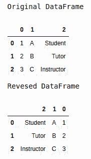
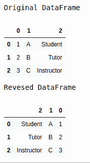

# 如何反转熊猫数据框的列顺序？

> 原文:[https://www . geesforgeks . org/如何反转熊猫的列顺序-数据框/](https://www.geeksforgeeks.org/how-to-reverse-the-column-order-of-the-pandas-dataframe/)

有时在处理数据帧时，我们可能希望更改或颠倒数据帧的列顺序。在本文中，让我们看看如何反转数据框的列顺序。这可以通过两种方式实现–

**方法 1:** 通过使用**属性，可以颠倒数据框中出现的列的顺序。相应数据框上的列[:-1]**。它从末尾访问列，外部数据框【…】使用提供的新序列重新索引数据框。

**示例:**

## 蟒蛇 3

```py
# importing required modules
import pandas as pd

dataframe = pd.DataFrame([[1, 'A', "Student"],
                          [2, 'B', "Tutor"],
                          [3, 'C', "Instructor"]])

print("Original DataFrame")
display(dataframe)

# reversing the dataframe
print("Reversed DataFrame")
display(dataframe[dataframe.columns[::-1]])
```

**输出:**



**方法 2:** [iloc](https://www.geeksforgeeks.org/python-extracting-rows-using-pandas-iloc/) 索引器也可用于反转数据框的列顺序，在指定的数据框上使用语法 **iloc[:，:-1]** 。内容不会保留在原始数据帧中。

## 蟒蛇 3

```py
# importing required modules
import pandas as pd

dataframe = pd.DataFrame([[1, 'A', "Student"],
                          [2, 'B', "Tutor"],
                          [3, 'C', "Instructor"]])

print("Original DataFrame")
display(dataframe)

# reversing the dataframe
print("Reversed DataFrame")
display(dataframe.iloc[:, ::-1])
```

**输出:**

