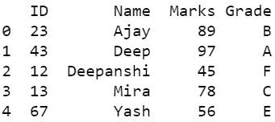

# 如何将熊猫数据帧保存为 gzip/zip 文件？

> 原文:[https://www . geesforgeks . org/如何保存熊猫-data frame-as-gzip-zip-file/](https://www.geeksforgeeks.org/how-to-save-pandas-dataframe-as-gzip-zip-file/)

**熊猫**是建立在 *NumPy* 库之上的开源库。它是一个 Python 包，提供了各种数据结构和操作来操作数字数据和时间序列。它主要是流行的，因为导入和分析数据容易得多。*熊猫*速度快，为用户带来高性能&生产力。

### 转换为 zip/gzip 文件

Pandas 中的 **to_pickle()** 方法用于将给定对象酸洗(序列化)到文件中。该方法使用如下语法:

**语法:**

```py
DataFrame.to_pickle(self, path,
                   compression='infer',
                   protocol=4)

```

此方法支持压缩，如 zip、gzip、bz2 和 xz。在给定的示例中，您将看到如何将数据帧转换为 zip 和 gzip。

**示例 1:** 将熊猫数据帧保存为 zip 文件

## 蟒蛇 3

```py
# importing packages
import pandas as pd

# dictionary of data
dct = {'ID': {0: 23, 1: 43, 2: 12,

              3: 13, 4: 67},

       'Name': {0: 'Ajay', 1: 'Deep',

                2: 'Deepanshi', 3: 'Mira',

                4: 'Yash'},

       'Marks': {0: 89, 1: 97, 2: 45, 3: 78,

                 4: 56},

       'Grade': {0: 'B', 1: 'A', 2: 'F', 3: 'C',

                 4: 'E'}
       }

# forming dataframe and printing
data = pd.DataFrame(dct)
print(data)

# using to_pickle function to form file
# by default, compression type infers from the file extension in specified path.
# file will be created in the given path
data.to_pickle('file.zip')
```

**输出:**



**示例 2:** 将熊猫数据帧保存为 gzip 文件。

## 蟒蛇 3

```py
# importing packages
import pandas as pd

# dictionary of data
dct = {"C1": range(5), "C2": range(5, 10)}

# forming dataframe and printing
data = pd.DataFrame(dct)
print(data)

# using to_pickle function to form file
# we can also select compression type
# file will be created in the given path
data.to_pickle('file.gzip')
```

**输出:**


### 正在读取 zip/gzip 文件

为了读取创建的文件，您需要使用 **read_pickle()** 方法。该方法使用如下语法:

```py
pandas.read_pickle(filepath_or_buffer,  
               compression='infer')

```

**示例 1:** 读取 zip 文件

## 蟒蛇 3

```py
# reading from the zip file
pd.read_pickle('file.zip')
```

**输出:**


**示例 2:** 读取 gzip 文件。

## 蟒蛇 3

```py
# reading from gzip file
pd.read_pickle('file.gzip')
```

**输出:**


### 

从上面两个例子中，我们可以看到这两个压缩文件都可以通过 **read_pickle()** 方法读取，除了文件扩展名之外没有任何变化。