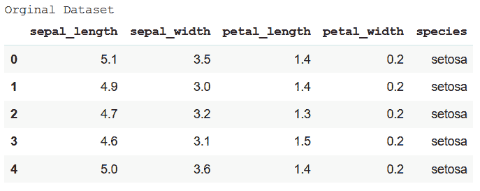
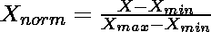
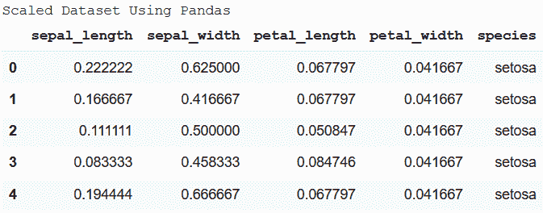
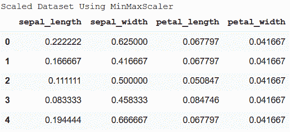
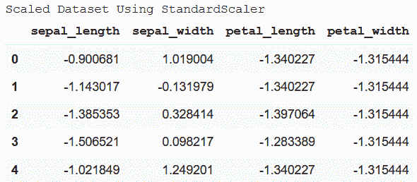

# 如何缩放熊猫数据框列？

> 原文:[https://www . geesforgeks . org/如何缩放-pandas-dataframe-columns/](https://www.geeksforgeeks.org/how-to-scale-pandas-dataframe-columns/)

当数据集的不同列的值在完全不同的比例下时，很难分析趋势和模式以及特征或列的比较。因此，如果所有列的比例都有显著差异，则需要修改，以便所有这些值都属于相同的比例。这个过程叫做**缩放**。

有两种最常见的技术来缩放熊猫数据帧的列–**最小-最大归一化和标准化**。下面的内容已经讨论了这两个问题。

**使用中的数据集:**虹膜



### **最小-最大归一化**

这里，所有值都在[0，1]范围内缩放，其中 0 是最小值，1 是最大值。最小-最大归一化公式为–



**方法一:利用熊猫和 Numpy**

第一种方法是分别计算公式中给出的所需值，然后将其应用于数据集。

**示例:**

## 蟒蛇 3

```
import seaborn as sns
import pandas as pd
import numpy as np

data = sns.load_dataset('iris')
print('Original Dataset')
data.head()

# Min-Max Normalization
df = data.drop('species', axis=1)
df_norm = (df-df.min())/(df.max()-df.min())
df_norm = pd.concat((df_norm, data.species), 1)

print("Scaled Dataset Using Pandas")
df_norm.head()
```

**输出:**



**方法二:使用 sklearn** 的最小最大缩放器

这是一种简单易行的方法。它只需要导入 sklearn 模块。

**示例:**

## 蟒蛇 3

```
import seaborn as sns
from sklearn.preprocessing import MinMaxScaler
import pandas as pd

data = sns.load_dataset('iris')
print('Original Dataset')
data.head()

scaler = MinMaxScaler()

df_scaled = scaler.fit_transform(df.to_numpy())
df_scaled = pd.DataFrame(df_scaled, columns=[
  'sepal_length', 'sepal_width', 'petal_length', 'petal_width'])

print("Scaled Dataset Using MinMaxScaler")
df_scaled.head()
```

**输出:**



### **标准化**

标准化没有任何固定的最小值或最大值。这里，所有列的值都以这样的方式进行缩放，即它们都具有等于 0 的平均值和等于 1 的标准差。这种缩放技术适用于异常值。因此，如果数据集中存在异常值，这种技术是首选的。

**示例:**

## 蟒蛇 3

```
import pandas as pd
from sklearn.preprocessing import StandardScaler
import seaborn as sns

data = sns.load_dataset('iris')
print('Original Dataset')
data.head()

std_scaler = StandardScaler()

df_scaled = std_scaler.fit_transform(df.to_numpy())
df_scaled = pd.DataFrame(df_scaled, columns=[
  'sepal_length','sepal_width','petal_length','petal_width'])

print("Scaled Dataset Using StandardScaler")
df_scaled.head()
```

**输出:**

