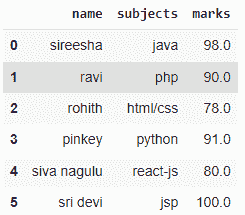

# 如何设置熊猫数据框中的单元格值？

> 原文:[https://www . geeksforgeeks . org/如何设置熊猫的细胞价值-数据框/](https://www.geeksforgeeks.org/how-to-set-cell-value-in-pandas-dataframe/)

在本文中，我们将讨论如何在 Python 的 Pandas DataFrame 中设置单元格值。

## 方法一:采用[熊猫.数据框在](https://www.geeksforgeeks.org/python-pandas-dataframe-at/)的方法

此方法用于设置现有值的值或设置新记录。

**语法**:

```
dataframe.at[index, 'column_name'] = value
```

哪里，

*   数据帧是输入数据帧
*   索引是要插入的位置
*   column_name 是插入值的列
*   值是要插入的值

**例**:

## 蟒蛇 3

```
# import pandas module
import pandas as pd

# create a dataframe
# with 3 rows amd 3  columns
data = pd.DataFrame({
    'name': ['sireesha', 'ravi', 'rohith', 'pinkey', 'gnanesh'],
    'subjects': ['java', 'php', 'html/css', 'python', 'R'],
    'marks': [98, 90, 78, 91, 87]
})

# set value at 6 th location for name column
data.at[5, 'name'] = 'sri devi'

# set value at 6 th location for subjects column
data.at[5, 'subjects'] = 'jsp'

# set value at 6 th location for marks column
data.at[5, 'marks'] = 100

# set value at 4 th location for name column
data.at[4, 'name'] = 'siva nagulu'

# set value at 4 th location for subjects column
data.at[4, 'subjects'] = 'react-js'

# set value at 4 th location for marks column
data.at[4, 'marks'] = 80

# display
data
```

**输出**:



## 方法二:使用 [loc()方法](https://www.geeksforgeeks.org/python-pandas-dataframe-loc/)

这里我们使用 loc()方法根据行索引和列名设置列值

**语法**:

```
dataframe.loc[index, 'column_name'] = value
```

哪里，

*   数据帧是输入数据帧
*   索引是要插入的位置
*   column_name 是插入值的列
*   值是要插入的值

**例**:

## 蟒蛇 3

```
# import pandas module
import pandas as pd

# create a dataframe
# with 3 rows amd 3  columns
data = pd.DataFrame({
    'name': ['sireesha', 'ravi', 'rohith', 'pinkey', 'gnanesh'],
    'subjects': ['java', 'php', 'html/css', 'python', 'R'],
    'marks': [98, 90, 78, 91, 87]
})

# set value at 6 th location for name column
data.loc[5, 'name'] = 'sri devi'

# set value at 6 th location for subjects column
data.loc[5, 'subjects'] = 'jsp'

# set value at 6 th location for marks column
data.loc[5, 'marks'] = 100

# set value at 4 th location for name column
data.loc[4, 'name'] = 'siva nagulu'

# set value at 4 th location for subjects column
data.loc[4, 'subjects'] = 'react-js'

# set value at 4 th location for marks column
data.loc[4, 'marks'] = 80

# display
data
```

**输出**:

