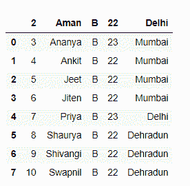
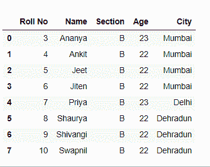
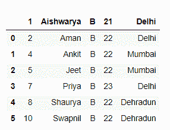
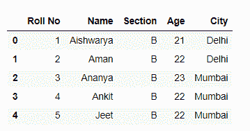

# 使用 Pandas 读取 csv 文件时如何跳行？

> 原文:[https://www . geesforgeks . org/如何在阅读时跳过行-CSV-文件-使用-pandas/](https://www.geeksforgeeks.org/how-to-skip-rows-while-reading-csv-file-using-pandas/)

由于以数据为中心的 Python 包的惊人生态系统，python 是进行数据分析的好语言。熊猫包就是其中之一，它让数据的导入和分析变得更加容易。

在这里，我们将讨论如何在读取 csv 文件时跳过行。我们将使用[熊猫](https://www.geeksforgeeks.org/introduction-to-pandas-in-python/)库的 **read_csv()** 方法来完成此任务。

> **语法:**PD . read _ CSV(file path _ or _ buffer，sep= '，'，分隔符=无，标头= '推断'，名称=无，index _ col =无，usecols =无，挤压=假，前缀=无，mangle _ dupe _ cols =真，dtype =无，引擎=无，转换器=无，true _ values =无，false _ values =无，skipinitialspace =假，skiprows =无，nrows =无，na _ values =无，keep_default_na，lineterminator =无，quotechar= ' " '，引号=0，转义符=无，注释=无，编码=无，方言=无，tupleize _ cols =无，error _ bad _ lines =真，warn _ bad _ lines =真，skipfooter=0，doublequote =真，delim _ 空白=假，low _ memory =真，memory _ map =假，float _ precision =无 **)**

下面给出了一些有用的参数:

<figure class="table">

| 参数 | 使用 |
| --- | --- |
| 文件路径或缓冲区 | 文件的网址或目录位置 |
| 九月 | 代表分隔符，默认值为'，'，如 csv 格式(逗号分隔值) |
| 索引 _ 列 | 此参数用于将传递列作为索引，而不是 0，1，2，3…r |
| 页眉 | 此参数用于将传递行[int/int list]作为标题 |
| 使用 _cols | 此参数是仅使用传递的列[字符串列表]来制作数据框 |
| 挤压 | 如果为真，并且只传递了一列，则返回熊猫系列 |
| skip prows | 此参数用于跳过新数据框中传递行 |
| 滑雪运动员 | 该参数用于跳过文件底部行数 |

</figure>

下载学生. csv 文件[点击此处](https://drive.google.com/file/d/1wHtb27WouL8pr_tL8uXQd_Pwr8TH910x/view?usp=sharing)

**方法 1:** 读取 csv 文件时，从开始处跳过 N 行。

**代码:**

## 蟒蛇 3

```
# Importing Pandas library
import pandas as pd

# Skipping 2 rows from start in csv
# and initialize it to a  dataframe
df = pd.read_csv("students.csv",
                  skiprows = 2)

# Show the dataframe
df
```

**输出:**



**方法 2:** 读取 csv 文件时跳过特定位置的行。

**代码:**

## 蟒蛇 3

```
# Importing Pandas library
import pandas as pd

# Skipping rows at specific position
df = pd.read_csv("students.csv",
                  skiprows = [0, 2, 5])

# Show the dataframe
df
```

**输出:**


**方法 3:** 读取 csv 文件时，除列名外，从头开始跳过 N 行。

**代码:**

## 蟒蛇 3

```
# Importing Pandas library
import pandas as pd

# Skipping 2 rows from start
# except the column names
df = pd.read_csv("students.csv",
                 skiprows = [i for i in range(1, 3) ])

# Show the dataframe
df
```

**输出:**



**方法 4:** 读取 csv 文件时根据条件跳过行。

**代码:**

## 蟒蛇 3

```
# Importing Pandas library
import pandas as pd

# function for checking and
# skipping every 3rd line
def logic(index):

    if index % 3 == 0:
        return True

    return False

# Skipping rows based on a condition
df = pd.read_csv("students.csv",
                 skiprows = lambda x: logic(x) )

# Show the dataframe
df
```

**输出:**



**方法 5:** 读取 csv 文件时从末尾跳过 N 行。

**代码:**

## 蟒蛇 3

```
# Importing Pandas library
import pandas as pd

# Skipping 2 rows from end
df = pd.read_csv("students.csv",
                  skipfooter = 5,
                  engine = 'python')

# Show the dataframe
df
```

**输出:**

