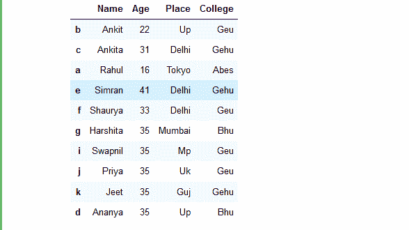
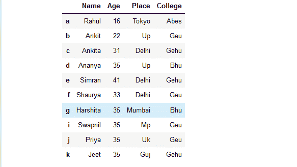
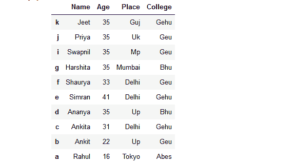
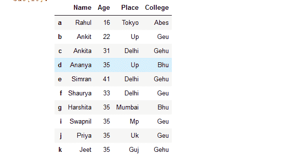
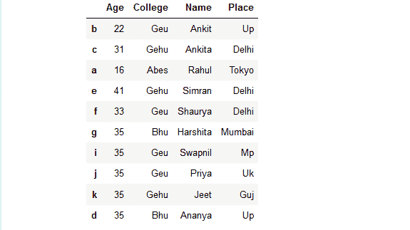
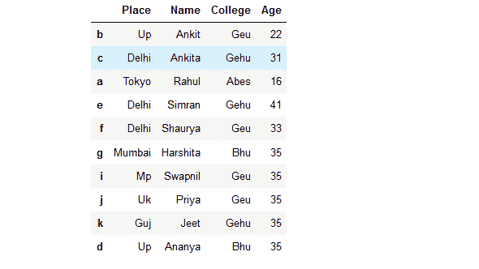
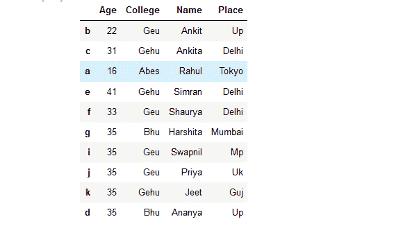

# 如何根据列名或行索引对熊猫数据帧进行排序？

> 原文:[https://www . geesforgeks . org/如何对熊猫进行排序-基于数据框的列名或行索引/](https://www.geeksforgeeks.org/how-to-sort-a-pandas-dataframe-based-on-column-names-or-row-index/)

熊猫 `**dataframe.sort_index()**`方法按照给定轴上的标签对对象进行排序。基本上，排序算法应用于轴标签，而不是数据框中的实际数据，并基于此重新排列数据。我们可以自由选择我们想要应用的排序算法。有三种可能的排序算法，我们可以使用“快速排序”、“mergesort”和“heapsort”。

> **语法:** DataFrame.sort_index(axis=0，level=None，升序=True，inplace=False，kind='quicksort '，na_position='last '，sort_remaining=True，by=None)
> 
> **参数:**
> **轴:** p 为索引，1 为直接排序的列
> **级别:**如果不是无，则对指定索引级别
> **中的值进行排序升序:**排序升序对降序
> **在位:**如果为真，就地执行操作，即更改实际数据帧，否则返回已排序的数据帧。
> **种类:** {'quicksort '，' mergesort '，' heapsort'}，默认为' quicksort '。排序算法的选择。有关更多信息，请参见 ndarray.np.sort。mergesort 是唯一稳定的算法。对于数据框，此选项仅在对单个列或标签进行排序时应用。
> **na _ position:**【{ ' First '，' last'}，默认为' last '】First 将 NaNs 放在开头，last 将 NaNs 放在结尾。未对多索引实现。
> **排序剩余:**如果为真，按级别和索引排序是多级的，则按指定级别排序后，也按其他级别排序(按顺序)
> 
> **返回:**已排序 _obj:数据帧

用列表字典创建一个简单的数据框，比如列名是:“姓名”、“年龄”、“地点”和“学院”。

```py
# import pandas library as pd
import pandas as pd

# List of Tuples
students = [('Ankit', 22, 'Up', 'Geu'),
           ('Ankita', 31, 'Delhi', 'Gehu'),
           ('Rahul', 16, 'Tokyo', 'Abes'),
           ('Simran', 41, 'Delhi', 'Gehu'),
           ('Shaurya', 33, 'Delhi', 'Geu'),
           ('Harshita', 35, 'Mumbai', 'Bhu' ),
           ('Swapnil', 35, 'Mp', 'Geu'),
           ('Priya', 35, 'Uk', 'Geu'),
           ('Jeet', 35, 'Guj', 'Gehu'),
           ('Ananya', 35, 'Up', 'Bhu')
            ]

# Create a DataFrame object from
# list of tuples with columns
# and indices.
details = pd.DataFrame(students, columns =['Name', 'Age',
                                           'Place', 'College'],
                        index =[ 'b', 'c', 'a', 'e', 'f', 'g',
                                 'i', 'j', 'k', 'd'])
# show the dataframe
details
```

**输出:**


**示例 1:** 根据行索引标签名称对数据框的行进行排序。

```py
# import pandas library as pd
import pandas as pd

# List of Tuples
students = [('Ankit', 22, 'Up', 'Geu'),
           ('Ankita', 31, 'Delhi', 'Gehu'),
           ('Rahul', 16, 'Tokyo', 'Abes'),
           ('Simran', 41, 'Delhi', 'Gehu'),
           ('Shaurya', 33, 'Delhi', 'Geu'),
           ('Harshita', 35, 'Mumbai', 'Bhu' ),
           ('Swapnil', 35, 'Mp', 'Geu'),
           ('Priya', 35, 'Uk', 'Geu'),
           ('Jeet', 35, 'Guj', 'Gehu'),
           ('Ananya', 35, 'Up', 'Bhu')
            ]

# Create a DataFrame object from
# list of tuples with columns
# and indices.
details = pd.DataFrame(students, columns =['Name', 'Age', 
                                           'Place', 'College'],
                        index =[ 'b', 'c', 'a', 'e', 'f', 
                                'g', 'i', 'j', 'k', 'd'])

# sort the rows of dataframe 
# based on row index
rslt_df = details.sort_index()

# show the resultant Dataframe
rslt_df
```

**输出:**


**示例 2:** 根据行索引标签以降序对数据框的行进行排序。

```py
# import pandas library as pd
import pandas as pd

# List of Tuples
students = [('Ankit', 22, 'Up', 'Geu'),
           ('Ankita', 31, 'Delhi', 'Gehu'),
           ('Rahul', 16, 'Tokyo', 'Abes'),
           ('Simran', 41, 'Delhi', 'Gehu'),
           ('Shaurya', 33, 'Delhi', 'Geu'),
           ('Harshita', 35, 'Mumbai', 'Bhu' ),
           ('Swapnil', 35, 'Mp', 'Geu'),
           ('Priya', 35, 'Uk', 'Geu'),
           ('Jeet', 35, 'Guj', 'Gehu'),
           ('Ananya', 35, 'Up', 'Bhu')
            ]

# Create a DataFrame object from
# list of tuples with columns
# and indices.
details = pd.DataFrame(students, columns =['Name', 'Age',
                                           'Place', 'College'],
                        index =[ 'b', 'c', 'a', 'e', 'f', 
                                'g', 'i', 'j', 'k', 'd'])

# sort the rows of dataframe in descending 
# order based on row index 
rslt_df = details.sort_index(ascending = False)

# show the resultant Dataframe
rslt_df
```

**输出:**


**示例 3:** 根据行索引标签对数据框的行进行就地排序。

```py
# import pandas library as pd
import pandas as pd

# List of Tuples
students = [('Ankit', 22, 'Up', 'Geu'),
           ('Ankita', 31, 'Delhi', 'Gehu'),
           ('Rahul', 16, 'Tokyo', 'Abes'),
           ('Simran', 41, 'Delhi', 'Gehu'),
           ('Shaurya', 33, 'Delhi', 'Geu'),
           ('Harshita', 35, 'Mumbai', 'Bhu' ),
           ('Swapnil', 35, 'Mp', 'Geu'),
           ('Priya', 35, 'Uk', 'Geu'),
           ('Jeet', 35, 'Guj', 'Gehu'),
           ('Ananya', 35, 'Up', 'Bhu')
            ]

# Create a DataFrame object from
# list of tuples with columns
# and indices.
details = pd.DataFrame(students, columns =['Name', 'Age',
                                           'Place', 'College'],
                        index =[ 'b', 'c', 'a', 'e', 'f', 
                                'g', 'i', 'j', 'k', 'd'])

# sort the rows of dataframe in Place 
# based on row index 
details.sort_index(inplace = True)

# show the resultant Dataframe
details
```

**输出:**


**示例 4:** 基于列名对数据框的列进行排序。

```py
# import pandas library as pd
import pandas as pd

# List of Tuples
students = [('Ankit', 22, 'Up', 'Geu'),
           ('Ankita', 31, 'Delhi', 'Gehu'),
           ('Rahul', 16, 'Tokyo', 'Abes'),
           ('Simran', 41, 'Delhi', 'Gehu'),
           ('Shaurya', 33, 'Delhi', 'Geu'),
           ('Harshita', 35, 'Mumbai', 'Bhu' ),
           ('Swapnil', 35, 'Mp', 'Geu'),
           ('Priya', 35, 'Uk', 'Geu'),
           ('Jeet', 35, 'Guj', 'Gehu'),
           ('Ananya', 35, 'Up', 'Bhu')
            ]

# Create a DataFrame object from
# list of tuples with columns
# and indices.
details = pd.DataFrame(students, columns =['Name', 'Age', 
                                           'Place', 'College'],
                        index =[ 'b', 'c', 'a', 'e', 'f', 
                                'g', 'i', 'j', 'k', 'd'])

# sort a dataframe based on column names
rslt_df = details.sort_index(axis = 1)

# show the resultant Dataframe
rslt_df
```

**输出:**


**示例 5:** 根据列名以降序对数据帧进行排序。

```py
# import pandas library as pd
import pandas as pd

# List of Tuples
students = [('Ankit', 22, 'Up', 'Geu'),
           ('Ankita', 31, 'Delhi', 'Gehu'),
           ('Rahul', 16, 'Tokyo', 'Abes'),
           ('Simran', 41, 'Delhi', 'Gehu'),
           ('Shaurya', 33, 'Delhi', 'Geu'),
           ('Harshita', 35, 'Mumbai', 'Bhu' ),
           ('Swapnil', 35, 'Mp', 'Geu'),
           ('Priya', 35, 'Uk', 'Geu'),
           ('Jeet', 35, 'Guj', 'Gehu'),
           ('Ananya', 35, 'Up', 'Bhu')
            ]

# Create a DataFrame object from
# list of tuples with columns
# and indices.
details = pd.DataFrame(students, columns =['Name', 'Age', 
                                           'Place', 'College'],
                        index =[ 'b', 'c', 'a', 'e', 'f', 
                                'g', 'i', 'j', 'k', 'd'])

# sort a dataframe in descending 
# order based on column names
rslt_df = details.sort_index(ascending = False, axis = 1)

# show the resultant Dataframe
rslt_df
```

**输出:**


**示例 6:** 根据列名对数据帧进行适当排序。

```py
# import pandas library as pd
import pandas as pd

# List of Tuples
students = [('Ankit', 22, 'Up', 'Geu'),
           ('Ankita', 31, 'Delhi', 'Gehu'),
           ('Rahul', 16, 'Tokyo', 'Abes'),
           ('Simran', 41, 'Delhi', 'Gehu'),
           ('Shaurya', 33, 'Delhi', 'Geu'),
           ('Harshita', 35, 'Mumbai', 'Bhu' ),
           ('Swapnil', 35, 'Mp', 'Geu'),
           ('Priya', 35, 'Uk', 'Geu'),
           ('Jeet', 35, 'Guj', 'Gehu'),
           ('Ananya', 35, 'Up', 'Bhu')
            ]

# Create a DataFrame object from
# list of tuples with columns
# and indices.
details = pd.DataFrame(students, columns =['Name', 'Age', 
                                           'Place', 'College'],
                        index =[ 'b', 'c', 'a', 'e', 'f', 
                                'g', 'i', 'j', 'k', 'd'])

# sort a dataframe in place 
# based on column names
details.sort_index(inplace = True, axis = 1)

# show the resultant Dataframe
details
```

**输出:**
