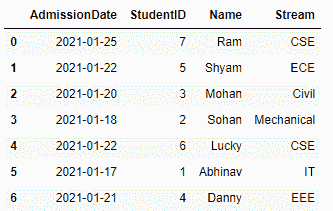
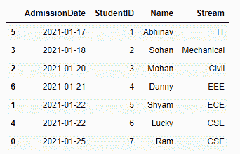
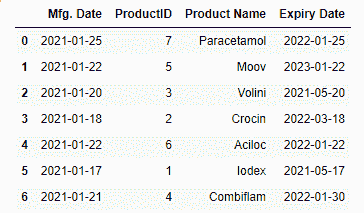
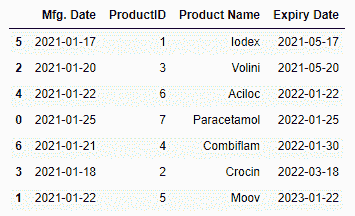

# 如何按日期对熊猫数据框进行排序？

> 原文:[https://www . geesforgeks . org/如何按日期对熊猫进行分类-数据框/](https://www.geeksforgeeks.org/how-to-sort-a-pandas-dataframe-by-date/)

在现实世界中，我们可以遇到任何形式的数据集，其中也可能包含日期。这些数据集可以以任何文件格式呈现，如。CSV，。xlsx，。txt 等。为了在 Python 中加载这些数据，我们使用了一个名为 Pandas 的库，它为我们提供了大量的函数和方法来处理这些数据。熊猫以数据帧的形式阅读这些数据集。

有时，可能会出现数据集可能包含与日期相关的属性的情况，我们希望按照日期值以特定的顺序对数据框中的记录进行排序。

在这篇文章中，我们将学习如何根据日期对熊猫数据帧进行排序。我将创建一个模仿现实问题的自定义数据框对象，这种方法将普遍适用于任何数据框。

## 按单列排序

为了根据包含日期的列对数据帧进行排序，我们将遵循一系列步骤，因此让我们一起学习。

**步骤 1:加载或创建具有日期栏的数据框**

## 计算机编程语言

```
# importing package
import pandas as pd

# Creating a dataframe that stores records of students taking admission in a college
data = pd.DataFrame({'AdmissionDate': ['2021-01-25','2021-01-22','2021-01-20',
                        '2021-01-18','2021-01-22','2021-01-17','2021-01-21'],
                     'StudentID': [7,5,3,2,6,1,4],
                     'Name': ['Ram','Shyam','Mohan','Sohan','Lucky','Abhinav','Danny'],
                     'Stream':['CSE','ECE','Civil','Mechanical','CSE','IT','EEE']
                   })
# Checking dataframe
print(data)
```

**输出:**



在这里，可以清楚地看到，我们的数据框包含一个名为“AdmissionDate”的列，其中包含日期值。

**第二步:将字符串数据类型转换为 datetime 对象。**

当我们读取数据集时，默认情况下，存储在“允许日期”列中的值被视为字符串数据类型。因此，我们需要将这个字符串对象转换为 datetime 对象，为此我们将使用。熊猫提供的 to_datetime()方法，可以通过以下方式完成:

## 计算机编程语言

```
# checking datatype
print(type(data.AdmissionDate[0]))

# convert to date
data['AdmissionDate'] = pd.to_datetime(data['AdmissionDate'])

# verify datatype
print(type(data.AdmissionDate[0]))
```

**输出:**

```
<class 'str'>
<class 'pandas._libs.tslibs.timestamps.Timestamp'>
```

**第三步:按照日期**对数据帧进行排序

我们将使用 sort_values()方法对数据集进行排序，我们将在函数中传递的属性是我们要用来对数据框进行排序的列名。

## 计算机编程语言

```
data.sort_values(by='AdmissionDate')
print(data)
```

**输出:**



这里需要注意的一点是，我们的数据框按照日期的升序排序，为了按照降序对数据框进行排序，我们可以在 sort_values()函数中传递一个额外的参数，该参数将升序值设置为 False，并将按照降序返回数据框。

## 计算机编程语言

```
data.sort_values(by='AdmissionDate',ascending=False)
print(data)
```

**输出:**


## 按日期按多列排序

我们还可以进一步扩展对多个日期时间列排序的理解，在这种情况下，我们保持对数据帧排序的优先级顺序。让我们看看。

**步骤 1:加载或创建具有多个日期列的数据框**

## 计算机编程语言

```
# importing package
import pandas as pd

# Creating a DataFrame
data_1 = pd.DataFrame({'Mfg. Date': ['2021-01-25','2021-01-22','2021-01-20','2021-01-18',
                       '2021-01-22','2021-01-17','2021-01-21'],
                       'ProductID': [7,5,3,2,6,1,4],
                       'Product Name': ['Paracetamol','Moov','Volini','Crocin',
                                        'Aciloc','Iodex','Combiflam'],
                       'Expiry Date':['2022-01-25','2023-01-22','2021-05-20','2022-03-18',
                                      '2022-01-22','2021-05-17','2022-01-30']
                       })

# Checking dataframe
print(data_1)
```

**输出:**



在这里，可以清楚地看到，我们的数据框包含两列日期，即“制造”。“日期”和“到期日”。

**第二步:将字符串数据类型转换为 datetime 对象。**

## 计算机编程语言

```
data_1[['Mfg. Date','Expiry Date']] = data_1[['Mfg. Date','Expiry Date']].apply(pd.to_datetime)
```

**第三步:按日期排序数据帧**

## 计算机编程语言

```
# sorting DataFrame by giving first priority to Expiry Date and then Mfg. Date
data_1.sort_values(by=['Expiry Date', 'Mfg. Date'])
```

**输出:**



在这里，我们得到了一个排序列表，按照我们的优先级按照到期日的升序排列。