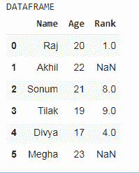
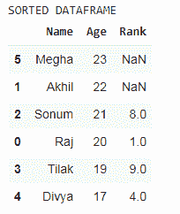

# 如何在 Python 中对熊猫数据帧进行多列排序？

> 原文:[https://www . geeksforgeeks . org/如何对熊猫进行分类-python 中的多列数据框/](https://www.geeksforgeeks.org/how-to-sort-a-pandas-dataframe-by-multiple-columns-in-python/)

排序是基于条件要求对数据帧执行的操作之一。我们可以按字母顺序以及数字顺序对数据帧进行排序。在本文中，我们将看到如何按多列对熊猫数据框进行排序。

**方法 1:** 使用sort_values()方法

> **语法:** df_name.sort_values(按列名，轴=0，升序=True，位置=False，种类='quicksort '，na_position='last '，ignore_index=False，key=None)
> 
> **参数:**
> 
> **依据:**它应该排序的列表或列的名称
> 
> **轴:**待排序轴。(0 或“轴”1 或“列”)默认为 0。(列号)
> 
> **升序:**排序升序或降序。为多个排序顺序指定布尔值列表。布尔值列表必须与“by”的值的数量相匹配，即 column _ names。默认情况下，这是真的。
> 
> **inplace:** 默认为假。但是如果它的值为真，它就地即在适当的位置执行操作。
> 
> **种类:**选择快速排序等排序算法。合并排序，堆排序。默认情况下，它是快速排序。

**对数据帧进行排序:**

*   导入模块。
*   创建一个数据帧。
*   现在，使用上面的语法对数据帧进行排序。

**创建数据帧:**

## 蟒蛇 3

```
#import libraries
import numpy as np
import pandas as pd

# creating a dataframe
df = pd.DataFrame({'Name': ['Raj', 'Akhil', 'Sonum', 'Tilak', 'Divya', 'Megha'],
                   'Age': [20, 22, 21, 19, 17, 23],
                   'Rank': [1, np.nan, 8, 9, 4, np.nan]})

# printing the dataframe
print('DATAFRAME')
df
```

**输出:**



**例 1:**

## 蟒蛇 3

```
# using the sorting function
print('SORTED DATAFRAME')
df.sort_values(by=['Age'], ascending=False)
```

**输出:**



在上面的示例中，升序值为 false，因此数据帧按降序排序。

**例 2:**

## 蟒蛇 3

```
print('SORTED DATAFRAME')
df.sort_values(by = ['Rank', 'Age'], ascending = [True, False], na_position = 'first')
```