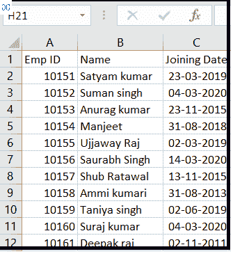
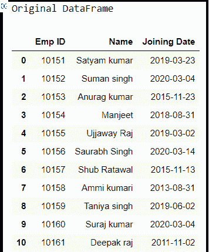
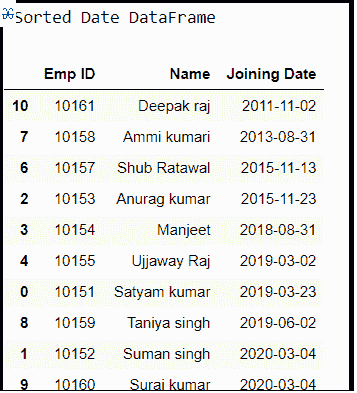

# 如何用熊猫在 excel 中排序日期？

> 原文:[https://www . geesforgeks . org/如何使用 pandas 对 excel 中的日期进行排序/](https://www.geeksforgeeks.org/how-to-sort-date-in-excel-using-pandas/)

在这些文章中，我们将讨论如何在单个数据框中导入 excel 文件，并对给定列中的日期进行排序。假设我们的 Excel 文件如下所示:



sample _ date . xlsx-范例 _ 日期. xlsx

要获取所使用的 excel 文件，请单击此处的。

**进场:**

*   导入熊猫模块
*   从 Excel 文件制作数据框
*   使用 [DataFrame.sort_value()](https://www.geeksforgeeks.org/python-pandas-dataframe-sort_values-set-1/) 函数对日期列进行排序
*   显示最终数据帧

**第一步:**导入熊猫模块，制作数据框表单 excel。

## 蟒蛇 3

```
# import module
import pandas as pd

# making data frame from excel file
df = pd.read_excel('excel_work\sample_date.xlsx')

print("Original DataFrame")
df
```

**输出:**



**第二步:**使用 DataFrame.sort_value()函数对日期进行排序。

## 蟒蛇 3

```
# sorting date with sort_value() function
Final_result = df.sort_values('Joining Date')

print(" Sorted Date DataFrame")
Final_result
```

**输出:**

