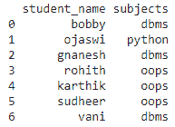
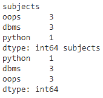
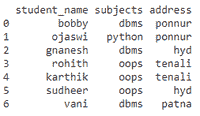
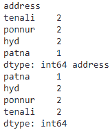
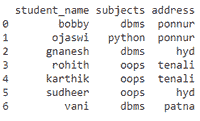
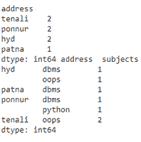

# 如何按组大小对分组熊猫数据帧进行排序？

> 原文:[https://www . geeksforgeeks . org/如何分类-分组-熊猫-按组大小的数据框/](https://www.geeksforgeeks.org/how-to-sort-grouped-pandas-dataframe-by-group-size/)

在本文中，我们将讨论如何根据熊猫的群体大小对分组数据进行排序。

### 使用的功能

在这里，我们将输入作为字典数据结构通过列表传递。

*   [**group by():**](https://www.geeksforgeeks.org/python-pandas-dataframe-groupby/)group by()用于根据列值对数据进行分组。
*   **size():** 这个用来获取数据帧的大小。
*   [**【sort _ values():**](https://www.geeksforgeeks.org/python-pandas-dataframe-sort_values-set-1/)**此函数按传递列的升序或降序对数据框进行排序。**

**任务很简单，对于给定的数据帧，首先我们需要根据需求按任意列分组，然后根据列的大小排列分组后的值。这里的大小是指一个值在一列中出现的次数或出现的频率。**

****例 1:****

## **蟒蛇 3**

```
# importing pandas module for dataframe
import pandas as pd

# creating a dataframe with student
# name and subject

dataframe1 = pd.DataFrame({'student_name': ['bobby', 'ojaswi', 'gnanesh',
                                            'rohith', 'karthik', 'sudheer',
                                            'vani'],

                           'subjects': ['dbms', 'python', 'dbms', 'oops',
                                        'oops', 'oops', 'dbms']})

# display dataframe
print(dataframe1)

# group the data  on subjects column based on
# size and sort in descending order
a = dataframe1.groupby('subjects').size().sort_values(ascending=False)

# group the data  on subjects column based on 
# size and sort in ascending order
b = dataframe1.groupby('subjects').size().sort_values(ascending=True)

print(a, b)
```

****输出:****

** **

****例 2:****

## **蟒蛇 3**

```
# importing pandas module for dataframe
import pandas as pd

# creating a dataframe with student name
# , subject and address
dataframe1 = pd.DataFrame({'student_name': ['bobby', 'ojaswi', 'gnanesh',
                                            'rohith', 'karthik', 'sudheer',
                                            'vani'],
                           'subjects': ['dbms', 'python', 'dbms', 'oops', 
                                        'oops', 'oops', 'dbms'],

                           'address': ['ponnur', 'ponnur', 'hyd', 'tenali',
                                       'tenali', 'hyd', 'patna']})

# display dataframe
print(dataframe1)

# group the data  on address column based  
# on size and sort in descending order
a = dataframe1.groupby('address').size().sort_values(ascending=False)

# group the data  on address column based 
# on size and sort in ascending order
b = dataframe1.groupby('address').size().sort_values(ascending=True)

print(a, b)
```

**输出:**

** **

**我们还可以对多个列进行分组。语法保持不变，但是我们需要在列表中传递多个列，并在 groupby()中传递列表**

****语法:****

> **dataframe.groupby([column1，column2，。列 n])。大小()。排序值(升序=真)**

****例 3:****

## **蟒蛇 3**

```
# importing pandas module for dataframe
import pandas as pd

# creating a dataframe with student
# name , subject and address
dataframe1 = pd.DataFrame({'student_name': ['bobby', 'ojaswi', 'gnanesh',
                                            'rohith', 'karthik', 'sudheer',
                                            'vani'],

                           'subjects': ['dbms', 'python', 'dbms', 'oops',
                                        'oops', 'oops', 'dbms'],

                           'address': ['ponnur', 'ponnur', 'hyd', 'tenali',
                                       'tenali', 'hyd', 'patna']})

# display dataframe
print(dataframe1)

# group the data  on address and subjects
# column based on size and sort in descending
# order
a = dataframe1.groupby(['address', 'subjects']
                       ).size().sort_values(ascending=False)

# group the data  on address and subjects
# column based on size and sort in ascending
# order
b = dataframe1.groupby(['address', 'subjects']
                       ).size().sort_values(ascending=True)

print(a, b)
```

****输出:****

** **