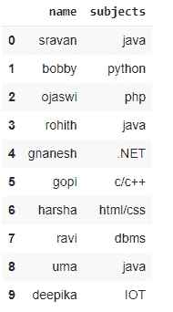
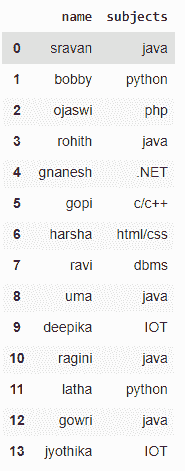
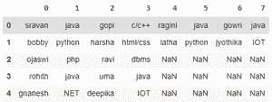

# 如何堆叠多个熊猫数据帧？

> 原文:[https://www . geesforgeks . org/how-stack-multi-pandas-data frames/](https://www.geeksforgeeks.org/how-to-stack-multiple-pandas-dataframes/)

在本文中，我们将看到如何堆叠多个熊猫数据帧。堆叠意味着将数据帧行附加到第二个数据帧，依此类推。如果有 4 个数据帧，则堆叠后的结果将是单个数据帧，顺序为数据帧 1、数据帧 2、数据帧 3、数据帧 4

## 方法 1:使用 [concat()](https://www.geeksforgeeks.org/pandas-concat-function-in-python/) 方法

这个方法将熊猫数据帧的行按照它们给出的顺序进行堆叠。

> **语法**:pandas . concat([first _ data frame，second_dataframe，third_dataframe，………………。，last_dataframe]，ignore_index=True，坐标轴)
> 
> **参数:**
> 
> *   数据帧是要堆叠的输入数据帧
> *   ignore_index 用于忽略输入数据帧的索引值
> *   axis=0 指定垂直堆叠
> *   axis=1 指定水平堆叠

**注意:**如果 ignore_index 参数未设置为 true，则意味着它将采用给定的索引，这将导致数据帧的错误堆叠

### **示例 1** : Python 程序垂直堆叠两个数据帧

## 蟒蛇 3

```py
# import pandas module
import pandas as pd

# create first dataframe
data1 = pd.DataFrame({'name': ['sravan', 'bobby',
                               'ojaswi', 'rohith', 
                               'gnanesh'],
                      'subjects': ['java', 'python',
                                   'php', 'java', '.NET']})

# create second dataframe
data2 = pd.DataFrame({'name': ['gopi', 'harsha', 'ravi',
                               'uma', 'deepika'],
                      'subjects': ['c/c++', 'html/css',
                                   'dbms', 'java', 'IOT']})

# stack the two DataFrames
pd.concat([data1, data2], ignore_index=True, axis=0)
```

**输出**:



### **示例 2:** 垂直堆叠多个数据帧的 Python 代码

## 蟒蛇 3

```py
# import pandas module
import pandas as pd

# create first dataframe
data1 = pd.DataFrame({'name': ['sravan', 'bobby', 'ojaswi',
                               'rohith', 'gnanesh'],
                      'subjects': ['java', 'python', 'php',
                                   'java', '.NET']})

# create second dataframe
data2 = pd.DataFrame({'name': ['gopi', 'harsha', 'ravi',
                               'uma', 'deepika'], 
                      'subjects': ['c/c++', 'html/css',
                                   'dbms', 'java', 'IOT']})

# create third dataframe
data3 = pd.DataFrame(
    {'name': ['ragini', 'latha'], 'subjects': ['java', 'python']})

# create forth dataframe
data4 = pd.DataFrame(
    {'name': ['gowri', 'jyothika'], 'subjects': ['java', 'IOT']})

# stack the four DataFrames
pd.concat([data1, data2, data3, data4], ignore_index=True,axis=0)
```

**输出**:



### **示例 3:** 水平堆叠多个数据帧的 Python 程序

## 蟒蛇 3

```py
# import pandas module
import pandas as pd

# create first dataframe
data1 = pd.DataFrame({'name': ['sravan', 'bobby', 'ojaswi', 
                               'rohith', 'gnanesh'], 
                      'subjects': ['java', 'python',
                                   'php', 'java', '.NET']})

# create second dataframe
data2 = pd.DataFrame({'name': ['gopi', 'harsha', 'ravi',
                               'uma', 'deepika'], 
                      'subjects': ['c/c++', 'html/css',
                                   'dbms', 'java', 'IOT']})

# create third dataframe
data3 = pd.DataFrame(
    {'name': ['ragini', 'latha'], 'subjects': ['java', 'python']})

# create forth dataframe
data4 = pd.DataFrame(
    {'name': ['gowri', 'jyothika'], 'subjects': ['java', 'IOT']})

# stack the four DataFrames horizontally
pd.concat([data1, data2, data3, data4], axis=1, ignore_index=True)
```

**输出:**



## 方法二:使用[追加()](https://www.geeksforgeeks.org/python-pandas-dataframe-append/)方法

append()方法用于将数据帧追加到给定的数据帧之后。

> **语法**:first _ data frame . append([second _ data frame，…，last_dataframe]，ignore_index=True)

### **示例** : Python 程序使用 append()方法堆叠多个数据帧

## 蟒蛇 3

```py
# import pandas module
import pandas as pd

# create first dataframe
data1 = pd.DataFrame({'name': ['sravan', 'bobby', 'ojaswi',
                               'rohith', 'gnanesh'],
                      'subjects': ['java', 'python', 'php',
                                   'java', '.NET']})

# create second dataframe
data2 = pd.DataFrame({'name': ['gopi', 'harsha', 'ravi',
                               'uma', 'deepika'],
                      'subjects': [ 'c/c++', 'html/css',
                                   'dbms', 'java', 'IOT']})

# create third dataframe
data3 = pd.DataFrame(
    {'name': ['ragini', 'latha'], 'subjects': ['java', 'python']})

# create forth dataframe
data4 = pd.DataFrame(
    {'name': ['gowri', 'jyothika'], 'subjects': ['java', 'IOT']})

# stack the four DataFrames using append()
data1.append([data2, data3, data4], ignore_index=True)
```

**输出**:

