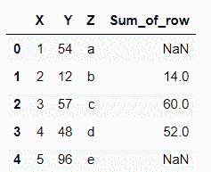
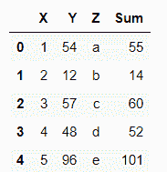
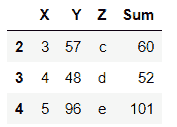

# 熊猫数据帧的值如何按行求和？

> 原文:[https://www . geeksforgeeks . org/如何对熊猫值求和-逐行数据框/](https://www.geeksforgeeks.org/how-to-sum-values-of-pandas-dataframe-by-rows/)

在 python pandas 模块上工作时，总而言之，可能需要一个 Dataframe 的行。下面是对数据帧的行求和的示例。数据框是一种二维数据结构，其形式为带有行和列的表。它可以通过从现有存储中加载数据集来创建，存储可以是 SQL 数据库、CSV 文件、Excel 文件，也可以是 python 列表或字典。

Pandas **dataframe.sum()** 函数返回所请求轴的值之和。

> **语法:** 数据帧总和(轴)
> 
> **参数:**
> 
> *   **轴:**{指数(0)，列(1)}

**每行之和:**

```py
df.sum(axis=1)
```

**例 1:**

使用 sum 函数对数据框的所有行求和，并将轴值设置为 1，以便对行值求和并将结果显示为输出。

## 蟒蛇 3

```py
# importing pandas module as pd
import pandas as pd

# creating a dataframe using dictionary
df = pd.DataFrame({'X':[1, 2, 3, 4, 5],
                   'Y':[54, 12, 57, 48, 96]})

# sum() method sums up the rows and columns of a dataframe
# axis = 1 sums up the rows
df = df.sum(axis = 1)
print(df)
```

**输出:**


按索引对所有行求和

**例 2:**

根据要求，使用 loc 函数和 sum 函数对数据框的所有行或某些行求和，并将轴设置为 1 以对行求和。它只汇总指定的行，并将 NaN 值放在剩余的位置。

## 蟒蛇 3

```py
# importing pandas as pd
import pandas as pd

# creating the dataframe using pandas DataFrame
df = pd.DataFrame({'X':[1, 2, 3, 4, 5],
                   'Y':[54, 12, 57, 48, 96],
                   'Z':['a', 'b', 'c', 'd', 'e']})

# df['column_name'] = df.loc[start_row_index:end_row_index,
# ['column1','column2']].sum(axis = 1)
# summing columns X and Y for row from 1 - 3
df['Sum_of_row'] = df.loc[1 : 3,['X' , 'Y']].sum(axis = 1)
print(df)
```

**输出:**



对从第 1 行到第 3 行的所有行求和

**例 3 :**

使用 eval 函数对行求和，以指定表达式作为参数计算行的总和。

## 蟒蛇 3

```py
# importing pandas as pd
import pandas as pd

# creating the dataframe using pandas DataFrame
df = pd.DataFrame({'X':[1, 2, 3, 4, 5],
                   'Y':[54, 12, 57, 48, 96],
                   'Z':['a', 'b', 'c', 'd', 'e']})

# eval('expression') calculates the sum of the specified columns of that row
df = df.eval('Sum = X + Y')
print(df)
```

**输出:**



使用 eval 函数对行求和

**例 4 :**

使用 eval 函数对行求和，计算具有指定行的行的总和，使用 loc 和表达式计算总和，作为 eval 函数的参数。它只返回 loc 中指定的行，并砍掉剩余的行。

## 蟒蛇 3

```py
# importing pandas as pd
import pandas as pd

# creating the dataframe using pandas DataFrame
df = pd.DataFrame({'X':[1, 2, 3, 4, 5],
                   'Y':[54, 12, 57, 48, 96],
                   'Z':['a', 'b', 'c', 'd', 'e']})

# eval('expression') calculates the sum
# of the specified columns of that row
# using loc for specified rows
df = df.loc[2:4].eval('Sum = X + Y')
display(df)
```

**输出:**



仅使用 eval 对指定行求和