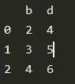

# 如何拍摄熊猫数据帧的柱状切片？

> 原文:[https://www . geeksforgeeks . org/如何获取熊猫数据框切片柱/](https://www.geeksforgeeks.org/how-to-take-column-slices-of-dataframe-in-pandas/)

在本文中，我们将学习如何在 Python 中按列分割数据帧。DataFrame 是一个带有标注轴的二维表格数据结构，即行和列。可以使用以下两种方法对数据帧进行切片:

### **方法#1**

使用 [loc](https://www.geeksforgeeks.org/python-pandas-dataframe-loc/) ，熊猫包中存在的 loc loc 可用于使用索引对数据帧进行切片。Pandas DataFrame.loc 属性通过给定数据帧中的标签或布尔数组访问一组行和列。

**语法:**

> [:，第一个:最后一个:步骤]

**进场:**

*   这里首先指出要采用的第一列的名称。
*   最后一个表示最后一列的名称。
*   该步骤指示每次提取后要前进的索引数量。

**例 1:**

## 蟒蛇 3

```py
# importing pandas
import pandas as pd

# Using DataFrame() method from pandas module
df1 = pd.DataFrame({"a": [1, 2, 3], "b": [2, 3, 4], 
                    "c": [3, 4, 5], "d": [4, 5, 6], 
                    "e": [5, 6, 7]})

df2 = df1.loc[:, "b":"d":2]
print(df2)
```

**输出**:



**例 2:**

## 蟒蛇 3

```py
# importing pandas
import pandas as pd

# Using DataFrame() method from pandas module
df1 = pd.DataFrame({"a": [1, 2, 3, 4, 5, 6, 7], 
                    "b": [2, 3, 4, 2, 3, 4, 5], 
                    "c": [3, 4, 5, 2, 3, 4, 5], 
                    "d": [4, 5, 6, 2, 3, 4, 5], 
                    "e": [5, 6, 7, 2, 3, 4, 5]})

df2 = df1.loc[:, "c":"e":1]
print(df2)
```