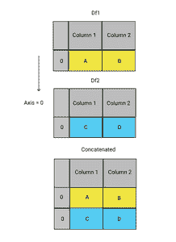
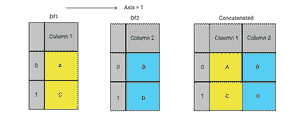
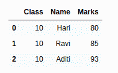
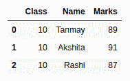
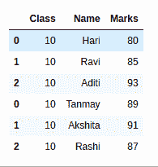

# 如何使用 Concat 联合熊猫数据帧？

> 原文:[https://www . geesforgeks . org/how-union-pandas-data frames-using-concat/](https://www.geeksforgeeks.org/how-to-union-pandas-dataframes-using-concat/)

**concat()** 函数执行所有重的提升操作，沿着一个轴执行连接操作，同时在其他轴上执行索引(如果有)的可选设置逻辑(并集或交集)。

concat()函数以两种方式之一组合数据帧:

*   **堆叠:轴= 0(这是默认选项)。**



轴=0

*   **并排:轴= 1**



轴=1

**使用 Concat 联合熊猫数据帧的步骤:**

*   **创建第一个数据框**

## 蟒蛇 3

```
import pandas as pd

students1 = {'Class': ['10','10','10'],
            'Name': ['Hari','Ravi','Aditi'],
            'Marks': [80,85,93]
           }

df1 = pd.DataFrame(students1, columns= ['Class','Name','Marks'])

df1
```

**输出:**



*   **创建第二个数据框**

## 蟒蛇 3

```
import pandas as pd

students2 = {'Class': ['10','10','10'],
            'Name': ['Tanmay','Akshita','Rashi'],
            'Marks': [89,91,87]
           }

df2 = pd.DataFrame(students2, 
                   columns= ['Class','Name','Marks'])

df2
```

**输出:**



*   **使用 Concat** 联合熊猫数据帧

## 蟒蛇 3

```
pd.concat([df1,df2])
```

**输出:**



**注意:**您需要在所有数据帧中保持相同的列名，以避免任何“NaN”值。