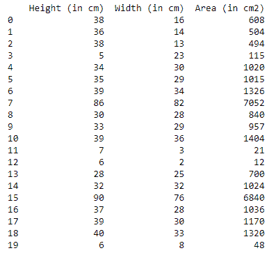
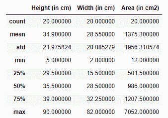

# 熊猫滤镜如何配合 IQR 使用？

> 原文:[https://www . geesforgeks . org/使用方法-pandas-filter-with-iqr/](https://www.geeksforgeeks.org/how-to-use-pandas-filter-with-iqr/)

**IQR 或四分位数区间**是用于测量给定数据可变性的统计测量值。用天真的话来说，它告诉我们大部分数据位于什么范围内。它可以通过取数据集中第三个四分位数和第一个四分位数之间的差值来计算。

```py
IQR = Q3 - Q1
```

其中，Q3 =第 75 个百分点值(它是数据集中中间值和最大值之间的中间值)。Q1 =第 25 个百分点值(它是数据集中中间值和最小值之间的中间值)。此外，Q2 表示第 50 个百分位数，即数据集的中位数。更多关于 IQR 的信息，请阅读[https://www.geeksforgeeks.org/interquartile-range-iqr/](https://www.geeksforgeeks.org/interquartile-range-iqr/)。

在本文中，我们将了解如何在 IQR 的帮助下使用 Pandas 过滤数据集。

四分位数区间(IQR)是一种通常用于过滤数据集中异常值的方法。异常值是远离常规观测值的极端值，这些值可能是由于测量的可变性或实验误差而产生的。很多时候，我们希望识别这些异常值，并将其过滤掉以减少误差。在这里，我们将展示一个使用 Python 编程语言 Pandas 检测异常值并将其过滤掉的示例。

让我们首先从导入重要的库开始，我们将需要这些库来识别和过滤异常值。

## 计算机编程语言

```py
# Importing important libraries
import numpy as np
import pandas as pd
import seaborn as sns
import matplotlib.pyplot as plt
plt.style.use('seaborn')
```

现在，我们将读取我们想要检测和过滤异常值的数据集。数据集可以从[https://tinyurl.com/gfgdata](https://tinyurl.com/gfgdata)下载。这可以使用熊猫库中的 read_csv()方法来完成，可以写成:

## 计算机编程语言

```py
# Reading the dataset
data = pd.read_csv('Dataset.csv')
print("The shape of the dataframe is: ", data.shape)
```

**输出:**

```py
 The shape of the dataframe is:  (20, 4)
```

**打印数据集**

我们可以打印数据集来查看数据。

## 计算机编程语言

```py
print(data)
```

我们的数据集如下所示:



我们可以使用 data . description()方法观察关于此数据集的一些统计信息，可以通过以下方式完成:

## 计算机编程语言

```py
data.describe()
```

**输出:**



可以观察到，与 75%的值相比，“高度”、“宽度”、“面积”等特征具有非常延迟的最大值，因此我们可以说在数据集中有某些观察值充当异常值。同样，这些列中的最小值与 25%的值相差很大，因此它表示存在异常值。

这可以通过绘制上述要素的方框图来验证，这里我绘制的是高度列的方框图，以同样的方式可以绘制其他要素的方框图。

## 计算机编程语言

```py
plt.figure(figsize=(6,4))
sns.boxplot(data['Height (in cm)'])
plt.show()
```