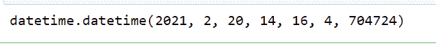
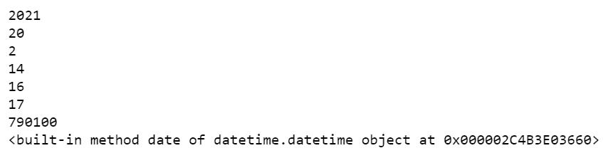
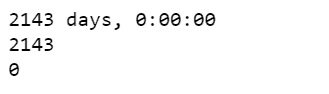

# 熊猫如何利用时间序列？

> 原文:[https://www . geeksforgeeks . org/如何利用熊猫的时间序列/](https://www.geeksforgeeks.org/how-to-utilize-time-series-in-pandas/)

python 中的 pandas 库提供了一套标准的时间序列工具和数据算法。通过这种方式，我们可以高效地处理非常大的时间序列，并轻松地对不规则和固定频率的时间序列进行切片、聚合和重采样。

时间序列数据是结构化数据的一种重要形式，广泛应用于金融、经济、生态等领域。在许多时间点观察或测量的任何东西都形成一个时间序列。

1.  **时间戳:**这些是特定的时刻
2.  **固定期间:**这将表示例如 5 月 25 日或 1999 年全年。

## **日期时间中的模块**

*   **日期:**该模块用于以年、月、日的格式存储日历。
*   **时间:**该模块用于以小时、分钟、秒和微秒的格式获取和显示时间。
*   **日期时间:**该模块用于存储日期和时间。
*   **时间增量:**该模块用于获取两个日期时间值之间的差值。

**以下是描述如何在熊猫库中利用时间序列的各种示例:**

**例 1:** 显示当前日期和时间。在这个程序中，我们将显示当前的日期和时间。

## 蟒蛇 3

```
# import datetime module 
# for getting date and time
from datetime import datetime

# command to display 
# current date and time
datetime.now()
```

**输出:**



**示例 2:** 从模块中单独显示小时、分钟、秒、月、年、日的程序。

## 蟒蛇 3

```
# import module
from datetime import datetime

# display all attributes
a=datetime.now()
print(a.year)
print(a.day)
print(a.month)
print(a.hour)
print(a.minute)
print(a.second)
print(a.microsecond)
print(a.date)
```

**输出:**



**例 3:** 两个日期的差异。我们可以使用 timedelta 模块获得小时、天和分钟的差异。

## 蟒蛇 3

```
# importing time delta module
from datetime import timedelta

# subtracting date from year 2027 to 2021
deltaresult = datetime(2027, 5, 7) - datetime(2021, 6, 24)

# display the result
print(deltaresult)

# to get days
print(deltaresult.days)

# to get seconds difference
print(deltaresult.seconds)
```

**输出:**



如果要生成时间序列数据，python 会支持 **date_range** 模块。这将生成给定频率内的日期。它可以在熊猫模块中找到。

> **语法:**pandas . date _ range(start =无，end =无，periods =无，freq =无)
> 
> **参数:**
> 
> *   **开始:**从开始日期开始的开始日期时间。
> *   **结束:**指定结束日期时间。
> *   **freq:** 代表像小时、分钟或秒这样的频率。

**例 4:** 在这个程序中，我们可以从 2021 年 1 月 1 日开始，使用 date_range 方法显示截止到 3 月的日期。

## 蟒蛇 3

```
# importing pandas module
import pandas as pd

# using date_range function to generate 
# dates from january 1 2021 to 
# march 16 2021 as periods = 75
dates = pd.date_range('1/1/2021', periods=75)

print(dates)
```