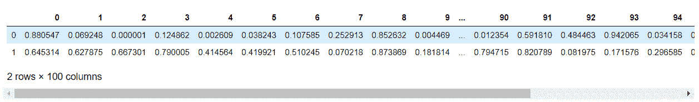

# 如何加宽输出显示，在 Pandas 数据框中看到更多的列？

> 原文:[https://www . geesforgeks . org/如何加宽输出-显示-查看更多-熊猫中的栏-数据框/](https://www.geeksforgeeks.org/how-to-widen-output-display-to-see-more-columns-in-pandas-dataframe/)

在 Python 中，如果数据框中有更多的列，那么并非所有的列都会显示在输出显示中。因此，让我们看看如何扩大输出显示，以看到更多的列。

**方法一:**使用[**pandas . set _ option()**](https://www.geeksforgeeks.org/pandas-set_option-function-in-python/)功能。

此函数用于设置指定选项的值。

> **语法:** pandas.set_option(pat，value)
> 
> **返回:**无

**示例:**

## 蟒蛇 3

```
# importing numpy library 
import numpy as np

# importing pandas library
import pandas as pd

# define a dataframe of
# 2 rows and 100 columns
# with random entries
df = pd.DataFrame(np.random.random(200).reshape(2, 100))

# show the dataframe
df
```

**输出:**



使用 pandas.set_option()函数以更宽的格式打印上述输出。

## 蟒蛇 3

```
# using pd.set_option()
# to widen the output 
# display
pd.set_option('display.max_columns', 100)

# show the dataframe
df
```