# 用熊猫索引和选择数据

> 原文:[https://www . geeksforgeeks . org/用熊猫索引和选择数据/](https://www.geeksforgeeks.org/indexing-and-selecting-data-with-pandas/)

**熊猫索引:**
熊猫索引意味着简单地从数据帧中选择特定的数据行和列。索引可能意味着选择所有的行和一些列，一些行和所有的列，或者每个行和列中的一些。索引也可以称为**子集选择**。


让我们看一些熊猫索引的例子。在本文中，我们使用“`nba.csv`”文件下载 CSV，点击[这里](https://media.geeksforgeeks.org/wp-content/uploads/nba-2.csv)。

#### 选择一些行和一些列

让我们取一个包含一些假数据的数据帧，现在我们对这个数据帧执行索引。在本例中，我们从数据框中选择一些行和一些列。带有数据集的数据框。
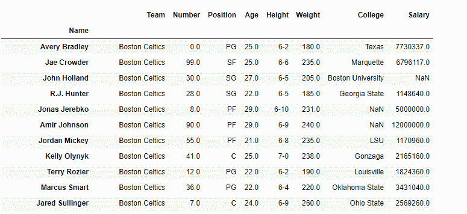
假设我们想要选择列`Age`、`College`和`Salary`仅用于带有标签`Amir Johnson`和`Terry Rozier`
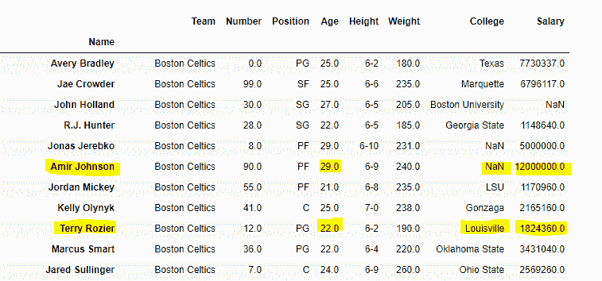
的行，我们的最终数据框将如下所示:
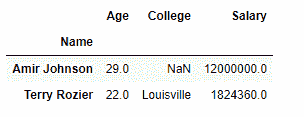

#### 选择一些行和所有列

假设我们要选择第`Amir Jhonson`、`Terry Rozier`行和`John Holland`行，所有列都在一个数据框中。
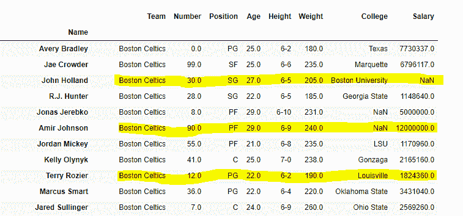
我们最终的数据帧如下所示:
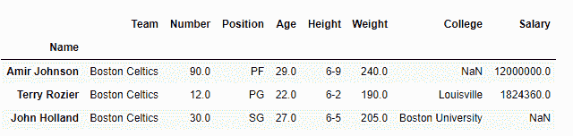

#### 选择一些列和所有行

假设我们要选择“年龄”、“身高”和“工资”列，所有行都在一个数据框中。
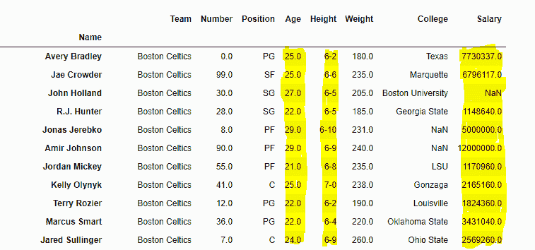
我们最终的数据帧应该是这样的:


### 熊猫索引使用`[ ]`、`[.loc[]](https://www.geeksforgeeks.org/python-pandas-extracting-rows-using-loc/)`、`[.iloc[ ]](https://www.geeksforgeeks.org/python-extracting-rows-using-pandas-iloc/)`、`[.ix[ ]](https://www.geeksforgeeks.org/python-pandas-dataframe-ix/)`

有很多方法可以从数据框中提取元素、行和列。熊猫中有一些索引方法有助于从数据帧中获取元素。这些索引方法看起来非常相似，但行为却大不相同。熊猫支持四种类型的多轴索引，它们是:

*   **数据框。[ ] ;**该功能也称为索引运算符
*   **[Dataframe.loc[ ]](https://www.geeksforgeeks.org/python-pandas-extracting-rows-using-loc/) :** 此功能用于标签。
*   **[data frame . iloc[]](https://www.geeksforgeeks.org/python-extracting-rows-using-pandas-iloc/):**此功能用于基于位置或整数的
*   **[Dataframe.ix[]](https://www.geeksforgeeks.org/python-pandas-dataframe-ix/) :** 此功能用于基于标签和整数的

他们统称为**索引器**。这些是迄今为止最常见的数据索引方式。这四个函数有助于从数据框中获取元素、行和列。

**使用索引运算符`[]` :**
索引运算符用于引用对象后面的方括号。`[.loc](https://www.geeksforgeeks.org/python-pandas-extracting-rows-using-loc/)`和`[.iloc](https://www.geeksforgeeks.org/python-extracting-rows-using-pandas-iloc/)`索引器也使用索引操作符进行选择。在这个索引操作符中引用 df[]。

#### 选择单个列

为了选择单个列，我们只需将列名放在括号中

```py
# importing pandas package
import pandas as pd

# making data frame from csv file
data = pd.read_csv("nba.csv", index_col ="Name")

# retrieving columns by indexing operator
first = data["Age"]

print(first)
```

**输出:**
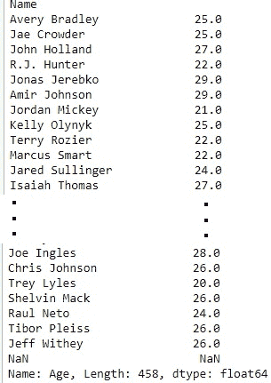

#### 选择多列

为了选择多个列，我们必须在索引操作符中传递一个列列表。

```py
# importing pandas package
import pandas as pd

# making data frame from csv file
data = pd.read_csv("nba.csv", index_col ="Name")

# retrieving multiple columns by indexing operator
first = data[["Age", "College", "Salary"]]

first
```

**输出:**
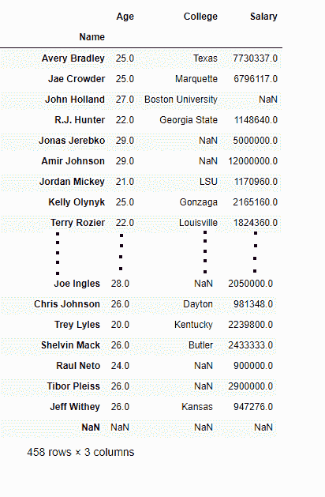

**使用`[.loc[ ]](https://www.geeksforgeeks.org/python-pandas-extracting-rows-using-loc/)` :**
索引数据帧此功能通过行和列的**标签**选择数据。`df.loc`索引器选择数据的方式与索引操作符不同。它可以选择行或列的子集。它还可以同时选择行和列的子集。

#### 选择单行

为了使用`.loc[]`选择单行，我们在`.loc`函数中放置一个单行标签。

```py
# importing pandas package
import pandas as pd

# making data frame from csv file
data = pd.read_csv("nba.csv", index_col ="Name")

# retrieving row by loc method
first = data.loc["Avery Bradley"]
second = data.loc["R.J. Hunter"]

print(first, "\n\n\n", second)
```

**输出:**
如输出图像所示，由于两次都只有一个参数，所以返回了两个序列。
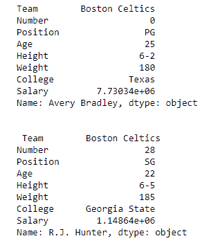

#### 选择多行

为了选择多行，我们将所有行标签放在一个列表中，并将其传递给`[.loc](https://www.geeksforgeeks.org/python-pandas-extracting-rows-using-loc/)`函数。

```py
import pandas as pd

# making data frame from csv file
data = pd.read_csv("nba.csv", index_col ="Name")

# retrieving multiple rows by loc method
first = data.loc[["Avery Bradley", "R.J. Hunter"]]

print(first)
```

**输出:**
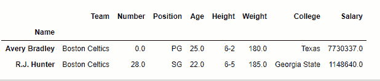

#### 选择两行三列

为了选择两行和三列，我们选择一个我们想要选择的两行和三列，并将其放在一个单独的列表中，如下所示:

```py
Dataframe.loc[["row1", "row2"], ["column1", "column2", "column3"]]

```

```py
import pandas as pd

# making data frame from csv file
data = pd.read_csv("nba.csv", index_col ="Name")

# retrieving two rows and three columns by loc method
first = data.loc[["Avery Bradley", "R.J. Hunter"],
                   ["Team", "Number", "Position"]]

print(first)
```

**输出:**


#### 选择所有行和一些列

为了选择所有的行和一些列，我们使用单冒号 **[:]** 来选择所有的行和一些列的列表，我们想要这样选择:

```py
Dataframe.loc[[:, ["column1", "column2", "column3"]]

```

```py
import pandas as pd

# making data frame from csv file
data = pd.read_csv("nba.csv", index_col ="Name")

# retrieving all rows and some columns by loc method
first = data.loc[:, ["Team", "Number", "Position"]]

print(first)
```

**输出:**
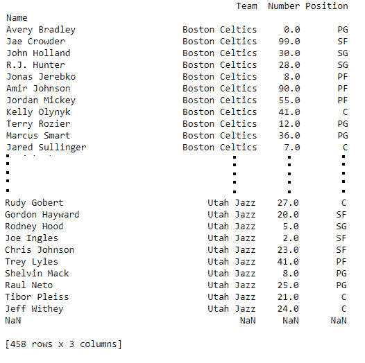

**使用`[.iloc[ ]](https://www.geeksforgeeks.org/python-extracting-rows-using-pandas-iloc/)` :**
索引数据框该功能允许我们按位置检索行和列。为了做到这一点，我们需要指定我们想要的行的位置，以及我们想要的列的位置。`df.iloc` 索引器与`df.loc` 非常相似，但仅使用整数位置进行选择。

#### 选择单行

为了使用`.iloc[]`选择单行，我们可以将单个整数传递给`.iloc[]`函数。

```py
import pandas as pd

# making data frame from csv file
data = pd.read_csv("nba.csv", index_col ="Name")

# retrieving rows by iloc method 
row2 = data.iloc[3] 

print(row2)
```

**输出:**
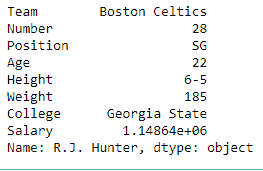

#### 选择多行

为了选择多行，我们可以将一个整数列表传递给`.iloc[]`函数。

```py
import pandas as pd

# making data frame from csv file
data = pd.read_csv("nba.csv", index_col ="Name")

# retrieving multiple rows by iloc method 
row2 = data.iloc [[3, 5, 7]]

row2
```

**输出:**
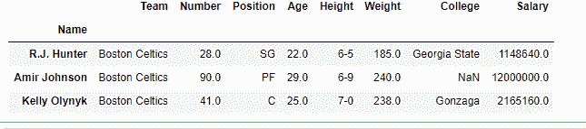

#### 选择两行和两列

为了选择两行两列，我们为行创建一个 2 整数列表，为列创建一个 2 整数列表，然后传递给`.iloc[]`函数。

```py
import pandas as pd

# making data frame from csv file
data = pd.read_csv("nba.csv", index_col ="Name")

# retrieving two rows and two columns by iloc method 
row2 = data.iloc [[3, 4], [1, 2]]

print(row2)
```

**输出:**
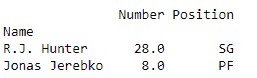

#### 选择所有行和一些列

为了选择所有的行和一些列，我们使用单冒号 **[:]** 来选择所有的行，对于列，我们制作一个整数列表，然后传递给一个`.iloc[]`函数。

```py
import pandas as pd

# making data frame from csv file
data = pd.read_csv("nba.csv", index_col ="Name")

# retrieving all rows and some columns by iloc method 
row2 = data.iloc [:, [1, 2]]

print(row2)
```

**输出:**
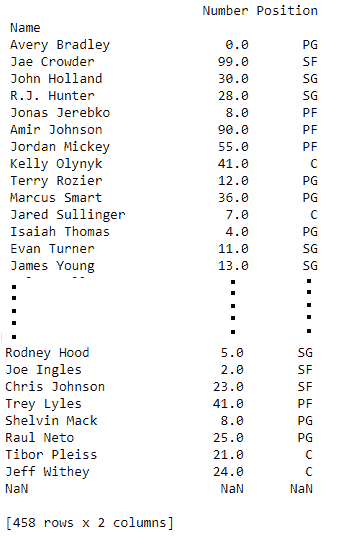

**使用[data frame . IX【】](https://www.geeksforgeeks.org/python-pandas-dataframe-ix/):**
熊猫发育早期，存在另一个索引器，`ix`。该索引器能够通过标签和整数位置进行选择。虽然它是通用的，但它引起了很多混乱，因为它不明确。有时整数也可以是行或列的标签。因此，有些情况下，它是模棱两可的。一般来说，`ix`是基于标签的，就像**一样。锁定**步进器。但是，`.ix`也支持整数类型选择(如。其中传递了一个整数。这仅适用于数据帧的索引不是基于整数的情况`.ix`将接受`.loc`和`.iloc`的任何输入。
**注:****。ix** 索引器在 Pandas 的近期版本中已被弃用。

#### 使用`[.ix[]](https://www.geeksforgeeks.org/python-pandas-dataframe-ix/)`作为`[.loc[]](https://www.geeksforgeeks.org/python-pandas-extracting-rows-using-loc/)`选择单行

为了选择单行，我们在一个`.ix`函数中放置一个单行标签。这个函数的行为类似于。loc[]如果我们传递一个行标签作为函数的参数。

```py
# importing pandas package
import pandas as pd

# making data frame from csv file
data = pd.read_csv("nba.csv", index_col ="Name")

# retrieving row by ix method
first = data.ix["Avery Bradley"]

print(first)

```

**输出:**
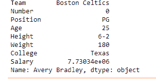

#### 使用`[.ix[]](https://www.geeksforgeeks.org/python-pandas-dataframe-ix/)`作为`[.iloc[]](https://www.geeksforgeeks.org/python-extracting-rows-using-pandas-iloc/)`选择单行

为了选择单行，我们可以将单个整数传递给`.ix[]`函数。如果我们在`.ix[]`函数中传递一个整数，这个函数类似于 iloc[]函数。

```py
# importing pandas package
import pandas as pd

# making data frame from csv file
data = pd.read_csv("nba.csv", index_col ="Name")

# retrieving row by ix method
first = data.ix[1]

print(first)
```

**输出:**
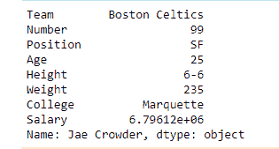

#### 数据框中的索引方法

| 功能 | 描述 |
| **[Dataframe.head()](https://www.geeksforgeeks.org/python-pandas-dataframe-series-head-method/)** | 返回数据帧的顶部 `n`行。 |
| **[【data frame . tail()](https://www.geeksforgeeks.org/python-pandas-dataframe-series-tail-method/)** | 返回数据帧的底部`n`行。 |
| **[数据框[]](https://www.geeksforgeeks.org/python-pandas-dataframe-at/)** | 访问行/列标签对的单个值。 |
| [Dataframe.iat[]](https://www.geeksforgeeks.org/python-pandas-dataframe-iat/) | 按整数位置访问行/列对的单个值。 |
| **[【data frame . tail()](https://www.geeksforgeeks.org/python-pandas-dataframe-series-tail-method/)** | 完全基于整数位置的索引，用于按位置选择。 |
| **DataFrame.lookup()** | 基于标签的数据帧“花式索引”功能。 |
| **[【data frame . pop()](https://www.geeksforgeeks.org/python-pandas-dataframe-pop/)** | 返回项目并从框架中删除。 |
| **数据帧. xs()** | 从数据框中返回横截面(行或列)。 |
| **[DataFrame.get()](https://www.geeksforgeeks.org/python-pandas-dataframe-get/)** | 从给定键的对象中获取项目(数据框列、面板切片等)。). |
| [DataFrame.isin()](https://www.geeksforgeeks.org/python-pandas-dataframe-isin/) | 返回布尔数据框，显示数据框中的每个元素是否包含在值中。 |
| **[数据框()](https://www.geeksforgeeks.org/python-pandas-dataframe-where/)** | 返回一个与自身形状相同的对象，其对应条目来自自身，条件为真，否则来自其他。 |
| **[【data frame . mask()](https://www.geeksforgeeks.org/python-pandas-dataframe-mask/)** | 返回一个与自身形状相同的对象，其对应条目来自自身，条件为假，否则来自其他。 |
| **[data frame . query()](https://www.geeksforgeeks.org/python-filtering-data-with-pandas-query-method/)** | 用布尔表达式查询框架的列。 |
| **[数据帧插入()](https://www.geeksforgeeks.org/python-pandas-dataframe-insert/)** | 将列插入指定位置的数据框。 |