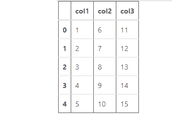
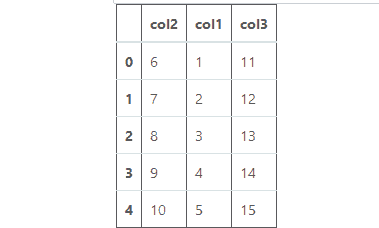

# 在熊猫数据框的特定位置插入给定的列

> 原文:[https://www . geeksforgeeks . org/insert-a-给定栏-特定位置-熊猫-dataframe/](https://www.geeksforgeeks.org/insert-a-given-column-at-a-specific-position-in-a-pandas-dataframe/)

在本文中，我们将使用 Pandas 的[**data frame . insert()**](https://www.geeksforgeeks.org/python-pandas-dataframe-insert/)方法在数据帧的特定列索引处插入一个新列。

> **语法:**数据框。插入(loc，列，值，allow_duplicates = False)
> 
> **返回:**无

**代码:**让我们创建一个数据帧。

## 蟒蛇 3

```py
# Importing pandas library
import pandas as pd

# dictionary
values = {'col2': [6, 7, 8, 
                   9, 10],
          'col3': [11, 12, 13,
                   14, 15]}

# Creating dataframe
df = pd.DataFrame(values)

# show the dataframe
df
```

**输出:**


**示例 1:** 在数据框的开头插入列。

## 蟒蛇 3

```py
# Importing pandas library
import pandas as pd

# dictionary
values = {'col2': [6, 7, 8, 
                   9, 10], 
          'col3': [11, 12, 13,
                   14, 15]}

# Creating dataframe
df = pd.DataFrame(values)

# New column to be added
new_col = [1, 2, 3, 4, 5] 

# Inserting the column at the
# beginning in the DataFrame
df.insert(loc = 0,
          column = 'col1',
          value = new_col)
# show the dataframe
df
```

**输出:**



**示例 2:** 在数据框的中间插入列

## 蟒蛇 3

```py
# Importing pandas library
import pandas as pd

# dictionary
values = {'col2': [6, 7, 8, 
                   9, 10], 
          'col3': [11, 12, 13,
                   14, 15]}

# Creating dataframe
df = pd.DataFrame(values)

# New column to be added
new_col = [1, 2, 3, 4, 5] 

# Inserting the column at the
# middle of the DataFrame
df.insert(loc = 1,
          column = 'col1',
          value = new_col)
# show the dataframe
df
```

**输出:**



**示例 3:** 在数据框的末尾插入列

## 蟒蛇 3

```py
# Importing pandas library
import pandas as pd

# dictionary
values = {'col2': [6, 7, 8, 
                   9, 10], 
          'col3': [11, 12, 13,
                   14, 15]}

# Creating dataframe
df = pd.DataFrame(values)

# New column to be added
new_col = [1, 2, 3, 4, 5] 

# Inserting the column at the
# end of the DataFrame
# df.columns gives index array 
# of column names
df.insert(loc = len(df.columns),
          column = 'col1',
          value = new_col)
# show the dataframe
df
```

**输出:**

