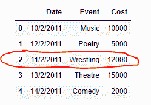

# 在熊猫数据框的给定位置插入行

> 原文:[https://www . geeksforgeeks . org/insert-row-给定熊猫位置-dataframe/](https://www.geeksforgeeks.org/insert-row-at-given-position-in-pandas-dataframe/)

在熊猫数据框中插入一行是一个非常直接的过程，我们已经在[中讨论了如何在数据框](https://www.geeksforgeeks.org/add-a-row-at-top-in-pandas-dataframe/)的开头插入行。现在，让我们讨论在具有基于整数的索引的数据帧中的任何位置插入行的方法。
**解决方案#1 :** 熊猫中不存在任何内置功能，可以帮助我们在给定数据框的任何特定位置插入一行。所以，我们要编写自己的定制函数来实现这个结果。
**注意:**在 Pandas Dataframe 的行之间插入行是一种低效的操作，用户应该避免。

## 蟒蛇 3

```
# importing pandas as pd
import pandas as pd

# Let's create the dataframe
df = pd.DataFrame({'Date':['10/2/2011', '12/2/2011', '13/2/2011', '14/2/2011'],
                    'Event':['Music', 'Poetry', 'Theatre', 'Comedy'],
                    'Cost':[10000, 5000, 15000, 2000]})

# Let's visualize the dataframe
print(df)
```

**输出:**


现在我们将编写一个定制的函数，在 dataframe 的任何给定位置插入一行。

## 蟒蛇 3

```
# Function to insert row in the dataframe
def Insert_row(row_number, df, row_value):
    # Starting value of upper half
    start_upper = 0

    # End value of upper half
    end_upper = row_number

    # Start value of lower half
    start_lower = row_number

    # End value of lower half
    end_lower = df.shape[0]

    # Create a list of upper_half index
    upper_half = [*range(start_upper, end_upper, 1)]

    # Create a list of lower_half index
    lower_half = [*range(start_lower, end_lower, 1)]

    # Increment the value of lower half by 1
    lower_half = [x.__add__(1) for x in lower_half]

    # Combine the two lists
    index_ = upper_half + lower_half

    # Update the index of the dataframe
    df.index = index_

    # Insert a row at the end
    df.loc[row_number] = row_value

    # Sort the index labels
    df = df.sort_index()

    # return the dataframe
    return df

# Let's create a row which we want to insert
row_number = 2
row_value = ['11/2/2011', 'Wrestling', 12000]

if row_number > df.index.max()+1:
    print("Invalid row_number")
else:

    # Let's call the function and insert the row
    # at the second position
    df = Insert_row(row_number, df, row_value)

    # Print the updated dataframe
    print(df)
```

**输出:**



如果给定的 row_number 无效，假设 dataframe 中的总行数为 100，那么 row_number 的最大值可以是 101，即在 dataframe 的最后添加一行。任何大于 101 的数字都会给出一条*错误*消息。

**示例 2:** 另一个自定义函数，它将使用 Pandas.concat()函数在数据框中的任何给定位置插入一行。

## 蟒蛇 3

```
# importing pandas as pd
import pandas as pd

# Let's create the dataframe
df = pd.DataFrame({'Date':['10/2/2011', '12/2/2011', '13/2/2011', '14/2/2011'],
                    'Event':['Music', 'Poetry', 'Theatre', 'Comedy'],
                    'Cost':[10000, 5000, 15000, 2000]})

# Let's visualize the dataframe
print(df)
```

**输出:**


在数据框中的任何给定位置插入一行的自定义函数。

## 蟒蛇 3

```
# Function to insert row in the dataframe
def Insert_row_(row_number, df, row_value):
    # Slice the upper half of the dataframe
    df1 = df[0:row_number]

    # Store the result of lower half of the dataframe
    df2 = df[row_number:]

    # Insert the row in the upper half dataframe
    df1.loc[row_number]=row_value

    # Concat the two dataframes
    df_result = pd.concat([df1, df2])

    # Reassign the index labels
    df_result.index = [*range(df_result.shape[0])]

    # Return the updated dataframe
    return df_result

# Let's create a row which we want to insert
row_number = 2
row_value = ['11/2/2011', 'Wrestling', 12000]

if row_number > df.index.max()+1:
    print("Invalid row_number")
else:

    # Let's call the function and insert the row
    # at the second position
    df = Insert_row_(2, df, row_value)

    # Print the updated dataframe
    print(df)
```

**输出:**

