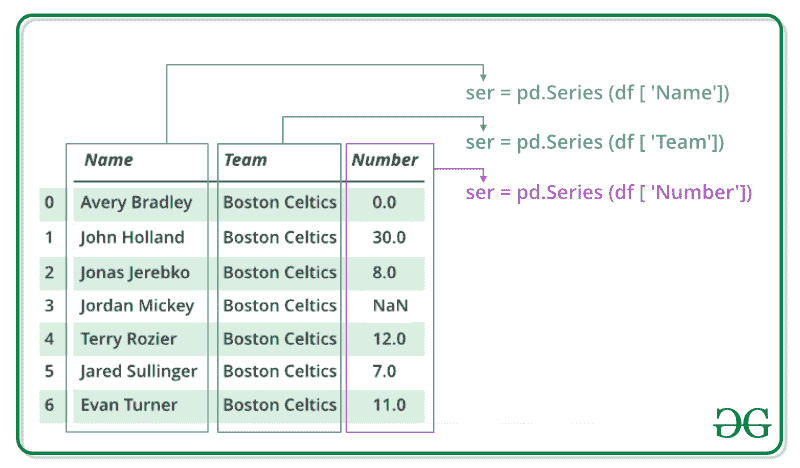
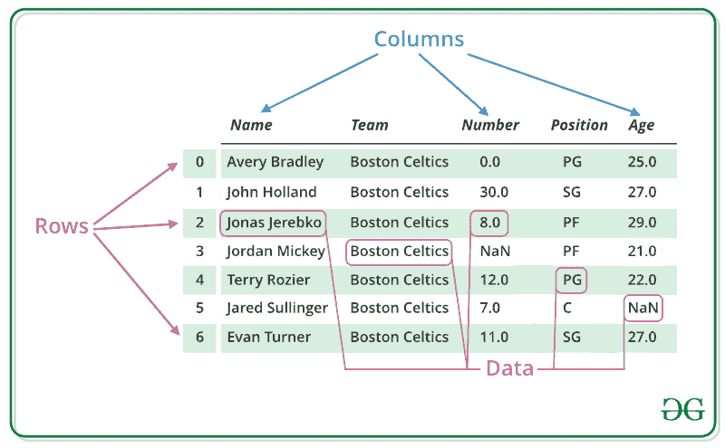

# 蟒蛇熊猫介绍

> 原文:[https://www . geesforgeks . org/python 中熊猫介绍/](https://www.geeksforgeeks.org/introduction-to-pandas-in-python/)

Pandas 是一个开源库，主要用于轻松直观地处理关系数据或标签数据。它提供各种数据结构和操作来处理数字数据和时间序列。这个库建立在数字图书馆的基础上。熊猫速度快，对用户来说性能和生产力都很高。

> **目录**:
> 
> *   [历史](#history)
> *   [优势](#advantages)
> *   [入门](#getting)
>     *   [系列](#series)
>     *   [数据帧](#dataframe)
> *   [为什么熊猫被用于数据科学](#why)

## 历史

熊猫最初是由韦斯·麦金尼在 2008 年在 AQR 资本管理公司工作时开发的。他说服 AQR 允许他开放熊猫的资源。2012 年，AQR 的另一名员工常社成为该图书馆的第二大贡献者。随着时间的推移，许多版本的熊猫已经发布。熊猫的最新版本是 1.3.4

## 优势

*   快速高效地操作和分析数据。
*   可以加载来自不同文件对象的数据。
*   轻松处理浮点和非浮点数据中的缺失数据(表示为 NaN)
*   大小可变:可以从数据框和更高维度的对象中插入和删除列
*   数据集合并和连接。
*   数据集的灵活整形和旋转
*   提供时序功能。
*   强大的分组功能，用于对数据集执行拆分-应用-合并操作。

## 入门指南

熊猫安装到系统后，您需要导入库。该模块通常导入为:

```
import pandas as pd
```

这里，pd 被称为熊猫的别名。但是，没有必要使用别名导入库，它只是有助于在每次调用方法或属性时编写更少的代码。

熊猫通常提供两种数据结构来处理数据，它们是:

*   **系列**
*   **数据帧**

### 系列:

[熊猫系列](https://www.geeksforgeeks.org/python-pandas-series/)是一个一维标签数组，能够保存任何类型的数据(整数、字符串、浮点、python 对象等)。).轴标签统称为索引。熊猫系列只不过是 excel 表格中的一列。标签不必是唯一的，但必须是可散列的类型。该对象支持整数索引和基于标签的索引，并提供了一系列方法来执行涉及索引的操作。



**注:**详见[蟒蛇|熊猫系列](https://www.geeksforgeeks.org/python-pandas-series/)

#### 创建系列

在现实世界中，熊猫系列将通过从现有存储中加载数据集来创建，存储可以是 SQL 数据库、CSV 文件、Excel 文件。熊猫系列可以从列表、字典和标量值等创建。

**示例:**

## 蟒蛇 3

```
import pandas as pd
import numpy as np

# Creating empty series
ser = pd.Series()

print(ser)

# simple array
data = np.array(['g', 'e', 'e', 'k', 's'])

ser = pd.Series(data)
print(ser)
```

**输出:**

```
Series([], dtype: float64)
0    g
1    e
2    e
3    k
4    s
dtype: object
```

**注:**更多信息请参考[打造熊猫系列](https://www.geeksforgeeks.org/creating-a-pandas-series/)

### 数据帧

[Pandas DataFrame](https://www.geeksforgeeks.org/python-pandas-dataframe/) 是一个二维大小可变、潜在异构的表格数据结构，带有标记轴(行和列)。数据框是一种二维数据结构，即数据以表格形式排列成行和列。熊猫数据框架由三个主要部分组成，即数据、行和列。



**注:**更多信息请参考 [Python |熊猫数据框](https://www.geeksforgeeks.org/python-pandas-dataframe/)

#### 创建数据帧:

在现实世界中，熊猫数据框架将通过从现有存储中加载数据集来创建，存储可以是 SQL 数据库、CSV 文件、Excel 文件。熊猫数据框架可以从列表、字典和字典列表等创建。

**示例:**

## 蟒蛇 3

```
import pandas as pd

# Calling DataFrame constructor
df = pd.DataFrame()
print(df)

# list of strings
lst = ['Geeks', 'For', 'Geeks', 'is', 
            'portal', 'for', 'Geeks']

# Calling DataFrame constructor on list
df = pd.DataFrame(lst)
print(df)
```

**输出:**

```
Empty DataFrame
Columns: []
Index: []
        0
0   Geeks
1     For
2   Geeks
3      is
4  portal
5     for
6   Geeks
```

**注:**更多信息，请参考[创建熊猫数据框](https://www.geeksforgeeks.org/creating-a-pandas-dataframe/)

## 为什么熊猫被用于数据科学

熊猫通常用于数据科学，但你有没有想过为什么？这是因为熊猫与其他用于数据科学的图书馆结合使用。它建立在 **NumPy** 库的顶部，这意味着 NumPy 的许多结构在熊猫中被使用或复制。熊猫生产的数据经常作为输入用于 **Matplotlib** 的绘图功能、 **SciPy** 中的统计分析、 **Scikit-learn** 中的机器学习算法。
Pandas 程序可以从任何文本编辑器中运行，但建议使用 Jupyter Notebook 进行此操作，因为 Jupyter 能够在特定单元格中执行代码，而不是执行整个文件。Jupyter 还提供了一种简单的方法来可视化熊猫数据框和地块。

**注:**关于 Jupyter 笔记本的更多信息，请参考[如何使用 Jupyter 笔记本-终极指南](https://www.geeksforgeeks.org/how-to-use-jupyter-notebook-an-ultimate-guide/)