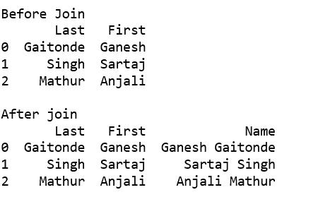

# 在 Pandas

中将两个文本列连接成一个单独的列

> 原文:[https://www . geesforgeks . org/join-two-text-columns-in-single-in-pandas/](https://www.geeksforgeeks.org/join-two-text-columns-into-a-single-column-in-pandas/)

让我们看看将两个文本列连接成一个列的不同方法。

**方法#1:使用 cat()函数**
我们在连接的时候也可以使用不同的分隔符。例如-、_、" "等。

```py
# importing pandas
import pandas as pd

df = pd.DataFrame({'Last': ['Gaitonde', 'Singh', 'Mathur'],
                   'First': ['Ganesh', 'Sartaj', 'Anjali']})

print('Before Join')
print(df, '\n')

print('After join')
df['Name'] = df['First'].str.cat(df['Last'], sep =" ")
print(df)
```

**输出:**


**方法 2:使用 lambda 函数**

此方法通过将 df[['First '，' Last']]替换为数据帧的任何列切片，例如 df.iloc[:，0:2]，来推广任意数量的字符串列。应用(λx:“”。join(x)，axis=1)。

```py
# importing pandas
import pandas as pd

df = pd.DataFrame({'Last': ['Gaitonde', 'Singh', 'Mathur'],
                   'First': ['Ganesh', 'Sartaj', 'Anjali']})

print('Before Join')
print(df, '\n')

print('After join')
df['Name'] = df[['First', 'Last']].apply(lambda x: ' '.join(x), axis = 1)
print(df)
```

**输出:**


**方法 3:使用+运算符**

我们需要在连接之前将数据框元素转换成字符串。我们还可以在连接过程中使用不同的分隔符，例如-、_、' '等。

```py
# importing pandas
import pandas as pd

df = pd.DataFrame({'Last': ['Gaitonde', 'Singh', 'Mathur'],
                   'First': ['Ganesh', 'Sartaj', 'Anjali']})

print('Before Join')
print(df, '\n')

print('After join')
df['Name']= df["First"].astype(str) +" "+ df["Last"]
print(df)
```

**输出:**
