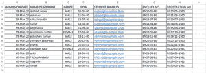
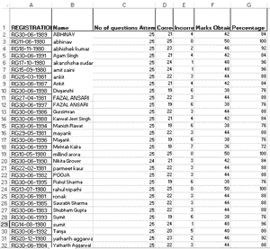
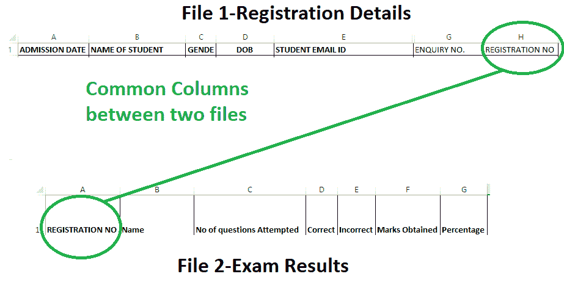
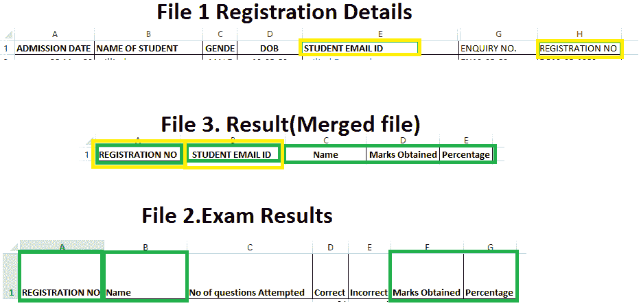
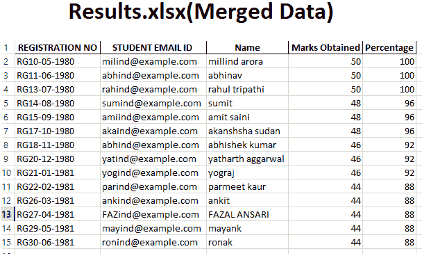

# 使用 Python 熊猫连接多个文件中的 Excel 数据

> 原文:[https://www . geesforgeks . org/joining-excel-数据-来自多个文件-使用-python-pandas/](https://www.geeksforgeeks.org/joining-excel-data-from-multiple-files-using-python-pandas/)

让我们看看如何连接两个 excel 文件的数据，并将合并后的数据保存为一个新的 Excel 文件。

我们有 2 个文件，`**registration details.xlsx**`和`**exam results.xlsx**`。

`**registration details.xlsx**`


我们在这个文件中有 7 列，有 14 个独特的学生详细信息。列名如下:

*   入院日期
*   学生姓名
*   性别
*   告发
*   学生电子邮件 Id
*   查询号码
*   注册号

`**exam results.xlsx**`


我们在这个文件中有 7 列，包含 32 个独特的学生详细信息。列名如下:

*   注册号
*   名字
*   尝试的问题数
*   正确的
*   错误的
*   获得的分数
*   百分率

您可以从以下链接下载这些文件:[报名详情. xlsx](https://drive.google.com/file/d/1il7uHi_qvy2J_TzMtOOyCrqh7AIK2IaW/view?usp=sharing) 和[考试成绩. xlsx](https://drive.google.com/file/d/18eBjPRHDQHzKUAPGgRBlc6eXdMeKxRVN/view?usp=sharing) 。

现在，让我们看看这两个文件之间的公共列:



所以 excel 文件之间的公共列是**注册号**。因此，我们需要合并这两个文件，这样新的 excel 文件将只保存所需的列，即:



**算法:**

1.  导入熊猫模块。
2.  使用`read_excel()`功能读取两个文件。
3.  使用`merge()`功能将它们组合起来。
4.  使用`to_excel()`功能，创建结果文件。

```py
# importing the module
import pandas

# reading the files
f1 = pandas.read_excel("registration details.xlsx")
f2 = pandas.read_excel("exam results.xlsx")

# merging the files
f3 = f1[["REGISTRATION NO", 
         "STUDENT EMAIL ID "]].merge(f2[["REGISTRATION NO", 
                                         "Name", "Marks Obtained", 
                                         "Percentage"]], 
                                     on = "REGISTRATION NO", 
                                     how = "left")

# creating a new file
f3.to_excel("Results.xlsx", index = False)
```

**输出:**
