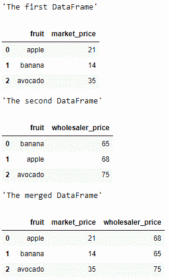
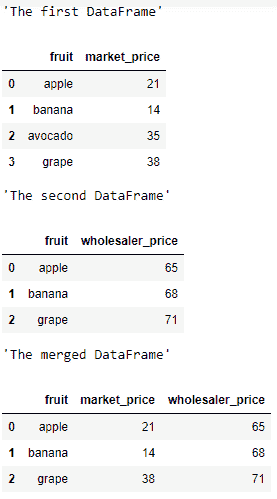
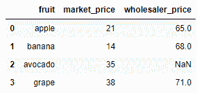
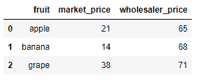

# 使用 merge()连接两个熊猫数据帧

> 原文:[https://www . geesforgeks . org/joining-two-pandas-data frames-using-merge/](https://www.geeksforgeeks.org/joining-two-pandas-dataframes-using-merge/)

让我们看看如何使用`**merge()**`功能连接两个熊猫数据帧。

## 合并()

> **语法:**数据帧合并(参数)
> 
> **参数:**
> 
> *   **右侧:**数据框或命名系列
> *   **如何:** { '左'，'右'，'外'，'内' }，默认'内'
> *   **在:**标签或列表上
> *   **left_on :** 标签或列表，或类似数组
> *   **right_on :** 标签或列表，或类似数组
> *   **左 _ 索引:** bool，默认 False
> *   **右 _ 索引:** bool，默认 False
> *   **排序:** bool，默认 False
> *   **后缀:**元组(str，str)，默认值(' _x '，' _y ')
> *   **副本:**布尔，默认真
> *   **指示器:**布尔值或字符串，默认为假
> *   **验证:**字符串，可选
> 
> **返回:**两个合并对象的数据帧。

**示例 1 :** 合并两个元素数量相同的数据帧:

```
# importing the module
import pandas as pd

# creating the first DataFrame
df1 = pd.DataFrame({"fruit" : ["apple", "banana", "avocado"],
                    "market_price" : [21, 14, 35]})
display("The first DataFrame")
display(df1)

# creating the second DataFrame
df2 = pd.DataFrame({"fruit" : ["banana", "apple", "avocado"],
                    "wholesaler_price" : [65, 68, 75]})
display("The second DataFrame")
display(df2)

# joining the DataFrames
display("The merged DataFrame")
pd.merge(df1, df2, on = "fruit", how = "inner")
```

**输出:**


**示例 2 :** 合并具有不同元素数量的两个数据帧:

```
# importing the module
import pandas as pd

# creating the first DataFrame
df1 = pd.DataFrame({"fruit" : ["apple", "banana", 
                               "avocado", "grape"],
                    "market_price" : [21, 14, 35, 38]})
display("The first DataFrame")
display(df1)

# creating the second DataFrame
df2 = pd.DataFrame({"fruit" : ["apple", "banana", "grape"],
                    "wholesaler_price" : [65, 68, 71]})
display("The second DataFrame")
display(df2)

# joining the DataFrames
# here both common DataFrame elements are in df1 and df2, 
# so it extracts apple, banana, grapes from df1 and df2.  
display("The merged DataFrame")
pd.merge(df1, df2, on = "fruit", how = "inner")
```

**输出:**


如果我们使用`how = "Outer"`，它将返回 df1 和 df2 中的所有元素，但是如果元素列为空，那么它将返回 NaN 值。

```
pd.merge(df1, df2, on = "fruit", how = "outer")
```

**输出:**


如果我们使用`how = "left"`，它会返回左侧数据框中存在的所有元素。

```
pd.merge(df1, df2, on = "fruit", how = "left")
```

**输出:**


如果我们使用`how = "right"`，它会返回出现在正确数据框中的所有元素。

```
pd.merge(df1, df2, on = "fruit", how = "right")
```

**输出:**
