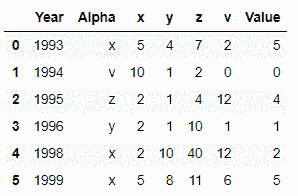
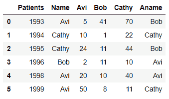
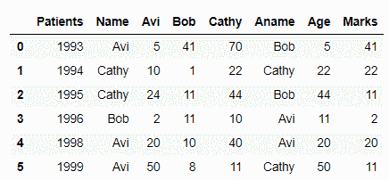
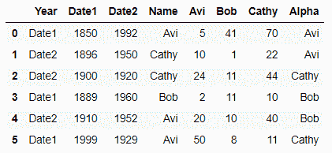
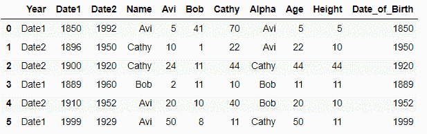

# 熊猫数据框的基于标签的索引

> 原文:[https://www . geesforgeks . org/基于标签的熊猫索引-dataframe/](https://www.geeksforgeeks.org/label-based-indexing-to-the-pandas-dataframe/)

索引在数据框中起着重要的作用。有时我们需要给熊猫数据框架一个基于标签的“花式索引”。为此，我们在熊猫中有一个功能被称为**熊猫。DataFrame.lookup()。**花式索引的概念很简单，也就是说，我们必须通过一个索引数组来一次访问多个数组元素。

**熊猫。DataFrame.lookup()** 函数将等长的行和列标签数组作为其属性，并返回对应于每个(行、列)对的值数组。

> **语法:**数据框查找(行标签，列标签)
> 
> **参数:**
> 行标签–用于查找的行标签。
> 列标签–用于查找的列标签。
> 
> **返回:**
> numpy.ndarray

**例 1:**

## 蟒蛇 3

```py
# importing pandas library
import pandas as pd

# Creating a Data frame
df = pd.DataFrame([['1993', 'x', 5, 4, 7, 2], 
                   ['1994', 'v', 10, 1, 2, 0],
                   ['1995', 'z', 2, 1, 4, 12],
                   ['1996', 'y', 2, 1, 10, 1], 
                   ['1998', 'x', 2, 10, 40, 12],
                   ['1999', 'x', 5, 8, 11, 6]], 
                  columns=('Year', 'Alpha', 'x', 'y', 'z', 'v'))

# Display Data frame
df
```

**输出:**


## 蟒蛇 3

```py
# Use concept of fancy indexing to make new 
# column 'Value' in data frame 
# with help of dataframe.lookup() function
df['Value'] = df.lookup(df.index, df['Alpha'])

# Modified Data frame
df
```

**输出:**



在上面的例子中，我们使用基于标签的花式索引的概念来一次访问数据帧的多个元素，并因此使用函数 **dataframe.lookup()** 创建一个新列“ **Value**

**例 2:**

## 蟒蛇 3

```py
# importing pandas library
import pandas as pd

# Creating a Data frame
df = pd.DataFrame([['1993', 'Avi', 5, 41, 70, 'Bob'], 
                   ['1994', 'Cathy', 10, 1, 22, 'Cathy'], 
                   ['1995', 'Cathy', 24, 11, 44, 'Bob'], 
                   ['1996', 'Bob', 2, 11, 10, 'Avi'], 
                   ['1998', 'Avi', 20, 10, 40, 'Avi'],
                   ['1999', 'Avi', 50, 8, 11, 'Cathy']],
                  columns=('Patients', 'Name', 'Avi', 'Bob', 'Cathy', 'Aname'))

# Display Data frame
df
```

**输出:**



## 蟒蛇 3

```py
# Use concept of fancy indexing to make two
# new columns in data frame with help of
# dataframe.lookup() function
df['Age'] = df.lookup(df.index, df['Name'])
df['Marks'] = df.lookup(df.index, df['Aname'])

# Modified Data frame
df
```

**输出:**



在上面的例子中，我们使用了基于标签的花式索引的概念来一次访问数据帧的多个元素，因此使用函数 **dataframe.lookup()** 创建了两个新列“ **Age** ”和“ **Marks**

**例 3:**

## 蟒蛇 3

```py
# importing pandas library
import pandas as pd

# Creating a Data frame
df = pd.DataFrame([['Date1', 1850, 1992,'Avi', 5, 41, 70, 'Avi'],
                   ['Date2', 1896, 1950, 'Cathy', 10, 1, 22, 'Avi'], 
                   ['Date2', 1900, 1920, 'Cathy', 24, 11, 44, 'Cathy'], 
                   ['Date1', 1889, 1960, 'Bob', 2, 11, 10, 'Bob'], 
                   ['Date2', 1910, 1952, 'Avi', 20, 10, 40, 'Bob'],
                   ['Date1', 1999, 1929, 'Avi', 50, 8, 11, 'Cathy']], 
                  columns=('Year', 'Date1', 'Date2', 'Name', 'Avi', 
                           'Bob', 'Cathy', 'Alpha'))

# Display Data frame
df
```

**输出:**



## 蟒蛇 3

```py
# Use concept of fancy indexing to make two 
# three columns in data frame with help of
# dataframe.lookup() function
df['Age'] = df.lookup(df.index, df['Name'])
df['Height'] = df.lookup(df.index, df['Alpha'])
df['Date_of_Birth'] = df.lookup(df.index, df['Year'])

# Modified Data frame
df
```

**输出:**



在上面的例子中，我们使用了基于标签的花式索引的概念来一次访问数据帧的多个元素，因此使用函数 **dataframe.lookup()** 创建了两个新列“ **Age** ”、“ **Height** 和“**Date _ of _ 出生日期**

这三个例子都展示了花式索引是如何工作的，以及我们如何使用花式索引和 dataframe.lookup()函数创建新的列。