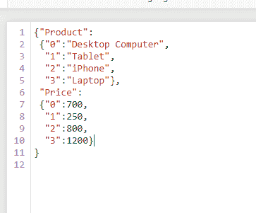
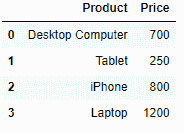
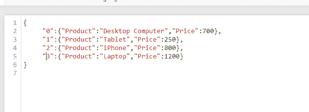
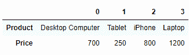
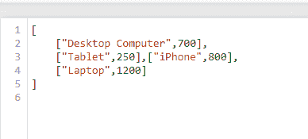
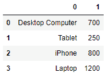
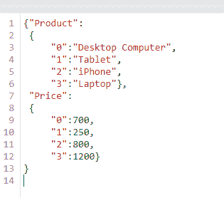
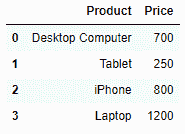

# 将 JSON 字符串加载到熊猫数据框

> 原文:[https://www . geesforgeks . org/load-JSON-string-into-pandas-data frame/](https://www.geeksforgeeks.org/load-json-string-into-pandas-dataframe/)

让我们看看如何在熊猫数据框中使用 JSON 格式的数据集。这可以使用内置的 **`read_json()`** 功能来完成。它使我们能够阅读熊猫数据框中的 JSON。

**示例:**考虑 JSON 文件路径 _to_json.json :



path_to_json.json

```
# importing the module
import pandas

# reading the file
data = df.read_json("path_to_json.json")

# displaying the DataFrame
print(data)
```

**输出:**



现在，最终的数据帧也取决于 JSON 文件的类型。所以 JSON 中主要有 3 种取向:

*   面向索引
*   价值导向
*   面向列

**1。** **指数导向**

这是一个面向索引的 JSON 文件的例子。



```
# importing the module
import pandas

# reading the file
data = df.read_json("sample.json")

# displaying the DataFrame
print(data)
```

**输出:**



**2。** **价值导向**

这是一个面向值的 JSON 文件的例子。



```
# importing the module
import pandas

# reading the file
data = df.read_json("sample.json")

# displaying the DataFrame
print(data)
```

**输出:**



**3。** **列向**

这是一个面向列的 JSON 文件的例子。



```
# importing the module
import pandas

# reading the file
data = df.read_json("sample.json")

# displaying the DataFrame
print(data)
```

**输出:**

