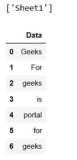

# 将 Excel 电子表格加载为熊猫数据框

> 原文:[https://www . geesforgeks . org/loading-excel-电子表格-as-pandas-dataframe/](https://www.geeksforgeeks.org/loading-excel-spreadsheet-as-pandas-dataframe/)

熊猫是一个非常强大和可扩展的数据分析工具。它支持多种文件格式，因为我们可以得到任何格式的数据。熊猫也支持 excel 文件格式。

我们首先需要导入 Pandas 并加载 excel 文件，然后将 excel 文件表解析为 Pandas 数据帧。

```
import pandas as pd

# Import the excel file and call it xls_file
excel_file = pd.ExcelFile('pandasEx.xlsx')

# View the excel_file's sheet names
print(excel_file.sheet_names)

# Load the excel_file's Sheet1 as a dataframe
df = excel_file.parse('Sheet1')
print(df)
```

**输出:**


也可以使用`read_excel()`方法的“`usecols`”参数读取特定的列。

```
# import pandas lib as pd 
import pandas as pd 

require_cols = [0, 3] 

# only read specific columns from an excel file 
required_df = pd.read_excel('SampleWork2.xlsx', usecols = require_cols) 

print(required_df) 
```

**输出:**

```
        Name  Percentage
0      Ankit          95
1      Rahul          90
2    Shaurya          85
3  Aishwarya          80
4   Priyanka          75
```

更多示例，请参考[https://www . geeksforgeeks . org/creating-a-data frame-use-excel-files/](http://Creating a dataframe using Excel files)