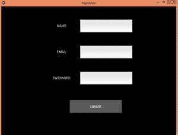
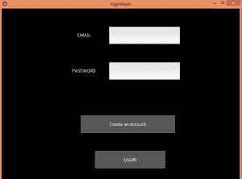
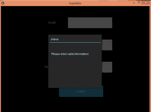
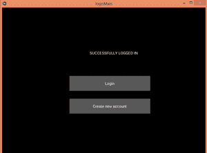

# 使用 Python 中的 Kivy GUI 和 Pandas 登录应用程序并验证信息

> 原文:[https://www . geesforgeks . org/log in-application-and-validating-info-using-kivy-GUI-and-pandas-in-python/](https://www.geeksforgeeks.org/login-application-and-validating-info-using-kivy-gui-and-pandas-in-python/)

**前提条件:**[【kivy】](https://www.geeksforgeeks.org/kivy-tutorial/)[熊猫](https://www.geeksforgeeks.org/python-pandas-dataframe/)

Kivy 是一个多平台图形用户界面库，以反应灵敏而闻名。它在单个应用程序中提供对多个屏幕的管理。

在这个应用程序中，我们将使用多个屏幕来登录用户信息并验证它。我们将把信息保存在一个 csv 文件中，并使用 pandas 通过将信息读入一个 DataFrame 来验证 csv 文件内部的信息。为了构建我们将使用的图形用户界面。kv 文件。

**进场:**

1.  将有三个屏幕，一个用于让用户登录，第二个用于注册，第三个用于告知登录是否成功。
2.  信息将存储在 csv 文件中。
3.  熊猫库将用于将 csv 文件读入数据帧，并进一步检查用户信息是否已经存在。
4.  如果输入的信息无效，弹出窗口将通知用户。
5.  最后，用户将被告知登录是否成功。

**主程序:**

```
# import all the relevant classes
from kivy.app import App
from kivy.uix.widget import Widget
from kivy.uix.screenmanager import ScreenManager, Screen
from kivy.properties import ObjectProperty
from kivy.lang import Builder
from kivy.uix.popup import Popup
from kivy.uix.floatlayout import FloatLayout
import pandas as pd

# class to call the popup function
class PopupWindow(Widget):
    def btn(self):
        popFun()

# class to build GUI for a popup window
class P(FloatLayout):
    pass

# function that displays the content
def popFun():
    show = P()
    window = Popup(title = "popup", content = show,
                   size_hint = (None, None), size = (300, 300))
    window.open()

# class to accept user info and validate it
class loginWindow(Screen):
    email = ObjectProperty(None)
    pwd = ObjectProperty(None)
    def validate(self):

        # validating if the email already exists 
        if self.email.text not in users['Email'].unique():
            popFun()
        else:

            # switching the current screen to display validation result
            sm.current = 'logdata'

            # reset TextInput widget
            self.email.text = ""
            self.pwd.text = ""

# class to accept sign up info  
class signupWindow(Screen):
    name2 = ObjectProperty(None)
    email = ObjectProperty(None)
    pwd = ObjectProperty(None)
    def signupbtn(self):

        # creating a DataFrame of the info
        user = pd.DataFrame([[self.name2.text, self.email.text, self.pwd.text]],
                            columns = ['Name', 'Email', 'Password'])
        if self.email.text != "":
            if self.email.text not in users['Email'].unique():

                # if email does not exist already then append to the csv file
                # change current screen to log in the user now 
                user.to_csv('login.csv', mode = 'a', header = False, index = False)
                sm.current = 'login'
                self.name2.text = ""
                self.email.text = ""
                self.pwd.text = ""
        else:
            # if values are empty or invalid show pop up
            popFun()

# class to display validation result
class logDataWindow(Screen):
    pass

# class for managing screens
class windowManager(ScreenManager):
    pass

# kv file
kv = Builder.load_file('login.kv')
sm = windowManager()

# reading all the data stored
users=pd.read_csv('login.csv')

# adding screens
sm.add_widget(loginWindow(name='login'))
sm.add_widget(signupWindow(name='signup'))
sm.add_widget(logDataWindow(name='logdata'))

# class that builds gui
class loginMain(App):
    def build(self):
        return sm

# driver function
if __name__=="__main__":
    loginMain().run()
```

**。kv 档:**。kv 文件包含设计和放置 GUI 以及定义屏幕转换方向的所有代码。

```
# there are three screens
windowManager:
    loginWindow:
    signupWindow:
    logDataWindow:

# GUI for the login window
<loginWindow>:
    email : email
    pwd : pwd
    FloatLayout:
        size: root.width, root.height
        Label:
            text : "EMAIL: "
            size_hint : 0.2, 0.1
            pos_hint : {"x":0.25, "top":0.9}
        TextInput:
            id : email
            multiline :False
            size_hint : 0.3, 0.1
            pos_hint : {"x" : 0.45, "top" : 0.9}
        Label:
            text : "PASSWORD: "
            size_hint : 0.2, 0.1
            pos_hint : {"x" : 0.25, "top" : 0.7}
        TextInput:
            id : pwd
            multiline :False
            size_hint : 0.3, 0.1
            pos_hint : {"x" : 0.45, "top" : 0.7}
        Button:
            text : "Create an account"
            size_hint : 0.4, 0.1
            pos_hint : {"x" : 0.33, "top" : 0.4}
            on_release: 
                app.root.current = 'signup'
                root.manager.transition.direction = "left"
        Button:
            text : "LOGIN"
            size_hint : 0.3, 0.1
            pos_hint : {"x" : 0.39, "top" : 0.2}
            on_release: 
                root.validate()
                root.manager.transition.direction = "up"

# GUI for the signup window
<signupWindow>:
    name2 : name2
    email : email
    pwd : pwd
    FloatLayout:
        Label:
            text : "NAME: "
            size_hint : 0.2, 0.1
            pos_hint : {"x":0.25, "top":0.9}
        TextInput:
            id : name2
            multiline : False
            size_hint : 0.3, 0.1
            pos_hint : {"x" : 0.45, "top" : 0.9}
        Label:
            text : "EMAIL: "
            size_hint : 0.2, 0.1
            pos_hint : {"x" : 0.25, "top" : 0.7}
        TextInput:
            id : email
            multiline : False
            size_hint : 0.3, 0.1
            pos_hint : {"x" : 0.45, "top" : 0.7}
        Label:
            text : "PASSWORD: "
            size_hint : 0.2, 0.1
            pos_hint : {"x" : 0.25, "top" : 0.5}
        TextInput:
            id : pwd
            multiline : False
            size_hint : 0.3, 0.1
            pos_hint : {"x" : 0.45, "top" : 0.5}
        Button:
            text : "SUBMIT"
            size_hint : 0.3, 0.1
            pos_hint : {"x" : 0.39, "top" : 0.28}
            on_press :
                root.signupbtn()
                root.manager.transition.direction = "right"

# GUI to show validation result
<logDataWindow>:
    info : info
    FloatLayout:
        Label:
            id : info
            size_hint : 0.8, 0.2
            pos_hint : {"x" : 0.15, "top" : 0.8}
            text : "SUCCESSFULLY LOGGED IN"
        Button:
            text : "Login"
            size_hint : 0.4, 0.1
            pos_hint : {"x" : 0.33, "top" : 0.55}
            on_release: 
                app.root.current = 'login'
                root.manager.transition.direction = "down"
        Button:
            text : "Create new account"
            size_hint : 0.4, 0.1
            pos_hint : {"x" : 0.33, "top" : 0.4}
            on_release: 
                app.root.current = 'signup'
                root.manager.transition.direction = "down"

# GUI for pop up window
<P>:
    Label:
        text : "Please enter valid information"
        size_hint : 0.2, 0.1
        pos_hint : {"x" : 0.3, "top" : 0.8}
```

**输出:**

**注册窗口:**



**登录窗口:**



**弹出窗口：**



**验证:**



<video class="wp-video-shortcode" id="video-457633-1" width="640" height="360" preload="metadata" controls=""><source type="video/mp4" src="https://media.geeksforgeeks.org/wp-content/uploads/20200720010817/kivy.mp4?_=1">[https://media.geeksforgeeks.org/wp-content/uploads/20200720010817/kivy.mp4](https://media.geeksforgeeks.org/wp-content/uploads/20200720010817/kivy.mp4)</video>