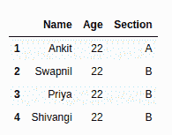
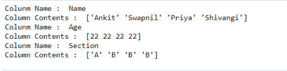
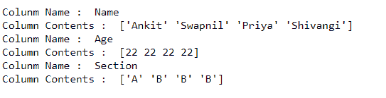
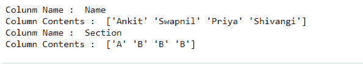
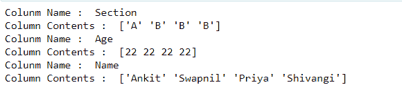
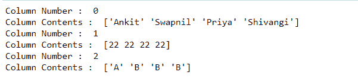

# 在 Python 中循环或迭代数据框的所有或某些列-熊猫

> 原文:[https://www . geesforgeks . org/loop-or-iterate-over-all-or-seven-columns-of-a-data frame-in-python-pandas/](https://www.geeksforgeeks.org/loop-or-iterate-over-all-or-certain-columns-of-a-dataframe-in-python-pandas/)

在本文中，我们将讨论如何循环或迭代数据框的全部或某些列？有各种各样的方法来完成这项任务。
我们先创建一个数据框，看看:
**代码:**

## 蟒蛇 3

```py
# import pandas package
import pandas as pd

# List of Tuples
students = [('Ankit', 22, 'A'),
           ('Swapnil', 22, 'B'),
           ('Priya', 22, 'B'),
           ('Shivangi', 22, 'B'),
            ]
# Create a DataFrame object
stu_df = pd.DataFrame(students, columns =['Name', 'Age', 'Section'],
                      index =['1', '2', '3', '4'])

stu_df
```

**输出:**



现在让我们来看看迭代数据框的某些列的不同方式:
**方法#1:** **使用** [**数据框. iteritems()**](https://www.geeksforgeeks.org/python-pandas-series-iteritems/)**:**
数据框类提供了一个成员函数 ITER items()，它给出了一个迭代器，可以用来迭代数据框的所有列。对于数据帧中的每一列，它都返回一个包含列名及其内容的元组的迭代器。
**代码:**

## 蟒蛇 3

```py
import pandas as pd

# List of Tuples
students = [('Ankit', 22, 'A'),
           ('Swapnil', 22, 'B'),
           ('Priya', 22, 'B'),
           ('Shivangi', 22, 'B'),
            ]

# Create a DataFrame object
stu_df = pd.DataFrame(students, columns =['Name', 'Age', 'Section'],
                      index =['1', '2', '3', '4'])

# gives a tuple of column name and series
# for each column in the dataframe
for (columnName, columnData) in stu_df.iteritems():
    print('Column Name : ', columnName)
    print('Column Contents : ', columnData.values)
```

**输出:**



**方法#2:** **使用[ ]运算符:**
我们可以迭代列名并选择所需的列。
**代码:**

## 蟒蛇 3

```py
import pandas as pd

# List of Tuples
students = [('Ankit', 22, 'A'),
           ('Swapnil', 22, 'B'),
           ('Priya', 22, 'B'),
           ('Shivangi', 22, 'B'),
            ]

# Create a DataFrame object
stu_df = pd.DataFrame(students, columns =['Name', 'Age', 'Section'],
                      index =['1', '2', '3', '4'])

# Iterate over column names
for column in stu_df:

    # Select column contents by column
    # name using [] operator
    columnSeriesObj = stu_df[column]
    print('Column Name : ', column)
    print('Column Contents : ', columnSeriesObj.values)
```

**输出:**



**方法#3:** **迭代多个列:**
假设我们需要迭代多个列。为此，我们可以从 dataframe 中选择一个以上的列，并对其进行迭代。
**代码:**

## 蟒蛇 3

```py
import pandas as pd

# List of Tuples
students = [('Ankit', 22, 'A'),
           ('Swapnil', 22, 'B'),
           ('Priya', 22, 'B'),
           ('Shivangi', 22, 'B'),
            ]

# Create a DataFrame object
stu_df = pd.DataFrame(students, columns =['Name', 'Age', 'Section'],
                      index =['1', '2', '3', '4'])

# Iterate over two given columns
# only from the dataframe
for column in stu_df[['Name', 'Section']]:

    # Select column contents by column  
    # name using [] operator
    columnSeriesObj = stu_df[column]
    print('Column Name : ', column)
    print('Column Contents : ', columnSeriesObj.values)
```

**输出:**



**方法#4:** **以相反的顺序迭代列:**
我们也可以以相反的顺序迭代列。
**代码:**

## 蟒蛇 3

```py
import pandas as pd

# List of Tuples
students = [('Ankit', 22, 'A'),
           ('Swapnil', 22, 'B'),
           ('Priya', 22, 'B'),
           ('Shivangi', 22, 'B'),
            ]

# Create a DataFrame object
stu_df = pd.DataFrame(students, columns =['Name', 'Age', 'Section'],
                       index =['1', '2', '3', '4'])

# Iterate over the sequence of column names
# in reverse order
for column in reversed(stu_df.columns):

    # Select column contents by column
    # name using [] operator
    columnSeriesObj = stu_df[column]
    print('Column Name : ', column)
    print('Column Contents : ', columnSeriesObj.values)
```

**输出:**



**方法#5:** **使用索引(**[**【iloc】**](https://www.geeksforgeeks.org/python-extracting-rows-using-pandas-iloc/)**):**
要按索引迭代数据框的列，我们可以迭代一个范围，即从 0 到最大列数，对于每个索引，我们可以使用 iloc[]选择列的内容。
**代码:**

## 蟒蛇 3

```py
import pandas as pd

# List of Tuples
students = [('Ankit', 22, 'A'),
           ('Swapnil', 22, 'B'),
           ('Priya', 22, 'B'),
           ('Shivangi', 22, 'B'),
            ]

# Create a DataFrame object
stu_df = pd.DataFrame(students, columns =['Name', 'Age', 'Section'],
                      index =['1', '2', '3', '4'])

# Iterate over the index range from
# 0 to max number of columns in dataframe
for index in range(stu_df.shape[1]):

    print('Column Number : ', index)

    # Select column by index position using iloc[]
    columnSeriesObj = stu_df.iloc[:, index]
    print('Column Contents : ', columnSeriesObj.values)
```

**输出:**

