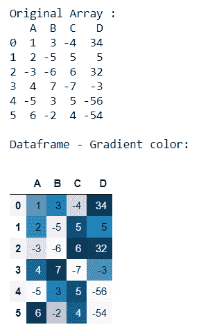
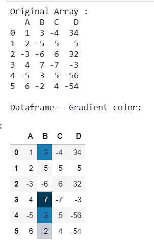
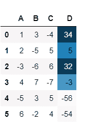

# 在熊猫

中的指定列上进行渐变颜色映射

> 原文:[https://www . geesforgeks . org/make-a-gradient-color-mapping-on-specified-column-in-pandas/](https://www.geeksforgeeks.org/make-a-gradient-color-mapping-on-a-specified-column-in-pandas/)

让我们看看如何在熊猫数据帧的特定列上进行渐变颜色映射。我们可以使用 Styler 类的**Styler . background _ gradient()**函数来实现。

> **语法**:styler . background _ gradient(cmap = ' PuBu '，低=0，高=0，轴=0，子集=无)
> 
> **参数:**
> 
> **cmap** : str 或 colormap (matplotlib colormap)
> 
> **低，高**:浮动(用这些值压缩范围。)
> 
> **轴** : int 或 str (1 或' columns '表示 columns，0 或' index '表示 rowwise)
> 
> **子集**:索引切片(将样式应用限制到的有效数据切片)
> 
> **返回**:自我

**进场:**

*   导入熊猫模块
*   创建数据帧
*   明智地选择带有 style.background_gradient()函数的特定列
*   显示数据帧

让我们用例子来理解:

**例 1 :**

创建一个数据框并渐变所有列。

## 蟒蛇 3

```
# importing pandas module
import pandas as pd

# Creating pandas DataFrame
df = pd.DataFrame({"A": [1, 2, -3, 4, -5, 6],
                   "B": [3, -5, -6, 7, 3, -2],
                   "C": [-4, 5, 6, -7, 5, 4],
                   "D": [34, 5, 32, -3, -56, -54]})

# Displaying the original DataFrame
print("Original Array : ")
print(df)

# backgroung color mapping
print("\nDataframe - Gradient color:")
df.style.background_gradient()
```

**输出:**



**例 2 :**

创建一个数据框，并对特定的列进行渐变

## 蟒蛇 3

```
# importing pandas module
import pandas as pd

# Creating pandas DataFrame
df = pd.DataFrame({"A": [1, 2, -3, 4, -5, 6],
                   "B": [3, -5, -6, 7, 3, -2],
                   "C": [-4, 5, 6, -7, 5, 4],
                   "D": [34, 5, 32, -3, -56, -54]})

# Displaying the original DataFrame
print("Original Array : ")
print(df)

# backgroung color mapping
print("\nDataframe - Gradient color:")

# df.style.background_gradient()
df.style.background_gradient(subset='B')
```

**输出:**



如果您想更改另一列

## 蟒蛇 3

```
df.style.background_gradient(subset='D')
```

**输出:**



,