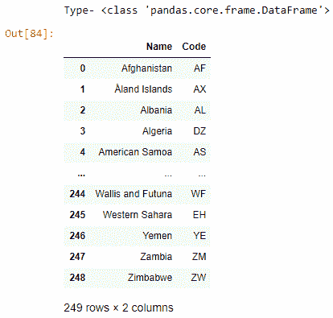
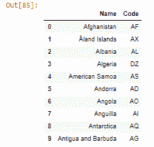

# 用熊猫操纵数据帧–蟒蛇

> 原文:[https://www . geesforgeks . org/operating-data frames-with-pandas-python/](https://www.geeksforgeeks.org/manipulating-dataframes-with-pandas-python/)

在用熊猫操纵数据帧之前，我们必须了解什么是数据操纵。现实世界中的数据是非常令人不快的&无序的，因此通过执行某些操作，我们可以根据自己的需求使数据变得可理解，这种将无序数据转换为有意义信息的过程可以通过数据操作来完成。

在这里，我们将学习如何操纵熊猫的数据帧。Pandas 是一个开源库，用于从数据操作到数据分析&是一个非常强大、灵活和易于使用的工具，可以使用 import pandas 作为 pd 导入。熊猫主要处理一维和二维数组中的数据；虽然，熊猫处理这两个不同。在熊猫中，一维数组被描述为一系列&数据帧只是一个二维数组。这里使用的数据集是 [country_code.csv](https://media.geeksforgeeks.org/wp-content/cdn-uploads/20210331113624/country_code.csv) 。

**以下是用于操作数据框的各种操作:**

*   首先，导入用于数据操作的库，即 pandas，然后分配和读取数据帧:

## 蟒蛇 3

```py
# import module
import pandas as pd

# assign dataset
df = pd.read_csv("country_code.csv")

# display
print("Type-", type(df))
df
```

**输出:**



*   我们可以通过使用 **head()** 函数读取数据帧，该函数也有一个参数(n)，即要显示的行数。

## 蟒蛇 3

```py
df.head(10)
```

**输出:**



*   使用**形状()计算数据框中的行和列。**返回元组中包含的行数和列数。

## 蟒蛇 3

```py
df.shape
```