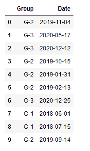
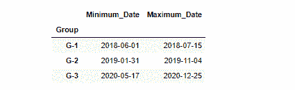

# 熊猫组的最大和最小日期

> 原文:[https://www . geesforgeks . org/max-and-min-in-pandas-group by/](https://www.geeksforgeeks.org/max-and-min-date-in-pandas-groupby/)

**先决条件:**T2】熊猫

熊猫团购功能非常强大。该函数能够将数据集分成不同的组进行分析。

**语法:**

```
dataframe.groupby([column names])
```

除了 groupby 函数，我们还可以使用熊猫库的 agg()函数。Agg()函数聚合用于在数据集中查找最小值、最大值、平均值和的数据。

**语法:**

> dataframe.agg(以键作为列名的字典)

### 方法:

*   导入模块
*   创建或加载数据
*   对所需的列使用 GroupBy 函数
*   然后在日期列上使用 agg()函数。
*   显示结果

**使用中的数据框:**



**程序:**

## 蟒蛇 3

```
import pandas as pd
import numpy as np

# Creating Dataframe
dataset = {'Group': ['G-2', 'G-3', 'G-3', 'G-2', 'G-2', 
                     'G-2', 'G-3', 'G-1', 'G-1', 'G-2'],

           'Date': ['2019-11-04', '2020-05-17', '2020-12-12', 
                    '2019-10-15', '2019-01-31', '2019-02-13',
                    '2020-12-25', '2018-06-01', '2018-07-15',
                    '2019-09-14']}

dataset = pd.DataFrame(dataset, columns=['Group', 'Date'])

# using groupby() function on Group column
df = dataset.groupby(['Group'])

# using agg() function on Date column
df2 = df.agg(Minimum_Date=('Date', np.min), Maximum_Date=('Date', np.max))

# Displaying result
display(df2)
```

**输出:**

