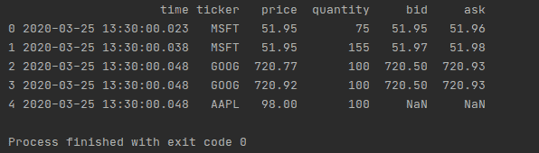
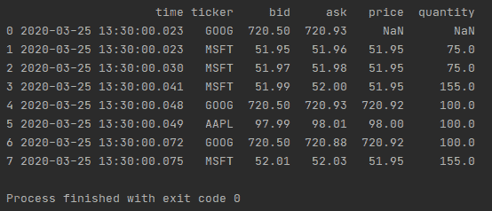
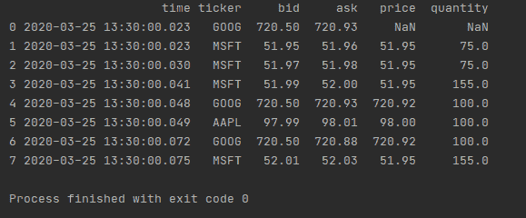
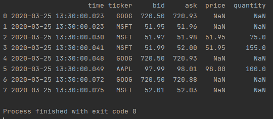
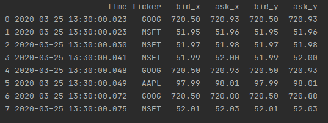

# 基于最接近的日期时间

合并两个熊猫数据帧

> 原文:[https://www . geesforgeks . org/merge-two-pandas-data frames-based-on-close-datetime/](https://www.geeksforgeeks.org/merge-two-pandas-dataframes-based-on-closest-datetime/)

在本文中，我们将讨论如何基于最近的日期时间合并熊猫数据帧。要了解如何合并数据帧，首先你必须了解如何创建一个数据帧，你必须参考文章 [**创建熊猫数据帧**](https://www.geeksforgeeks.org/creating-a-pandas-dataframe/) **。**创建数据帧后，需要合并它们，为了合并数据帧，有一个名为 *merge_asof()* 的函数，当写这个时，它可以写成:

> pandas.merge_asof(左，右，on=无，左 _ on =无，右 _ on =无，左 _ index =假，右 _ index =假，by =无，左 _ by =无，右 _ by =无，后缀=('_x '，' _y ')，容差=无，允许 _ 精确 _ 匹配=真，方向= '向后')

**注:**

*   要了解更多关于此功能的信息，请参考 Python 中的文章**[**pandas . merge _ asof()函数**](https://www.geeksforgeeks.org/pandas-merge_asof-function-in-python/)**
*   **数据帧必须按关键字排序。**

### **逐步方法**

****第一步:**导入熊猫库**

**为了完成这个任务，我们必须导入名为熊猫的库。**

```
import pandas as pd
```

****步骤 2:** 创建数据框**

**在这一步中，我们必须使用函数“pd”创建数据帧。DataFrame()”。在本例中，我们创建了两个数据框，一个命名为左，另一个命名为右，因为我们的最后一个目标是基于最接近的日期时间合并两个数据框。它可以写成:**

> **左= pd。data frame({ 0**
> 
> **"时间":[pd。时间戳(“2020-03-25 13:30:00.023”)，**
> 
> **警局。时间戳(“2020-03-25 13:30:00.023”)，**
> 
> **警局。时间戳(“2020-03-25 13:30:00.030”)，**
> 
>  **警局。时间戳(“2020-03-25 13:30:00.041”)，
> 
> 警局。时间戳(“2020-03-25 13:30:00.048”)，
> 
> 警局。时间戳(“2020-03-25 13:30:00.049”)，
> 
> 警局。时间戳(“2020-03-25 13:30:00.072”)，
> 
> 警局。时间戳(“2020-03-25 13:30:00.075”)
> 
> ],
> 
> “ticker”:[“GOOG”、“MSFT”、“MSFT”、“MSFT”、“GOOG”、“AAPL”、“GOOG”、“MSFT”]，
> 
> “投标”:[720.50、51.95、51.97、51.99、720.50、97.99、720.50、52.01]，
> 
> “询问”:[720.93、51.96、51.98、52.00、720.93、98.01、720.88、52.03]
> 
> })
> 
> 右= pd。data frame({ 0
> 
> “时间”:[
> 
> 警局。时间戳(“2020-03-25 13:30:00.023”)，
> 
> 警局。时间戳(“2020-03-25 13:30:00.038”)，
> 
> 警局。时间戳(“2020-03-25 13:30:00.048”)，
> 
> 警局。时间戳(“2020-03-25 13:30:00.048”)，
> 
> 警局。时间戳(“2020-03-25 13:30:00.048”)
> 
> ],
> 
> 股票代码:[“MSFT”、“MSFT”、“谷歌”、“谷歌”、“AAPL”]，
> 
> “价格”:[51.95，51.95，720.77，720.92，98.0]，
> 
> 【数量】:75，155，100，100，100
> 
> })**

****步骤 3:** 合并数据帧并打印它们**

**在这一步中，将使用函数“pd.merge_asof()”合并数据帧。merge_asof()函数的结果存储在一个变量中，然后使用“print()”打印该变量。**

## **蟒蛇 3**

```
# Importing the required package
import pandas as pd

# Creating the DataFrame of left side
left = pd.DataFrame({

    "time": [pd.Timestamp("2020-03-25 13:30:00.023"),
             pd.Timestamp("2020-03-25 13:30:00.023"),
             pd.Timestamp("2020-03-25 13:30:00.030"),
             pd.Timestamp("2020-03-25 13:30:00.041"),
             pd.Timestamp("2020-03-25 13:30:00.048"),
             pd.Timestamp("2020-03-25 13:30:00.049"),
             pd.Timestamp("2020-03-25 13:30:00.072"),
             pd.Timestamp("2020-03-25 13:30:00.075")
             ],

    "ticker": ["GOOG", "MSFT", "MSFT", "MSFT", "GOOG",
               "AAPL", "GOOG", "MSFT"],

    "bid": [720.50, 51.95, 51.97, 51.99, 720.50, 97.99,
            720.50, 52.01],

    "ask": [720.93, 51.96, 51.98, 52.00, 720.93, 98.01,
            720.88, 52.03]
})

# Creating the Dataframe of right side
right = pd.DataFrame({
    "time": [
        pd.Timestamp("2020-03-25 13:30:00.023"),
        pd.Timestamp("2020-03-25 13:30:00.038"),
        pd.Timestamp("2020-03-25 13:30:00.048"),
        pd.Timestamp("2020-03-25 13:30:00.048"),
        pd.Timestamp("2020-03-25 13:30:00.048")
    ],
    "ticker": ["MSFT", "MSFT", "GOOG", "GOOG", "AAPL"],

    "price": [51.95, 51.95, 720.77, 720.92, 98.0],

    "quantity": [75, 155, 100, 100, 100]
})

# Applying merge_asof on data and store it
# in a variable
merged_dataframe = pd.merge_asof(right, left, on="time",
                                 by="ticker")

# print the variable
print(merged_dataframe)
```

****输出:****

****

****示例 1:** 现在我们在 merge_asof 函数中更改左右数据框的位置。**

## **蟒蛇 3**

```
# Importing the required package
import pandas as pd
# Creating the DataFrame of left side
left = pd.DataFrame({
    "time": [pd.Timestamp("2020-03-25 13:30:00.023"),
             pd.Timestamp("2020-03-25 13:30:00.023"),
             pd.Timestamp("2020-03-25 13:30:00.030"),
             pd.Timestamp("2020-03-25 13:30:00.041"),
             pd.Timestamp("2020-03-25 13:30:00.048"),
             pd.Timestamp("2020-03-25 13:30:00.049"),
             pd.Timestamp("2020-03-25 13:30:00.072"),
             pd.Timestamp("2020-03-25 13:30:00.075")
             ],
    "ticker": ["GOOG", "MSFT", "MSFT", "MSFT", "GOOG",
               "AAPL", "GOOG", "MSFT"],

    "bid": [720.50, 51.95, 51.97, 51.99, 720.50, 97.99,
            720.50, 52.01],

    "ask": [720.93, 51.96, 51.98, 52.00, 720.93, 98.01,
            720.88, 52.03]
})

# Creating the Dataframe of right side
right = pd.DataFrame({
    "time": [
        pd.Timestamp("2020-03-25 13:30:00.023"),
        pd.Timestamp("2020-03-25 13:30:00.038"),
        pd.Timestamp("2020-03-25 13:30:00.048"),
        pd.Timestamp("2020-03-25 13:30:00.048"),
        pd.Timestamp("2020-03-25 13:30:00.048")
    ],
    "ticker": ["MSFT", "MSFT", "GOOG", "GOOG", "AAPL"],

    "price": [51.95, 51.95, 720.77, 720.92, 98.0],

    "quantity": [75, 155, 100, 100, 100]
})

# Applying merge_asof on data and store it
# in a variable
merged_dataframe = pd.merge_asof(left, right, on="time",
                                 by="ticker")

# print the variable
print(merged_dataframe)
```

****输出:****

****

****注意:**因此，从我们的两个输出中可以清楚地看到，当我们将右侧数据框放在第一个位置时，输出中的行数等于右侧数据框中的行数，当左侧数据框放在第一个位置时，输出中的行数等于左侧数据框中的行数。如果我们查看两个输出并比较它们，那么我们可以很容易地说 merge_asof()类似于左连接，只是我们匹配最近的键而不是相等的键。**

****例 2:** 我们只在报价时间和交易时间之间的 2 毫秒内报价。**

## **蟒蛇 3**

```
# Importing the required package
import pandas as pd

# Creating the DataFrame of left side
left = pd.DataFrame({
    "time": [pd.Timestamp("2020-03-25 13:30:00.023"),
             pd.Timestamp("2020-03-25 13:30:00.023"),
             pd.Timestamp("2020-03-25 13:30:00.030"),
             pd.Timestamp("2020-03-25 13:30:00.041"),
             pd.Timestamp("2020-03-25 13:30:00.048"),
             pd.Timestamp("2020-03-25 13:30:00.049"),
             pd.Timestamp("2020-03-25 13:30:00.072"),
             pd.Timestamp("2020-03-25 13:30:00.075")
             ],
    "ticker": ["GOOG", "MSFT", "MSFT", "MSFT", "GOOG",
               "AAPL", "GOOG", "MSFT"],

    "bid": [720.50, 51.95, 51.97, 51.99, 720.50, 97.99,
            720.50, 52.01],

    "ask": [720.93, 51.96, 51.98, 52.00, 720.93, 98.01,
            720.88, 52.03]
})

# Creating the Dataframe of right side
right = pd.DataFrame({
    "time": [
        pd.Timestamp("2020-03-25 13:30:00.023"),
        pd.Timestamp("2020-03-25 13:30:00.038"),
        pd.Timestamp("2020-03-25 13:30:00.048"),
        pd.Timestamp("2020-03-25 13:30:00.048"),
        pd.Timestamp("2020-03-25 13:30:00.048")
    ],
    "ticker": ["MSFT", "MSFT", "GOOG", "GOOG", "AAPL"],

    "price": [51.95, 51.95, 720.77, 720.92, 98.0],

    "quantity": [75, 155, 100, 100, 100]
})

# Applying merge_asof on data and store it
# in a variable
merged_dataframe = pd.merge_asof(left, right, on="time", by="ticker",
                                 tolerance=pd.Timedelta("2ms"))

# print the variable
print(merged_dataframe)
```

****输出:****

****

****例 3:** 我们只计算报价时间和交易时间之间 10 毫秒内的时间，不包括精确匹配的时间。然而，先前的数据将向前传播。**

## **蟒蛇 3**

```
# Importing the required package
import pandas as pd

# Creating the DataFrame of left side
left = pd.DataFrame({
    "time": [pd.Timestamp("2020-03-25 13:30:00.023"),
             pd.Timestamp("2020-03-25 13:30:00.023"),
             pd.Timestamp("2020-03-25 13:30:00.030"),
             pd.Timestamp("2020-03-25 13:30:00.041"),
             pd.Timestamp("2020-03-25 13:30:00.048"),
             pd.Timestamp("2020-03-25 13:30:00.049"),
             pd.Timestamp("2020-03-25 13:30:00.072"),
             pd.Timestamp("2020-03-25 13:30:00.075")
             ],
    "ticker": ["GOOG", "MSFT", "MSFT", "MSFT", "GOOG",
               "AAPL", "GOOG", "MSFT"],

    "bid": [720.50, 51.95, 51.97, 51.99, 720.50, 97.99,
            720.50, 52.01],

    "ask": [720.93, 51.96, 51.98, 52.00, 720.93, 98.01,
            720.88, 52.03]
})

# Creating the Dataframe of right side
right = pd.DataFrame({
    "time": [
        pd.Timestamp("2020-03-25 13:30:00.023"),
        pd.Timestamp("2020-03-25 13:30:00.038"),
        pd.Timestamp("2020-03-25 13:30:00.048"),
        pd.Timestamp("2020-03-25 13:30:00.048"),
        pd.Timestamp("2020-03-25 13:30:00.048")
    ],

    "ticker": ["MSFT", "MSFT", "GOOG", "GOOG", "AAPL"],

    "price": [51.95, 51.95, 720.77, 720.92, 98.0],

    "quantity": [75, 155, 100, 100, 100]
})

# Applying merge_asof on data and store it
# in a variable
merged_dataframe = pd.merge_asof(left, right, on="time", by="ticker",
                                 tolerance=pd.Timedelta("2ms"),
                                 allow_exact_matches=False)

# print the variable
print(merged_dataframe)
```

****输出:****

****

****示例 4:** 当在两个地方使用相同的数据帧时。在这个左侧数据框中，两边都使用。**

## **蟒蛇 3**

```
# Importing the required package
import pandas as pd

# Creating the DataFrame of left side
left = pd.DataFrame({
    "time": [pd.Timestamp("2020-03-25 13:30:00.023"),
             pd.Timestamp("2020-03-25 13:30:00.023"),
             pd.Timestamp("2020-03-25 13:30:00.030"),
             pd.Timestamp("2020-03-25 13:30:00.041"),
             pd.Timestamp("2020-03-25 13:30:00.048"),
             pd.Timestamp("2020-03-25 13:30:00.049"),
             pd.Timestamp("2020-03-25 13:30:00.072"),
             pd.Timestamp("2020-03-25 13:30:00.075")
             ],

    "ticker": ["GOOG", "MSFT", "MSFT", "MSFT", "GOOG",
               "AAPL", "GOOG", "MSFT"],

    "bid": [720.50, 51.95, 51.97, 51.99, 720.50, 97.99,
            720.50, 52.01],

    "ask": [720.93, 51.96, 51.98, 52.00, 720.93, 98.01,
            720.88, 52.03]
})

# Creating the Dataframe of right side
right = pd.DataFrame({
    "time": [
        pd.Timestamp("2020-03-25 13:30:00.023"),
        pd.Timestamp("2020-03-25 13:30:00.038"),
        pd.Timestamp("2020-03-25 13:30:00.048"),
        pd.Timestamp("2020-03-25 13:30:00.048"),
        pd.Timestamp("2020-03-25 13:30:00.048")
    ],

    "ticker": ["MSFT", "MSFT", "GOOG", "GOOG", "AAPL"],

    "price": [51.95, 51.95, 720.77, 720.92, 98.0],

    "quantity": [75, 155, 100, 100, 100]
})

# Applying merge_asof on data and store it
# in a variable
merged_dataframe = pd.merge_asof(left, left, on="time",
                                 by="ticker")

# print the variable
print(merged_dataframe)
```

****输出:****

****

**它将相同的数据帧创建为两个帧，一个表示为 x，另一个表示为 y，即 bid_x、bid_y、ask_x、ask_y。**