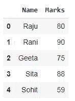
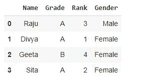
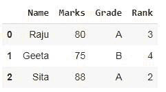
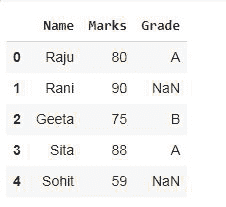
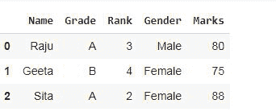

# 将两个熊猫数据帧合并到特定的列中

> 原文:[https://www . geesforgeks . org/merge-two-pandas-data frames-on-seven-columns/](https://www.geeksforgeeks.org/merge-two-pandas-dataframes-on-certain-columns/)

通过简单地指定要合并的特定列，我们可以使用合并函数合并特定列上的两个熊猫数据帧。

> **语法:** DataFrame.merge(右，how='inner '，on=None，left_on=None，right_on=None，left_index=False，right_index=False，sort=False，copy=True，指示符=False，validate=None)

**示例 1:** 让我们创建一个数据帧，然后将它们合并成一个数据帧。

**创建数据框:**

## 蟒蛇 3

```
# importing modules
import pandas as pd

# creating a dataframe
df1 = pd.DataFrame({'Name':['Raju', 'Rani', 'Geeta', 'Sita', 'Sohit'],
                    'Marks':[80, 90, 75, 88, 59]})

# creating another dataframe with different data
df2 = pd.DataFrame({'Name':['Raju', 'Divya', 'Geeta', 'Sita'],
                    'Grade':['A', 'A', 'B', 'A'],
                    'Rank':[3, 1, 4, 2 ],
                    'Gender':['Male', 'Female', 'Female', 'Female']})
# display df1
display(df1)

# display df2
display(df2)
```

**输出:**



df1



df2

**现在合并数据帧:**

## 蟒蛇 3

```
# applying merge
df1.merge(df2[['Name', 'Grade', 'Rank']])
```

**输出:**



合并的数据帧

结果数据框包含 df1 的所有列，但 df2 的某些指定列带有键列名称，即结果列包含名称、标记、等级、等级列。两个数据框的值数量不同，但合并后仅显示两个数据框中的公共值。

**示例 2:** 在结果数据框中，df2 的 Grade 列基于左侧合并类型的键列 Name 与 df1 合并，即显示左侧数据框(df1)的所有值。

## 蟒蛇 3

```
# importing modules
import pandas as pd

# creating a dataframe
df1 = pd.DataFrame({'Name':['Raju', 'Rani', 'Geeta', 'Sita', 'Sohit'],
                    'Marks':[80, 90, 75, 88, 59]})

# creating another dataframe with different data
df2 = pd.DataFrame({'Name':['Raju', 'Divya', 'Geeta', 'Sita'],
                    'Grade':['A', 'A', 'B', 'A'],
                    'Rank':[3, 1, 4, 2 ],
                    'Gender':['Male', 'Female', 'Female', 'Female']})
# display df1
display(df1)

# display df2
display(df2)

# applying merge with more parameters
df1.merge(df2[['Grade', 'Name']], on = 'Name', how = 'left')
```

**输出:**


df1


df2



合并的数据帧

**例 3:** 在这个例子中，我们已经合并了 df1 和 df2。df1 的“标记”列与 df2 合并，此处仅显示两个数据框中基于键列名称的公共值。

## 蟒蛇 3

```
# importing modules
import pandas as pd

# creating a dataframe
df1 = pd.DataFrame({'Name':['Raju', 'Rani', 'Geeta', 'Sita', 'Sohit'],
                    'Marks':[80, 90, 75, 88, 59]})

# creating another dataframe with different data
df2 = pd.DataFrame({'Name':['Raju', 'Divya', 'Geeta', 'Sita'],
                    'Grade':['A', 'A', 'B', 'A'],
                    'Rank':[3, 1, 4, 2 ],
                    'Gender':['Male', 'Female', 'Female', 'Female']})
# display df1
display(df1)

# display df2
display(df2)

# applying merge with more parameters
df2.merge(df1[['Marks', 'Name']])
```

**输出:**


df1


df2



合并的数据帧