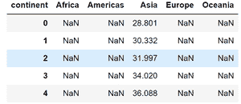
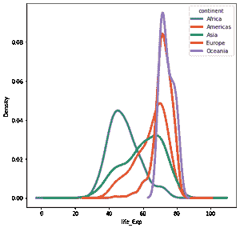
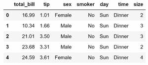
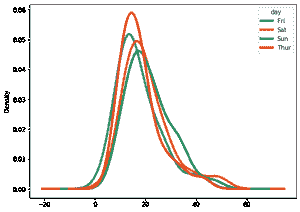

# 蟒蛇熊猫多密度地块

> 原文:[https://www . geeksforgeeks . org/python 中有熊猫的多密度地块/](https://www.geeksforgeeks.org/multiple-density-plots-with-pandas-in-python/)

多密度图是比较数据中多个组分布的好方法。我们可以使用熊猫 [**plot.density()**](https://www.geeksforgeeks.org/density-plots-with-pandas-in-python/) 功能制作多个密度图。然而，如果我们使用密度函数，我们需要转换宽格式的**数据。宽数据表示不同列中的不同组。我们使用 Pandas **pivot()** 函数转换宽格式的数据。**

**让我们创建简单的数据帧，然后将其重塑为宽格式:**

**例 1:**

这里我们使用的是 [**数据集**](https://drive.google.com/file/d/1mi_EF-d_SPJt8TflPjzHjhK_LgQxD055/view?usp=sharing) 。

**步骤 1:** 从数据集创建数据帧。

## 蟒蛇 3

```
import pandas as pd

# creating a dataframe
df = pd.read_csv(r"gapminder1.csv")
df.head()
```

**输出:**


资料组

**第二步:**让我们将数据按照国家分组在不同的列中，这样我们就可以应用 density()函数绘制多个密度图。

## 蟒蛇 3

```
# converting data into wide-format
data_wide = df.pivot(columns='continent',
                     values='lifeExp')
data_wide.head()
```

**输出:**



**第三步:**现在我们使用 **plot.density()** 绘制多密度图

## 蟒蛇 3

```
import matplotlib.pyplot as plt

# calling density() to make
# multiple density plot 
data_wide.plot.density(figsize = (7, 7),
                       linewidth = 4)

plt.xlabel("life_Exp")
```

**输出:**



多重密度图

**例 2:** 我们也可以在 dataframe 上调用 **plot.kde()** 函数，用 Pandas 做多密度图。

这里我们使用的是这个例子的 tips 数据集，你可以在这里找到它[。](https://github.com/mwaskom/seaborn-data/blob/master/tips.csv)

**步骤 1:** 从数据集创建数据帧。

## 蟒蛇 3

```
import pandas as pd

# creating a dataframe
df = pd.read_csv(r"tips.csv")
df.head()
```

**输出:**



tips_df

**步骤 2:** 现在应用 pivot()函数使数据帧为宽格式，然后应用 kde()得到多密度图。

## 蟒蛇 3

```
# Converting to wide dataframe
data_wide = df.pivot(columns = 'day',
                     values = 'total_bill')

# plotting multiple density plot
data_wide.plot.kde(figsize = (8, 6),
                   linewidth = 4)
```

**输出:**



提示多重付款