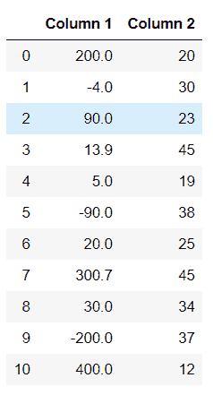
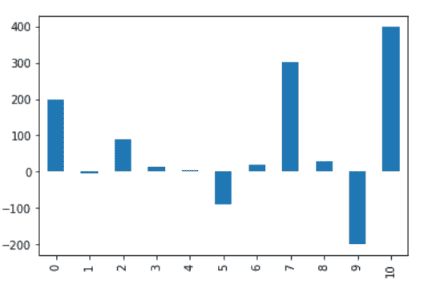
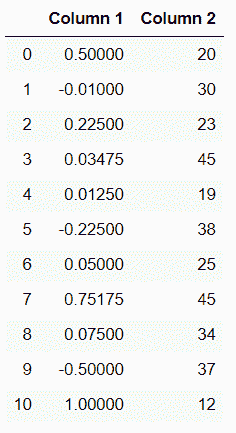
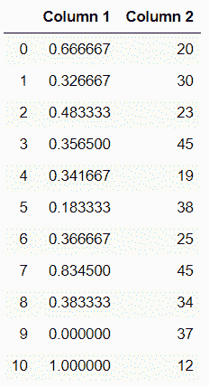
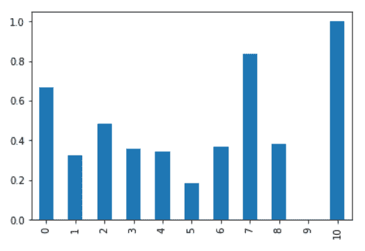
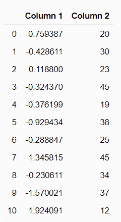
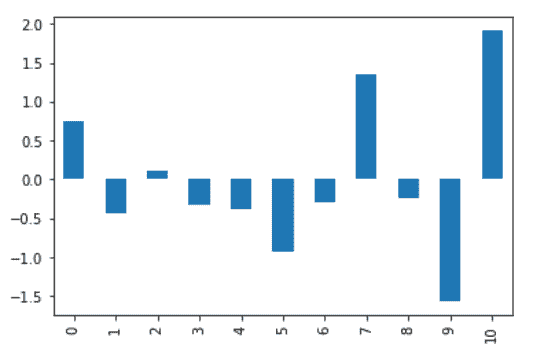
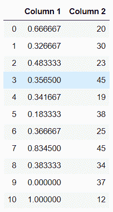
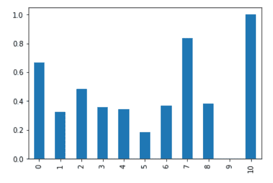

# 熊猫中的一列正常化

> 原文:[https://www.geeksforgeeks.org/normalize-a-column-in-pandas/](https://www.geeksforgeeks.org/normalize-a-column-in-pandas/)

在这篇文章中，我们将学习如何在熊猫中规范化一个列。让我们先讨论一些概念:

*   **Pandas:** Pandas 是一个开源库，建立在 NumPy 库之上。它是一个 Python 包，提供了各种数据结构和操作来操作数字数据和统计数据。主要是因为导入和分析数据容易得多。熊猫速度快，对用户来说是高效的&。
*   **数据标准化:**数据标准化也可以是机器学习中的典型实践，包括将数值列转换为标准标度。在机器学习中，一些特征值与其他特征值相差很多倍。价值较高的特征将主导学习过程。

### 所需步骤

在这里，我们将应用一些技术来规范化列值，并通过示例来讨论这些技术。为此，让我们了解熊猫正常化所需的步骤。

1.  导入库(熊猫)
2.  导入/加载/创建数据。
3.  使用技术来规范化列。

### 示例:

在这里，我们通过一些随机值创建数据，并对列应用一些规范化技术。

## 蟒蛇 3

```py
# importing packages
import pandas as pd

# create data
df = pd.DataFrame({'Column 1':[200,-4,90,13.9,5,
                               -90,20,300.7,30,-200,400],

                   'Column 2':[20,30,23,45,19,38,
                               25,45,34,37,12]})

# view data
display(df)
```

**输出:**



数据集由两列组成，其中列 1 未规范化，但列 2 已规范化。因此，我们在第 1 列中应用了规范化技术。

## 蟒蛇 3

```py
df['Column 1'].plot(kind = 'bar')
```

**输出:**



### 使用最大绝对缩放:

最大绝对缩放通过将每个观察值除以其最大绝对值，在-1 和 1 之间重新缩放每个特征。我们可以使用。max()和。abs()方法，如下所示。

## 蟒蛇 3

```py
# copy the data
df_max_scaled = df.copy()

# apply normalization techniques on Column 1
column = 'Column 1'
df_max_scaled[column] = df_max_scaled[column] /df_max_scaled[column].abs().max()

# view normalized data
display(df_max_scaled)
```

**输出:**



### 使用最小-最大特征缩放:

最小-最大方法(通常称为归一化)通过减去特征的最小值，然后除以范围，将特征重新缩放到[0，1]的硬性范围。我们可以使用。min()和。max()方法。

## 蟒蛇 3

```py
# copy the data
df_min_max_scaled = df.copy()

# apply normalization techniques by Column 1
column = 'Column 1'
df_min_max_scaled[column] = (df_min_max_scaled[column] - df_min_max_scaled[column].min()) / (df_min_max_scaled[column].max() - df_min_max_scaled[column].min())    

# view normalized data
display(df_min_max_scaled)
```

**输出:**



我们来看看这个情节。

## 蟒蛇 3

```py
df_min_max_scaled['Column 1'].plot(kind = 'bar')
```



### 使用 z 评分法:

z-score 方法(通常称为标准化)将信息转换为平均值为 0、典型偏差为 1 的分布。每个标准化值通过减去相应特征的平均值，然后除以质量偏差来计算。

## 蟒蛇 3

```py
# copy the data
df_z_scaled = df.copy()

# apply normalization technique to Column 1
column = 'Column 1'
df_z_scaled[column] = (df_z_scaled[column] - df_z_scaled[column].mean()) / df_z_scaled[column].std()    

# view normalized data  
display(df_z_scaled)
```

**输出:**



我们来看看这个情节。

## 蟒蛇 3

```py
df_z_scaled['Column 1'].plot(kind = 'bar')
```



### 使用 sklearn:

通过将每个要素缩放到给定范围来转换要素。该估计器分别缩放和平移每个特征，使得它在训练集的给定范围内，例如在 0 和 1 之间。在这里，我们将使用最小最大缩放器。

## 蟒蛇 3

```py
from sklearn.preprocessing import MinMaxScaler
import numpy as np

# copy the data
df_sklearn = df.copy()

# apply normalization techniques
column = 'Column 1'
df_sklearn[column] = MinMaxScaler().fit_transform(np.array(df_sklearn[column]).reshape(-1,1))

# view normalized data  
display(df_sklearn)
```

**输出:**



让我们看看这个情节:

## 蟒蛇 3

```py
df_sklearn['Column 1'].plot(kind = 'bar')
```

