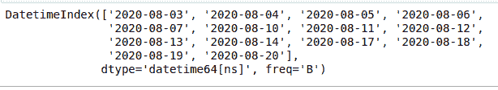
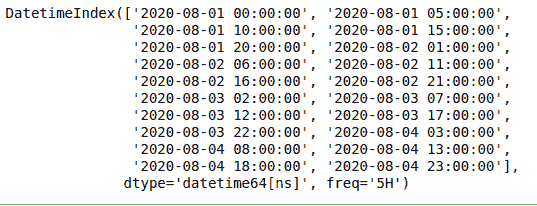

# Python 中 pandas.bdate_range()函数

> 原文:[https://www . geesforgeks . org/pandas-bdate _ range-function-in-python/](https://www.geeksforgeeks.org/pandas-bdate_range-function-in-python/)

此方法用于返回固定频率的日期时间索引，默认频率为工作日。

> **语法:**pandas . bdate _ range(start =None，end=None，periods=None，freq='B '，tz=None，normalize=True，name=None，weekmask=None，节假日= None，closed=None，**kwargs，)
> 
> **参数:**
> 
> *   **开始:**字符串或类似日期时间，默认无，用于生成日期的左边界。
> *   **end :** 字符串或类似日期时间，默认无，用于生成日期的右边界。
> *   **周期:**整数，默认无，要生成的周期数。
> *   **freq :** 字符串或 DateOffset，默认为‘B’(商业日报)，Frequency 字符串可以有倍数，例如‘5H’。
> *   **tz :** 字符串或无，用于返回本地化日期时间索引的时区名称，例如亚洲/北京。

下面是上述方法的实现，并附有一些例子:

**例 1 :**

## 蟒蛇 3

```py
# importing packages
import pandas

# using pandas.bdate_range() method
print(pandas.bdate_range(start='8/1/2020',
                         end='8/20/2020'))
```

**输出:**



**例 2 :**

## 蟒蛇 3

```py
# importing packages
import pandas

# using pandas.bdate_range() method
print(pandas.bdate_range(start='8/1/2020',
                         end='8/5/2020',
                         freq='5H'))
```

**输出:**

