# 熊猫内置数据可视化| ML

> 原文:[https://www . geesforgeks . org/pandas-内置数据可视化-ml/](https://www.geeksforgeeks.org/pandas-built-in-data-visualization-ml/)

数据可视化是以图形格式呈现数据。它通过以简单易懂的格式总结和呈现大量数据，帮助人们理解数据的意义，并帮助清晰有效地交流信息。

在本教程中，我们将了解熊猫内置的数据可视化功能！它是由 matplotlib 构建的，但是为了更容易使用，它被烤成了熊猫！

让我们来看看！

**安装**
安装熊猫最简单的方法就是使用 pip:

```py
pip install pandas

```

或者，从[这里](https://pypi.org/project/pandas/#downloads)下载

本文通过绘制不同类型的图表，展示了在熊猫中使用内置数据可视化功能的示例。

### 导入必要的库和数据文件–

本教程使用的示例 csv 文件 df1 和 df2 可以从[这里](https://drive.google.com/file/d/1nQWuiHZvNef4UuakMUDhaPWC_BANIt2p/view?usp=sharing)下载。

```py
import numpy as np
import pandas as pd

# There are some fake data csv files
# you can read in as dataframes
df1 = pd.read_csv('df1', index_col = 0)
df2 = pd.read_csv('df2')
```

### 样式表–

Matplotlib 有样式表，可以用来让情节看起来更好一点。这些样式表包括`plot_bmh`、`plot_fivethirtyeight`、`plot_ggplot` 等。他们基本上创造了一套你的情节遵循的风格规则。我们推荐使用它们，它们让你所有的情节看起来都一样，感觉更专业。我们甚至可以创建自己的，如果希望公司的地块都有相同的外观(虽然创建起来有点乏味)。

下面是如何使用它们。

**之前 `plt.style.use()`地块看起来是这样的:**

```py
df1['A'].hist()
```

**输出:**
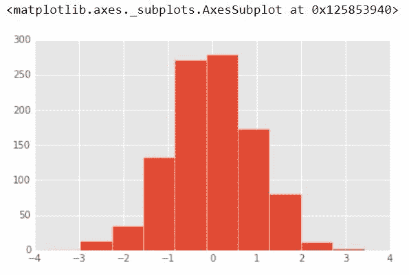

**调用样式:**

现在，在调用`ggplot`样式后，剧情看起来是这样的:

```py
import matplotlib.pyplot as plt
plt.style.use('ggplot')
df1['A'].hist()
```

**输出:**


调用`bmh`样式后的图是这样的:

```py
plt.style.use('bmh')
df1['A'].hist()
```

**输出:**
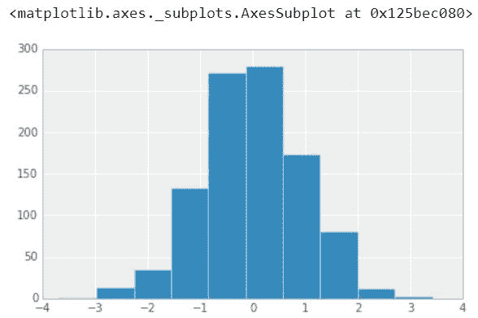

调用`dark_background`样式后的图是这样的:

```py
plt.style.use('dark_background')
df1['A'].hist()
```

**输出:**
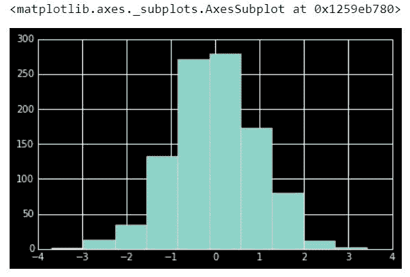

调用`fivethirtyeight`样式后的图是这样的:

```py
plt.style.use('fivethirtyeight')
df1['A'].hist()
```

**输出:**
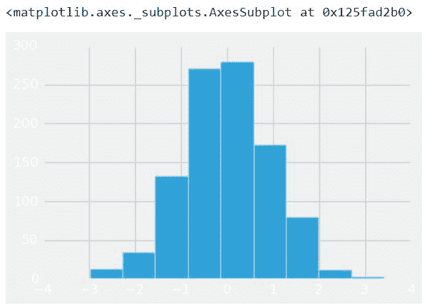

### 绘图类型–

熊猫内置了几种剧情类型，大部分都是按性质统计的剧情:

*   df.plot.area*   df.plot.barh 的缩写*   df.plot .密度*   df.plot.hist(打印. hist)文件*   df.plot.line*   df.plot .散点图*   df .绘图. bar*   df.plot.box*   df.plot .河西边*   df.plot.kde*   df.plot.pie

    您也可以只调用`df.plot(kind='hist')` 或者用上面列表中显示的任何关键术语(例如‘box’、‘barh’等)替换该类参数。).让我们开始检查它们！

    ### 1.)区域

    面积图或面积图以图形方式显示定量数据。它基于折线图。轴和线之间的区域通常用颜色、纹理和阴影来强调。人们通常用面积图来比较两个或更多的量。

    ```py
    df2.plot.area(alpha = 0.4)
    ```

    **输出:**
    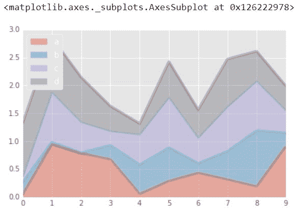

    ### 2.)Barplots

    条形图或条形图是用矩形条表示分类数据的图表，矩形条的高度或长度与它们所代表的值成比例。条形图可以垂直或水平绘制。垂直条形图有时被称为折线图。

    ```py
    df2.head()
    ```

    **输出:**
    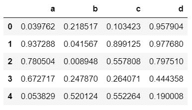

    ```py
    df2.plot.bar()
    ```

    **输出:**
    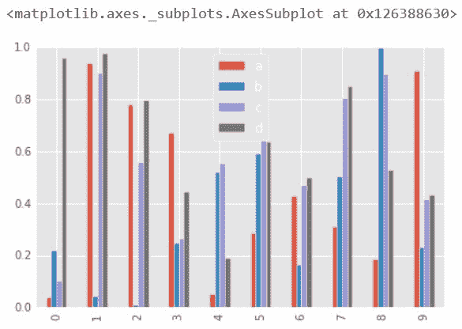

    ```py
    df2.plot.bar(stacked = True)
    ```

    **输出:**
    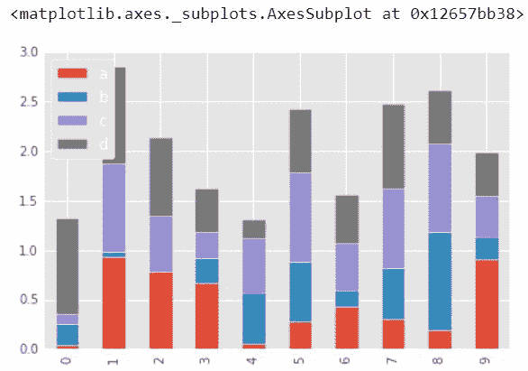

    ### 3.)直方图

    直方图是一种图表，可以让您发现并显示一组连续数据的基本频率分布(形状)。这允许检查数据的潜在分布(例如，正态分布)、异常值、偏斜度等。

    ```py
    df1['A'].plot.hist(bins = 50)
    ```

    **输出:**
    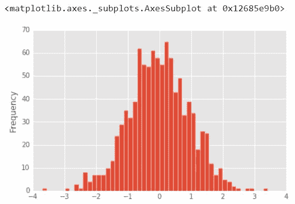

    ### 4.)线图

    折线图是显示沿着数字线的数据频率的图表。当数据是时间序列时，最好使用线图。这是一种快速、简单的数据组织方式。

    ```py
    df1.plot.line(x = df1.index, y ='B', figsize =(12, 3), lw = 1)
    ```

    **输出:**
    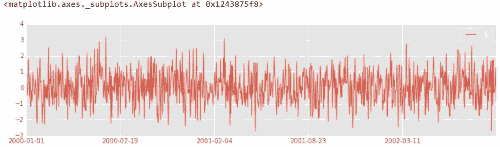

    ### 5.)散点图

    当您想要显示两个变量之间的关系时，可以使用散点图。散点图有时被称为相关图，因为它们显示了两个变量是如何相关的。

    ```py
    df1.plot.scatter(x ='A', y ='B')
    ```

    **输出:**
    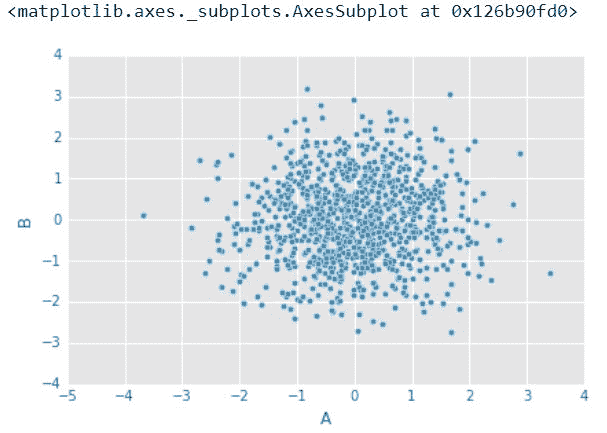

    您可以使用 c 根据另一个列值进行着色。使用 cmap 指示要使用的颜色映射。对于所有的彩色地图，请查看:[http://matplotlib.org/users/colormaps.html](http://matplotlib.org/users/colormaps.html)

    ```py
    df1.plot.scatter(x ='A', y ='B', c ='C', cmap ='coolwarm')
    ```

    **输出:**
    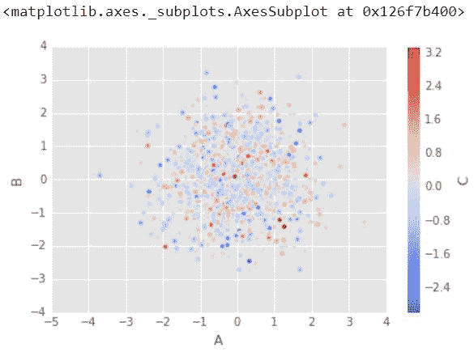

    或者使用 s 表示基于另一列的大小。s 参数需要是一个数组，而不仅仅是列名:

    ```py
    df1.plot.scatter(x ='A', y ='B', s = df1['C']*200)
    ```

    **输出:**
    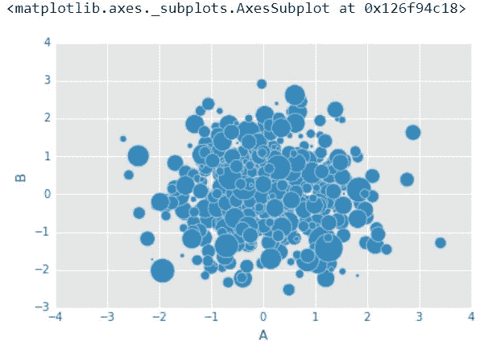

    ### 6.)方框图

    这是一种绘图，其中绘制了一个矩形来表示第二个和第三个四分位数，通常内部有一条垂直线来指示中间值。下四分位数和上四分位数显示为矩形两侧的水平线。
    箱线图是基于五个数字汇总(“最小值”、第一个四分位数(Q1)、中间值、第三个四分位数(Q3)和“最大值”)显示数据分布的标准化方式。它可以告诉你你的异常值和它们的值。它还可以告诉你你的数据是否对称，你的数据分组有多紧密，以及你的数据是否和如何偏斜。

    ```py
    df2.plot.box() # Can also pass a by = argument for groupby
    ```

    **输出:**
    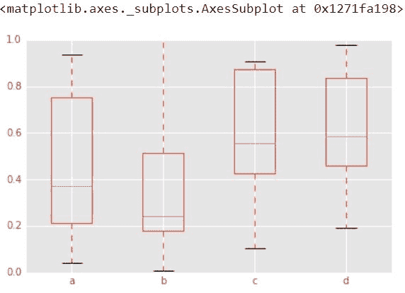

    ### 7.)六边形箱图

    六边形宁滨是另一种方法，可以解决许多点开始重叠的问题。六角形宁滨图密度，而不是点。点被归入网格六边形，分布(每个六边形的点数)使用六边形的颜色或面积来显示。
    用于二元数据，散点图的替代:

    ```py
    df = pd.DataFrame(np.random.randn(1000, 2), columns =['a', 'b'])
    df.plot.hexbin(x ='a', y ='b', gridsize = 25, cmap ='Oranges')
    ```

    **输出:**
    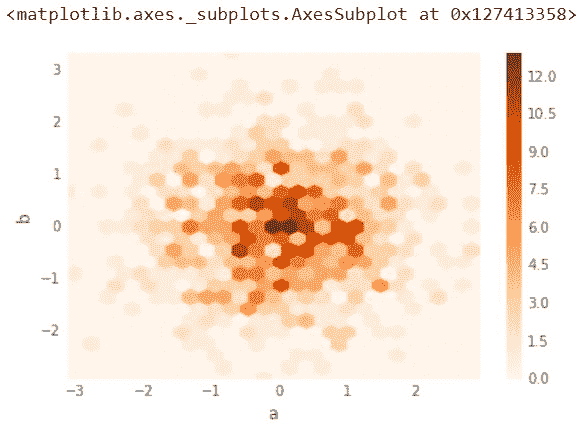

    ### 8.)核密度估计图(KDE)

    KDE 是一种给定一组数据，让你创建一条平滑曲线的技术。

    如果您只想将某些数据的“形状”可视化，作为离散直方图的一种连续替换，这可能会很有用。它还可以用来生成看起来像来自某个数据集的点，这种行为可以支持简单的模拟，其中模拟对象是根据真实数据建模的。

    ```py
    df2['a'].plot.kde()
    ```

    **输出:**
    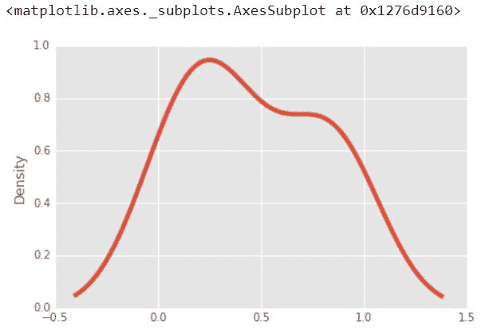

    ```py
    df2.plot.density()
    ```

    **输出:**
    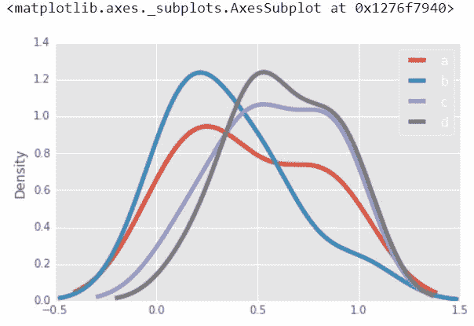

    **就是这样！**希望你能明白为什么这种绘图方法会比完全打开的 matplotlib 更容易使用，它平衡了易用性和对图形的控制。许多情节调用也接受其父 matplotlib plt 的附加参数。打电话。