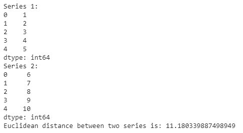

# 熊猫–计算两个系列之间的欧几里得距离

> 原文:[https://www . geeksforgeeks . org/pandas-计算两个系列之间的欧几里德距离/](https://www.geeksforgeeks.org/pandas-compute-the-euclidean-distance-between-two-series/)

在各种机器学习算法中使用了许多距离度量。其中之一就是欧氏距离。欧几里得距离是最常用的距离度量，它只是两点之间的直线距离。点之间的欧几里得距离由公式给出:

![  \[d(x, y) = \sqrt{\sum_{i=0}^{n}(x_{i}-y_{i})^{2}}\] ](img/d6481958bd6e5ab34800d3ee8265875e.png "Rendered by QuickLaTeX.com")

我们可以用各种方法来计算两个数列之间的欧氏距离。这里有几个相同的方法:
**例 1:**

```py
import pandas as pd
import numpy as np

# create pandas series
x = pd.Series([1, 2, 3, 4, 5])
y = pd.Series([6, 7, 8, 9, 10])

# here we are computing every thing
# step by step
p1 = np.sum([(a * a) for a in x])
p2 = np.sum([(b * b) for b in y])

# using zip() function to create an
# iterator which aggregates elements 
# from two or more iterables
p3 = -1 * np.sum([(2 * a*b) for (a, b) in zip(x, y)])
dist = np.sqrt(np.sum(p1 + p2 + p3))

print("Series 1:", x)
print("Series 2:", y)
print("Euclidean distance between two series is:", dist)
```

**输出:**


**例 2:**

```py
import pandas as pd
import numpy as np

x = pd.Series([1, 2, 3, 4, 5])
y = pd.Series([6, 7, 8, 9, 10])

# zip() function creates an iterator
# which aggregates elements from two 
# or more iterables
dist = np.sqrt(np.sum([(a-b)*(a-b) for a, b in zip(x, y)]))    

print("Series 1:")
print(x)

print("Series 2:")
print(y)

print("Euclidean distance between two series is:", dist)
```

**输出:**


**示例 3:** 在本例中，我们使用的是 **np.linalg.norm()** 函数，该函数返回八个不同矩阵范数中的一个。

```py
import pandas as pd
import numpy as np

x = pd.Series([1, 2, 3, 4, 5])
y = pd.Series([6, 7, 8, 9, 10])
dist = (np.linalg.norm(x-y))

print("Series 1:")
print(x)

print("Series 2:")
print(y)

print("Euclidean distance between two series is:", dist)
```

**输出:**


**示例 4:** 我们现在来试试更大的系列:

```py
import pandas as pd
import numpy as np

x = pd.Series([1, 2, 3, 4, 5, 6, 7, 8, 9, 10])
y = pd.Series([12, 8, 7, 5, 6, 5, 3, 9, 7, 1])
dist = np.sqrt(np.sum([(a-b)*(a-b) for a, b in zip(x, y)]))

print("Series 1:")
print(x)

print("Series 2:")
print(y)

print("Euclidean distance between two series is:", dist)
```

**输出:**
