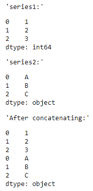
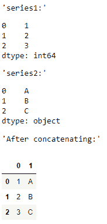
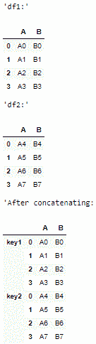
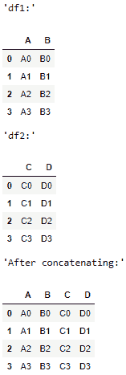
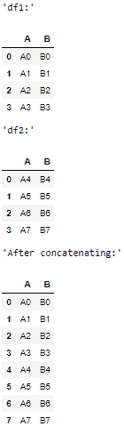
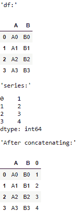

# pandas.concat()函数在 Python 中

> 原文:[https://www . geesforgeks . org/pandas-concat-function-in-python/](https://www.geeksforgeeks.org/pandas-concat-function-in-python/)

pandas.concat()函数执行沿带有熊猫对象的轴的执行连接操作的所有繁重工作，同时在其他轴上执行索引(如果有的话)的可选设置逻辑(并集或交集)。

> **语法:** concat(objs，axis，join，ignore_index，key，levels，names，verify_integrity，sort，copy)
> 
> **参数:**
> 
> *   **对象:**系列或数据框对象
> *   **轴:**轴连接；默认值= 0
> *   **连接:**方式处理其他轴上的索引；默认值=“外部”
> *   **ignore_index:** 如果为 True，则不要使用沿拼接轴的索引值；默认值=假
> *   **键:**向结果索引添加标识符的序列；默认值=无
> *   **级别:**用于构建多索引的特定级别(唯一值)；默认值=无
> *   **名称:**结果分层索引中的级别名称；默认值=无
> *   **verify_integrity:** 检查新级联轴是否包含重复项；默认值=假
> *   **排序:**当连接为“外部”时，如果非连接轴尚未对齐，则对其进行排序；默认值=假
> *   **复制:**如果为 False，不要进行不必要的数据复制；默认值=真
> 
> **返回:**类型的对象(数据帧系列)

**示例 1:** 用默认参数串联 2 个系列。

## 蟒蛇 3

```
# importing the module
import pandas as pd

# creating the Series
series1 = pd.Series([1, 2, 3])
display('series1:', series1)
series2 = pd.Series(['A', 'B', 'C'])
display('series2:', series2)

# concatenating
display('After concatenating:')
display(pd.concat([series1, series2]))
```

**输出:**



**示例 2:** 水平串联 2 个系列，索引= 1

## 蟒蛇 3

```
# importing the module
import pandas as pd

# creating the Series
series1 = pd.Series([1, 2, 3])
display('series1:', series1)
series2 = pd.Series(['A', 'B', 'C'])
display('series2:', series2)

# concatenating
display('After concatenating:')
display(pd.concat([series1, series2], 
                  axis = 1))
```

**输出:**



**示例 3:** 连接 2 个数据帧并分配密钥。

## 蟒蛇 3

```
# importing the module
import pandas as pd

# creating the DataFrames
df1 = pd.DataFrame({'A': ['A0', 'A1', 'A2', 'A3'], 
                    'B': ['B0', 'B1', 'B2', 'B3']})
display('df1:', df1)
df2 = pd.DataFrame({'A': ['A4', 'A5', 'A6', 'A7'], 
                    'B': ['B4', 'B5', 'B6', 'B7']})
display('df2:', df2)

# concatenating
display('After concatenating:')
display(pd.concat([df1, df2], 
                  keys = ['key1', 'key2']))
```

**输出:**



**示例 4:** 水平连接 2 个数据帧，轴= 1 **。**

## 蟒蛇 3

```
# importing the module
import pandas as pd

# creating the DataFrames
df1 = pd.DataFrame({'A': ['A0', 'A1', 'A2', 'A3'], 
                    'B': ['B0', 'B1', 'B2', 'B3']})
display('df1:', df1)
df2 = pd.DataFrame({'C': ['C0', 'C1', 'C2', 'C3'], 
                    'D': ['D0', 'D1', 'D2', 'D3']})
display('df2:', df2)

# concatenating
display('After concatenating:')
display(pd.concat([df1, df2],
                  axis = 1))
```

**输出:**



**示例 5:** 将 2 个数据帧连接起来，ignore_index = True，以便在连接的数据帧中显示新的索引值。

## 蟒蛇 3

```
# importing the module
import pandas as pd

# creating the DataFrames
df1 = pd.DataFrame({'A': ['A0', 'A1', 'A2', 'A3'], 
                    'B': ['B0', 'B1', 'B2', 'B3']})
display('df1:', df1)
df2 = pd.DataFrame({'A': ['A4', 'A5', 'A6', 'A7'], 
                    'B': ['B4', 'B5', 'B6', 'B7']})
display('df2:', df2)

# concatenating
display('After concatenating:')
display(pd.concat([df1, df2], 
                  ignore_index = True))
```

**输出:**



**示例 6:** 将数据帧与序列连接起来。

## 蟒蛇 3

```
# importing the module
import pandas as pd

# creating the DataFrame
df = pd.DataFrame({'A': ['A0', 'A1', 'A2', 'A3'], 
                    'B': ['B0', 'B1', 'B2', 'B3']})
display('df:', df1)
# creating the Series
series = pd.Series([1, 2, 3, 4])
display('series:', series)

# concatenating
display('After concatenating:')
display(pd.concat([df, series],
                  axis = 1))
```

**输出:**

