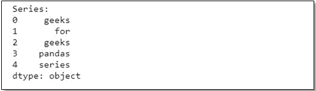
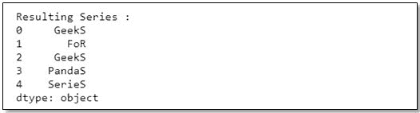

# Pandas–在一系列

中，将每个单词的第一个和最后一个字符转换为大写

> 原文:[https://www . geeksforgeeks . org/pandas-将每个单词的第一个和最后一个字符转换为序列中的大写字母/](https://www.geeksforgeeks.org/pandas-convert-the-first-and-last-character-of-each-word-to-upper-case-in-a-series/)

在 python 中，如果我们希望只将每个单词的第一个字符转换为大写，我们可以使用[大写()](https://www.geeksforgeeks.org/string-capitalize-python/)方法。或者我们可以只取字符串的第一个字符，使用 [upper()](https://www.geeksforgeeks.org/python-string-upper/) 方法将其改为大写。因此，为了将一系列单词的第一个和最后一个字符转换为大写，我们将使用类似的方法。首先，让我们在熊猫中创建一个系列。

**示例:**让我们创建熊猫系列

```
# importing pandas as pd 
import pandas as pd

# Create the series
series = pd.Series(['geeks', 'for', 'geeks',
                    'pandas', 'series'])

# Print the series
print("Series:")
series
```

**输出:**


一旦我们使用熊猫创建了一个系列，我们将使用[地图()](https://www.geeksforgeeks.org/python-map-function/)功能对整个系列应用[λ()](https://www.geeksforgeeks.org/python-lambda/)功能。lambda 函数将使用切片来获取第一个字符，大写它，并按原样添加字符串的其余部分，直到最后一个字符。最后一个字符再次大写，并添加到结果序列中。

**示例:**

```
# Apply the lambda function to
# capitalize first and last 
# character to each word
newSeries = series.map(lambda x: x[0].upper() + x[1:-1] + x[-1].upper())

# Print the resulting series
print("\nResulting Series :")
newSeries
```

**输出:**
