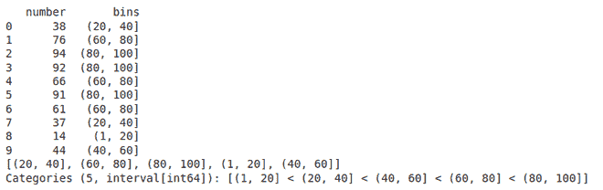
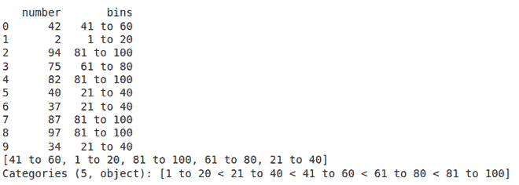

# Python 中的熊猫. cut()方法

> 原文:[https://www.geeksforgeeks.org/pandas-cut-method-in-python/](https://www.geeksforgeeks.org/pandas-cut-method-in-python/)

Pandas cut()函数用于将数组元素分成不同的容器。cut 函数主要用于对标量数据进行统计分析。

> **语法:**剪切(x，箱，右=真，标签=无，重箱=假，精度=3，include _ low =假，重复=“提升”，)
> 
> **参数:**
> 
> ***x:*** 要入库的输入数组。必须是一维的。
> 
> **面元:**定义分割的面元边缘。
> 
> **右侧:**(布尔值，默认为真)指示箱是否包括最右边。如果 right == True(默认值)，则箱[1，2，3，4]指示(1，2)，(2，3)，(3，4)。
> 
> **标签:**(数组或布尔值，可选)指定返回箱的标签。必须与结果箱的长度相同。如果为假，则仅返回容器的整数指示符。
> 
> **返回箱:** (bool，默认 False)是否返回箱。当以标量形式提供容器时很有用。

**示例 1:** 假设我们有一个由 1 到 100 的 10 个随机数组成的数组，我们希望将数据分成 5 个区间，分别为(1，20)【20，40】【40，60】【60，80】【80，100】。

## 蟒蛇 3

```py
import pandas as pd
import numpy as np

df= pd.DataFrame({'number': np.random.randint(1, 100, 10)})
df['bins'] = pd.cut(x=df['number'], bins=[1, 20, 40, 60,
                                          80, 100])
print(df)

# We can check the frequency of each bin
print(df['bins'].unique())
```

**输出:**



**示例 2:** 我们还可以给我们的箱添加标签，例如，让我们看看前面的示例，并给它添加一些标签

## 蟒蛇 3

```py
import pandas as pd
import numpy as np

df = pd.DataFrame({'number': np.random.randint(1, 100, 10)})
df['bins'] = pd.cut(x=df['number'], bins=[1, 20, 40, 60, 80, 100],
                    labels=['1 to 20', '21 to 40', '41 to 60',
                            '61 to 80', '81 to 100'])

print(df)

# We can check the frequency of each bin
print(df['bins'].unique())
```

**输出:**

