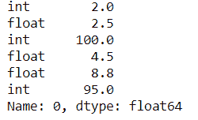
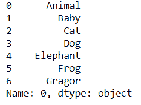

# 熊猫。Python 中的 DataFrame.iterrows()函数

> 原文:[https://www . geesforgeks . org/pandas-data frame-ITER rows-function-in-python/](https://www.geeksforgeeks.org/pandas-dataframe-iterrows-function-in-python/)

**Pandas DataFrame . ITER rows()**用于以(索引、序列)对的形式迭代 Pandas Data frame 行。这个函数遍历数据框列，它将返回一个元组，该元组的列名和内容以序列的形式出现。

> **语法:**data frame . ITER row()
> 
> **收益率:**
> **指数-** 该行的指数。多索引的元组
> **数据-** 作为系列的行数据
> 
> **返回:**
> **它**:一个遍历框架行的生成器

**例 1:**

有时我们需要在不使用任何循环的情况下遍历数据框的行和列，在这种情况下，Pandas DataFrame.iterrows()起着至关重要的作用。

## 蟒蛇 3

```py
import pandas as pd

# Creating a data frame along with column name
df = pd.DataFrame([[2, 2.5, 100, 4.5, 8.8, 95]], columns=[
                  'int', 'float', 'int', 'float', 'float', 'int'])

# Iter over the data frame rows
# # using df.iterrows()
itr = next(df.iterrows())[1]
itr
```

**输出:**



在上面的例子中，我们使用**Pandas data frame . iter rows()**对数字数据帧行进行 ITER。

**例 2:**

## 蟒蛇 3

```py
import pandas as pd

# Creating a data frame
df = pd.DataFrame([['Animal', 'Baby', 'Cat', 'Dog',
                    'Elephant', 'Frog', 'Gragor']])

# Itering over the data frame rows
# using df.iterrows()
itr = next(df.iterrows())[1]
itr
```

**输出:**



在上面的例子中，我们使用**Pandas data frame . iterrow()**对没有列名的数据帧进行迭代

**注意:**由于 iterrows 为每行返回一个 Series，因此**不会跨行保留**数据类型。