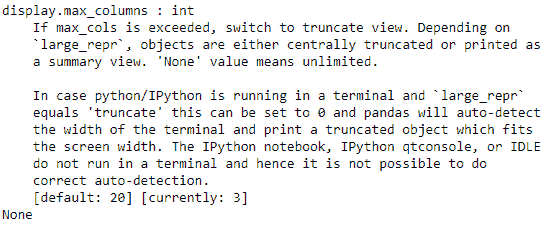

# pandas . description _ option()函数在 Python 中

> 原文:[https://www . geesforgeks . org/pandas-description _ option-function-in-python/](https://www.geeksforgeeks.org/pandas-describe_option-function-in-python/)

Pandas 有一个选项系统，可以让你自定义其行为的某些方面，显示相关的选项是用户最有可能调整的。让我们看看如何查看指定选项的描述。

## description _ option()

> **语法:**pandas . description _ option(pat，_ print _ desc = False)
> T3】参数:T5】
> 
> *   **pat :** Regexp，应该匹配单个选项。
> *   **_print_desc :** 如果为真(默认)，说明将打印到标准输出。否则，描述将作为 unicode 字符串返回(用于测试)。
> 
> **返回:**无默认情况下，如果 _print_desc 为假，则描述为 unicode 字符串

**示例 1 :** 获取 max_columns 的描述。

## 蟒蛇 3

```
# importing the module
import pandas as pd

# description for max_columns
print(pd.describe_option("display.max_columns"))
```

**输出:**



**示例 2 :** 通过在参数中不传递任何内容来获取所有选项的描述。

## 蟒蛇 3

```
# importing the module
import pandas as pd

# description for all the options
print(pd.describe_option())
```

**输出:**

<video class="wp-video-shortcode" id="video-459875-1" width="640" height="360" preload="metadata" controls=""><source type="video/mp4" src="https://media.geeksforgeeks.org/wp-content/uploads/20200726205326/pd.describe_options.mp4?_=1">[https://media.geeksforgeeks.org/wp-content/uploads/20200726205326/pd.describe_options.mp4](https://media.geeksforgeeks.org/wp-content/uploads/20200726205326/pd.describe_options.mp4)</video>