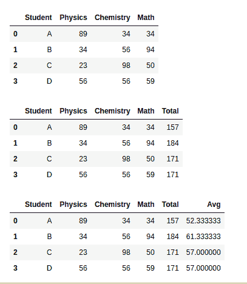

# pandas.eval()函数在 Python 中

> 原文:[https://www . geesforgeks . org/pandas-eval-function-in-python/](https://www.geeksforgeeks.org/pandas-eval-function-in-python/)

此方法用于使用各种后端将 Python 表达式评估为字符串。它返回数组、数值标量、数据帧、序列。

> **语法:** pandas.eval(expr，parser='pandas '，engine=None，truediv=True，local_dict=None，global_dict=None，resolvers=()，level=0，target=None，inplace=False)
> 
> **论据:**
> 
> *   **expr :** 字符串或 unicode。要计算的表达式。该字符串不能包含任何 Python
> *   **解析器:**字符串，默认为‘pandas’，{‘pandas’，‘python’}。
> *   **引擎:**字符串或无，默认为‘numexpr’，{‘python’，‘numexpr’}
> *   **truediv :** bool，可选，是否使用 truediv，如 Python 中> = 3
> *   **级别:** int，可选，要遍历并添加到当前范围的先前堆栈帧的数量。大多数用户会**不* *需要更改此参数。

下面是上述方法的实现，并附有一些例子:

**例 1 :**

## 蟒蛇 3

```
# importing package
import pandas

# evaluate the expressions given
# in form of string
print(pandas.eval("2+3"))
print(pandas.eval("2+3*(5-2)"))
```

**输出:**

```
5
11

```

**例 2 :**

## 蟒蛇 3

```
# importing package
import pandas

# creating data
data = pandas.DataFrame({
      "Student": ["A", "B", "C", "D"], 
    "Physics": [89,34,23,56], 
    "Chemistry": [34,56,98,56], 
    "Math": [34,94,50,59]
    })

# view data
display(data)

# adding new column by existing 
# columns evaluation
data['Total']=pandas.eval("data.Physics+data.Chemistry+data.Math")

# view data
display(data)

# adding new column by existing 
# columns evaluation
pandas.eval("Avg=data.Total/3",target=data,inplace=True)

# view data
display(data)
```

**输出:**

