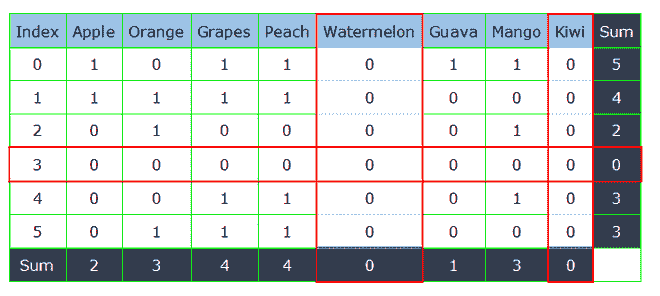
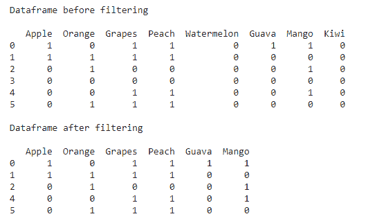
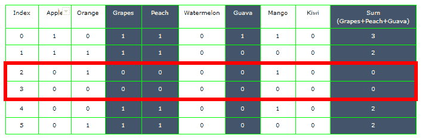

# 熊猫通过行或列的总和过滤数据帧

> 原文:[https://www . geesforgeks . org/pandas-filter-a-data frame 按行或列的总和/](https://www.geeksforgeeks.org/pandas-filter-a-dataframe-by-the-sum-of-rows-or-columns/)

在本文中，我们将看到如何根据行或列的总和来过滤熊猫数据帧。这在某些情况下会很有用。假设你有一个由顾客和他们购买的水果组成的数据框架。行由不同的客户组成，列包含不同类型的水果。您希望根据他们的购买情况过滤数据框。要了解更多关于[根据条件](https://www.geeksforgeeks.org/ways-to-filter-pandas-dataframe-by-column-values/)按列值和[行过滤熊猫数据帧的信息，请参考文章链接。](https://www.geeksforgeeks.org/selecting-rows-in-pandas-dataframe-based-on-conditions/) [Pandas dataframe.sum()](https://www.geeksforgeeks.org/python-pandas-dataframe-sum/) 函数用于返回这些值的总和。

**所需步骤:**

1.  创建或导入数据框
2.  对行求和:这可以使用[来完成。sum()函数](https://www.geeksforgeeks.org/sum-function-python/)并通过参数轴=1
3.  对列求和:通过使用。sum()函数并传递参数轴=0
4.  基于所需条件的过滤

### **基于行和列之和的过滤**

如果您想删除没有购买任何水果的顾客或没有被任何顾客购买的任何特定水果。在这种情况下，我们需要根据行或列总和的值进行筛选。下面是上述方法的代码实现。



## 蟒蛇 3

```
# importing pandas library
import pandas as pd

# creating dataframe
df = pd.DataFrame({'Apple': [1, 1, 0, 0, 0, 0],
                   'Orange': [0, 1, 1, 0, 0, 1],
                   'Grapes': [1, 1, 0, 0, 1, 1],
                   'Peach': [1, 1, 0, 0, 1, 1],
                   'Watermelon': [0, 0, 0, 0, 0, 0],
                   'Guava': [1, 0, 0, 0, 0, 0],
                   'Mango': [1, 0, 1, 0, 1, 0],
                   'Kiwi': [0, 0, 0, 0, 0, 0]})

print("Dataframe before filtering\n")
print(df)

# filtering on the basis of rows
df = df[df.sum(axis=1) > 0]

# filtering on the basis of columns
df = df.loc[:, df.sum(axis=0) > 0]

print("\nDataframe after filtering\n")
print(df)
```

**输出:**



### **根据** **几列之和**过滤行

现在，如果我们想从有限的列表中过滤那些没有购买任何水果的客户，例如，没有购买葡萄、番石榴或桃子的客户应该从数据框中删除。这里，我们根据特定的列过滤行，在这种情况下是葡萄、桃子和番石榴。



在计算这三列的所有行的总和时，我们发现索引 2 和 3 的总和为零。

## 蟒蛇 3

```
# importing pandas library
import pandas as pd

# creating dataframe
df = pd.DataFrame({'Apple': [1, 1, 0, 0, 0, 0],
                   'Orange': [0, 1, 1, 0, 0, 1],
                   'Grapes': [1, 1, 0, 0, 1, 1],
                   'Peach': [1, 1, 0, 0, 1, 1],
                   'Watermelon': [0, 0, 0, 0, 0, 0],
                   'Guava': [1, 0, 0, 0, 0, 0],
                   'Mango': [1, 0, 1, 0, 1, 0],
                   'Kiwi': [0, 0, 0, 0, 0, 0]})

print("Dataframe before filtering\n")
print(df)

# list of columns to be considered
columns = ['Grapes', 'Guava', 'Peach']

# filtering rows on basis of certain columns
df = df[df[columns].sum(axis=1) > 0]

print("\nDataframe after filtering\n")
print(df)
```