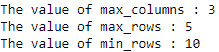
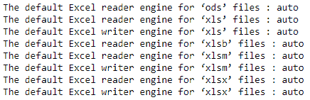

# Python 中 Pandas.get_option()函数

> 原文:[https://www . geesforgeks . org/pandas-get _ option-function-in-python/](https://www.geeksforgeeks.org/pandas-get_option-function-in-python/)

熊猫有一个选项系统，可以让你定制它行为的某些方面，显示相关的选项是用户最有可能调整的。让我们看看如何看到指定选项的价值。

### get_option()

> **语法:**pandas . get _ option(pat)
> T3】参数:
> 
> *   **pat :** Regexp，应该匹配单个选项。
> 
> **返回:**选项的值
> **提升:**选项错误如果不存在这样的选项

**示例 1 :** 获取可显示的最大和最小列数和行数的值。

## 蟒蛇 3

```py
# importing the module
import pandas as pd

# fetching maximum number of
# columns that can be displayed
print("The value of max_columns : " +
      str(pd.get_option("display.max_columns")))

# fetching maximum number of
# rows that can be displayed
print("The value of max_rows : " +
      str(pd.get_option("display.max_rows")))

# fetching minimum number of
# rows that can be displayed
print("The value of min_rows : " +
      str(pd.get_option("display.min_rows")))
```

**输出:**



输出可能会有所不同。

**例 2 :** 提取 Excel 文件相关的属性。

## 蟒蛇 3

```py
# importing the module
import pandas as pd

# default Excel reader engine for ‘ods’ files
print("The default Excel reader engine for ‘ods’ files : " +
      str(pd.get_option("io.excel.ods.reader")))

# default Excel reader engine for ‘xls’ files
print("The default Excel reader engine for ‘xls’ files : " +
      str(pd.get_option("io.excel.xls.reader")))

# default Excel writer engine for ‘xls’ files
print("The default Excel writer engine for ‘xls’ files : " +
      str(pd.get_option("io.excel.xls.writer")))

# default Excel reader engine for ‘xlsb’ files
print("The default Excel reader engine for ‘xlsb’ files : " +
      str(pd.get_option("io.excel.xlsb.reader")))

# default Excel reader engine for ‘xlsm’ files
print("The default Excel reader engine for ‘xlsm’ files : " +
      str(pd.get_option("io.excel.xlsm.reader")))

# default Excel writer engine for ‘xlsm’ files
print("The default Excel writer engine for ‘xlsm’ files : " +
      str(pd.get_option("io.excel.xlsm.writer")))

# default Excel reader engine for ‘xlsm’ files
print("The default Excel reader engine for ‘xlsx’ files : " +
      str(pd.get_option("io.excel.xlsx.reader")))

# default Excel writer engine for ‘xlsx’ files
print("The default Excel writer engine for ‘xlsx’ files : " +
      str(pd.get_option("io.excel.xlsx.writer")))
```

**输出:**

