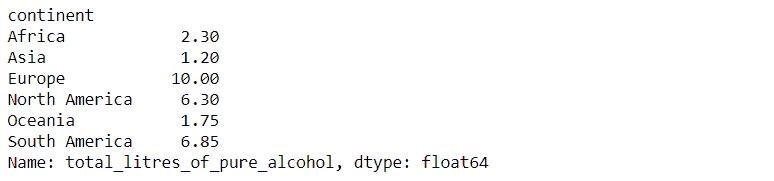
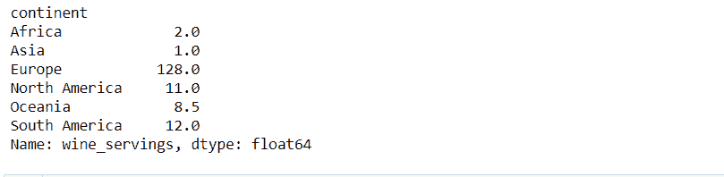
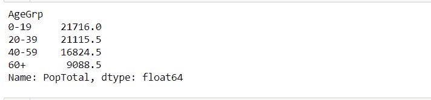

# 熊猫分组和计算中位数

> 原文:[https://www . geeksforgeeks . org/pandas-group by-and-computing-median/](https://www.geeksforgeeks.org/pandas-groupby-and-computing-median/)

Python 中的熊猫被认为是执行数据分析最流行和最强大的工具。这是因为熊猫功能的美丽，以及在大数据集的集合和子集上工作的能力。因此，在本文中，我们将研究熊猫分组功能是如何工作的，并在处理大型数据集时节省大量精力。此外，我们将使用熊猫分组和中位数功能解决现实世界的问题。

### **熊猫群 by()**

熊猫中的 [groupby()](https://www.geeksforgeeks.org/pandas-groupby/) 方法将数据集分割成子集，以简化计算。通常，groupby()分割数据，应用功能，然后为我们组合结果。让我们举个例子，如果我们有不同国家的饮酒数据，并且我们想在整个大陆进行数据分析，这个问题可以通过在熊猫中使用 groupby()方法来最小化。它按大陆分割数据，并使用中位数()方法计算中位数。

**语法:**

> data frame . group by(by =无，轴=0，级别=无，as _ index =真，排序=真，group _ keys =真，挤压= <object object="">，观察到的=假，dropna =真)</object>

**例 1** :在给定的数据集上，求各洲的酒精消费量中位数。

**数据集:** [饮酒国家. csv](https://www.kaggle.com/faressayah/drinks-by-country)

## 蟒蛇 3

```
# import the packages
import pandas as pd

# read Dataset
data = pd.read_csv("drinksbycountry.csv")
data.head()

# perform groupby on continent and find median
# of total_litres_of_pure_alcohol
data.groupby(["continent"])["total_litres_of_pure_alcohol"].median()

# perform groupby on continent and find median
# of wine_serving
data.groupby(["continent"])["wine_servings"].median()
```

**输出:**



纯酒精总升数的中位数



葡萄酒供应量的中位数

**例 2:** 求给定数据集上按年龄划分的总人口组的中位数。

**数据集:** [世界人口 by ge2020 . CSV](https://www.kaggle.com/alizahidraja/world-population-by-age-group-2020)

## 蟒蛇 3

```
# import packages
import pandas as pd

# read Dataset
data = pd.read_csv("WorldPopulationByAge2020.csv")
data.head()

# perform group by AgeGrp and find median
data.groupby(["AgeGrp"])["PopTotal"].median()
```

**输出:**



按年龄分组