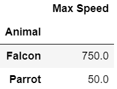
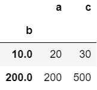
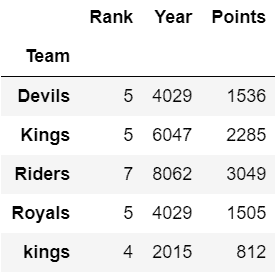

# 熊猫分组和求和

> 原文:[https://www.geeksforgeeks.org/pandas-groupby-and-sum/](https://www.geeksforgeeks.org/pandas-groupby-and-sum/)

**熊猫**是建立在 *NumPy* 库之上的开源库。它是一个 Python 包，提供了各种数据结构和操作来操作数字数据和时间序列。它主要是流行的，因为导入和分析数据容易得多。*熊猫*速度快，为用户带来高性能&生产力。

**Groupby** 是一个相当简单的概念。我们可以创建一组类别，并对这些类别应用一个函数。这是一个简单的概念，但却是一项在数据科学中广泛使用的极其有价值的技术。这是有帮助的，因为我们可以:

*   计算每个组的汇总统计信息
*   执行特定于组的转换
*   进行数据过滤

*groupby()* 包括拆分对象、应用函数和组合结果的组合。这可用于对大量数据进行分组，并对这些组进行计算操作，例如 *sum()* 。

#### 下面是一些实现使用 *groupby()的例子。sum()* 在*熊猫*舱:*T5】*

**例 1:**

## 蟒蛇 3

```
# import required module
import pandas as pd

# create dataframe
df = pd.DataFrame({'Animal': ['Falcon', 'Falcon', 'Parrot', 'Parrot'],
                   'Max Speed': [380., 370., 24., 26.]})

# use groupby() to compute sum
df.groupby(['Animal']).sum()
```

**输出**



**例 2:**

## 蟒蛇 3

```
# import required module
import pandas as pd

# assign list
l = [[100, 200, 300], [10, None, 40],
     [20, 10, 30], [100, 200, 200]]

# create dataframe
df = pd.DataFrame(l, columns=["a", "b", "c"])

# use groupby() to generate sum
df.groupby(by=["b"]).sum()
```

**输出:**



**例 3:**

## 蟒蛇 3

```
# import required module
import pandas as pd

# assign data
ipl_data = {'Team': ['Riders', 'Riders', 'Devils', 'Devils',
                     'Kings',  'kings', 'Kings', 'Kings',
                     'Riders', 'Royals', 'Royals', 'Riders'],
            'Rank': [1, 2, 2, 3, 3, 4, 1, 1, 2, 4, 1, 2],

            'Year': [2014, 2015, 2014, 2015, 2014, 2015, 2016, 
                     2017, 2016, 2014, 2015, 2017],

            'Points': [876, 789, 863, 673, 741, 812, 756, 788, 
                       694, 701, 804, 690]}

# create dataframe
df = pd.DataFrame(ipl_data)

# use groupby() to generate sum
df.groupby(['Team']).sum()
```

**输出:**

