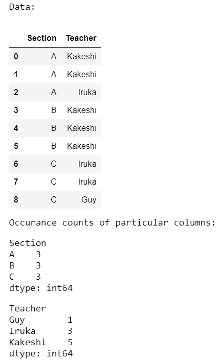

# 熊猫分组–计算第

栏中的出现次数

> 原文:[https://www . geesforgeks . org/pandas-group by-count-in-column-occurs/](https://www.geeksforgeeks.org/pandas-groupby-count-occurrences-in-column/)

使用**大小()**或**计数()**方法与[**熊猫进行比较。DataFrame . group by()**](https://www.geeksforgeeks.org/python-pandas-dataframe-groupby/)**将生成出现在 data frame 特定列中的数据出现次数的计数。不过这个操作也可以用[熊猫来进行。Series.value_counts()](https://www.geeksforgeeks.org/python-pandas-series-value_counts/) 和，[熊猫。Index.value_counts()](https://www.geeksforgeeks.org/python-pandas-index-value_counts/) 。**

****接近****

*   **导入模块**
*   **创建或导入数据框**
*   **应用 groupby**
*   **使用两种方法中的任何一种**
*   **显示结果**

### **方法 1:使用 pandas.groupyby()。si **ze()****

**使用该方法的基本方法是在 **groupby()** 方法中将列名指定为参数，然后对其使用 **size()** 。以下是描述如何为不同数据集计算列中出现次数的各种示例。**

****例 1:****

**在本例中，我们分别计算数据集中所有列的出现次数。**

## **蟒蛇 3**

```
# import module
import pandas as pd

# assign data
data = pd.DataFrame({'Section': ['A', 'A', 'A', 'B', 'B',
                                 'B', 'C', 'C', 'C'],
                     'Teacher': ['Kakeshi', 'Kakeshi', 'Iruka',
                                 'Kakeshi', 'Kakeshi', 'Kakeshi',
                                 'Iruka', 'Iruka', 'Guy']})

# display dataframe
print('Data:')
display(data)

print('Occurrence counts of particular columns:')

# count occurrences a particular column
occur = data.groupby(['Section']).size()

# display occurrences of a particular column
display(occur)

# count occurrences a particular column
occur = data.groupby(['Teacher']).size()

# display occurrences of a particular column
display(occur)
```

****输出:****

****

****例 2:****

**在下面的程序中，我们计算了与上一个程序中使用的相同数据集中所有列的出现次数。**

## **蟒蛇 3**

```
# import module
import pandas as pd

# assign data
data = pd.DataFrame({'Section': ['A', 'A', 'A', 'B', 'B', 'B',
                                 'C', 'C', 'C'],
                     'Teacher': ['Kakeshi', 'Kakeshi', 'Iruka',
                                 'Kakeshi', 'Kakeshi', 'Kakeshi',
                                 'Iruka', 'Iruka', 'Guy']})

# display dataframe
print('Data:')
display(data)

print('Occurrence counts of combined columns:')

# count occurrences of combined columns
occur = data.groupby(['Section', 'Teacher']).size()

# display occurrences of combined columns
display(occur)
```